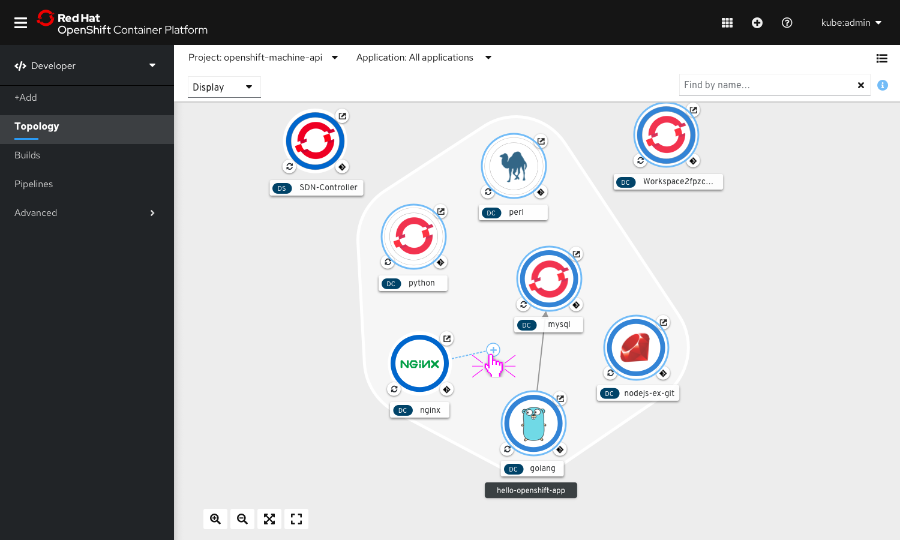
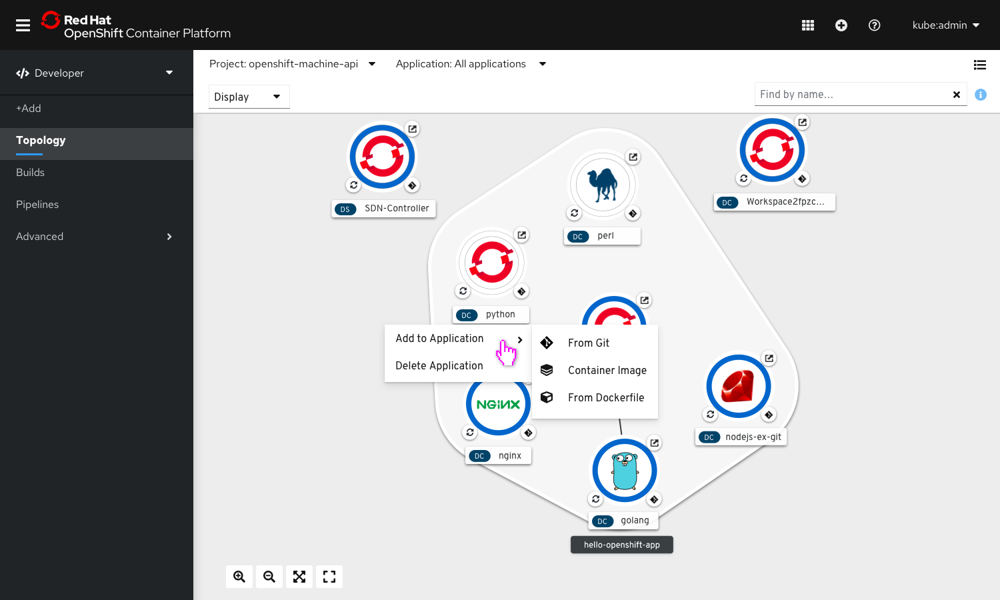

# Topology - Access Add actions from topology view
### 1. Using gestures

To access the add action from the topology view, start dragging the connector handle. While not hovering over a potential connection target, the arrow would turn into an ‘add’ cursor.

On dropping the add cursor anywhere on the topology canvas, the in-context add menu could be accessed.

### 2. Using right-click to invoke in-context menu

On performing a right-click anywhere on the empty area in topology, the in-context add menu could be accessed.

### 3. Exiting the flow
• Pressing <ESC> when the context menu is displayed will hide the menu

• Pressing <ESC> when the "add/connector handle" is being dragged will hide the handle

• When the list menu of add flows appear, clicking anywhere on the blank area on the canvas would end the flow
