# Channels in Topology

## Description

A channel can be connected to Knative services with subscriptions. Subscriptions are represented by the lines to the right of the channel. Channels are Kubernetes custom resources which define a single event forwarding and persistence layer.

A channel can also be standalone or only connected to the event sources.

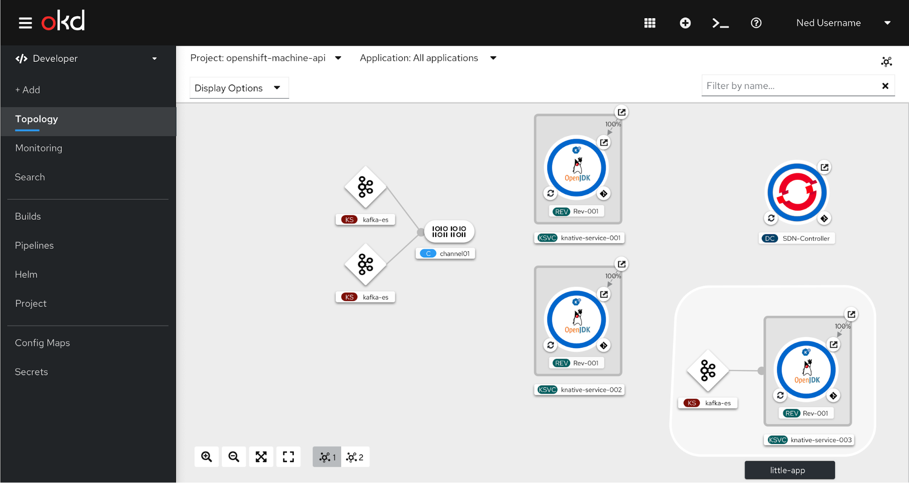

## In-Context Menu

The user can right click on the channel and the in-context menu will appear.

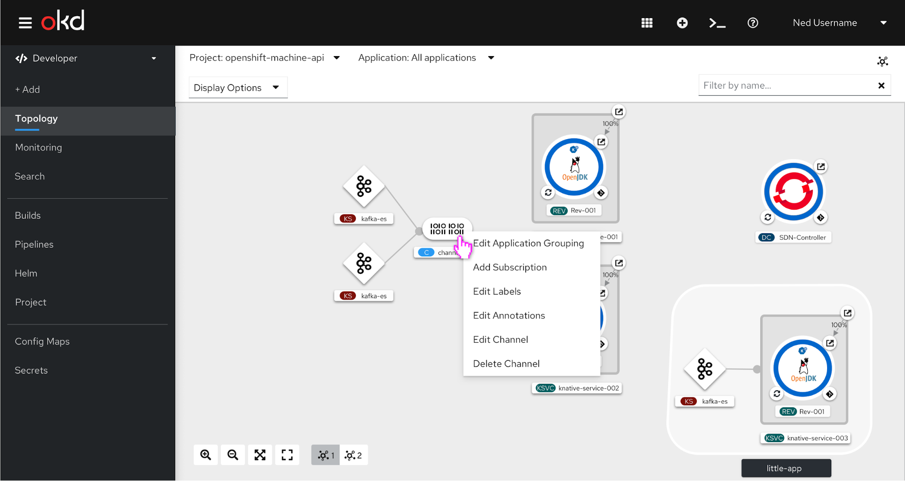

## Side panel for channels

When the channel is selected, the side panel appears. The channel will highlight with a blue border. In this view, the event sources and subscribers with their associated subscriptions are listed.

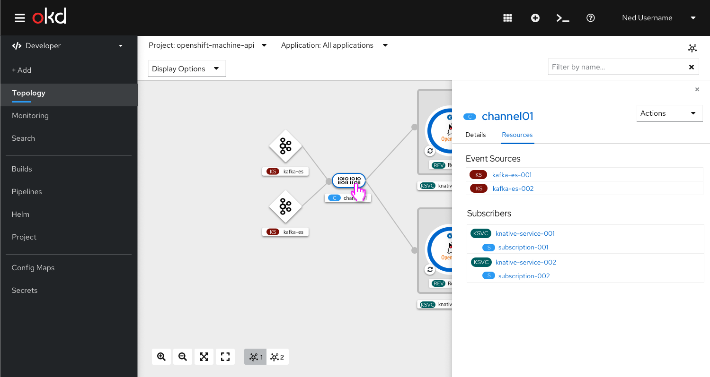

## Actions dropdown for channel

When the user selects the actions dropdown, they have a variety of options available to them, such as adding a subscription or editing the channel.

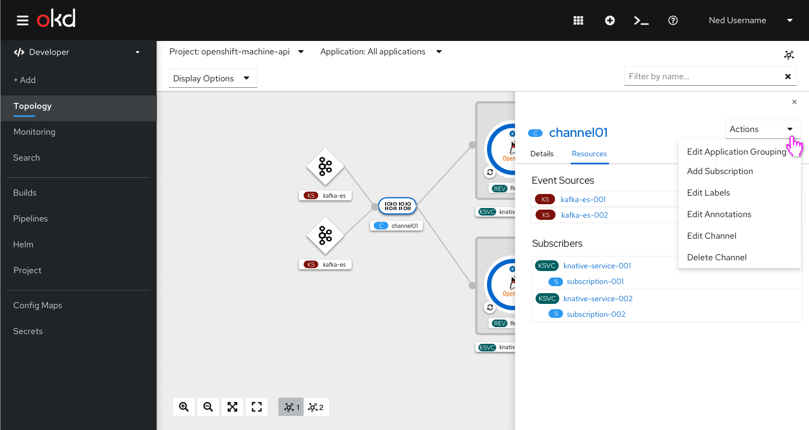

## Drag and Drop

Channels will also have the blue arrow to drag and drop to add subscriptions. Events are delivered to services or forwarded to other channels (possibly of a different type)using subscriptions.

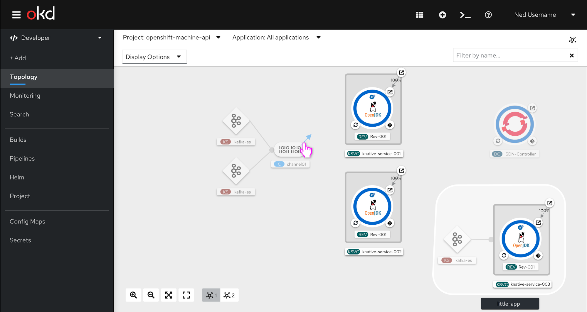

The user can hover the blue plus sign on a Knative service and the tooltip with “Add Subscription” will appear. If the user drops the blue plus on the Knative service the subscription will be added.

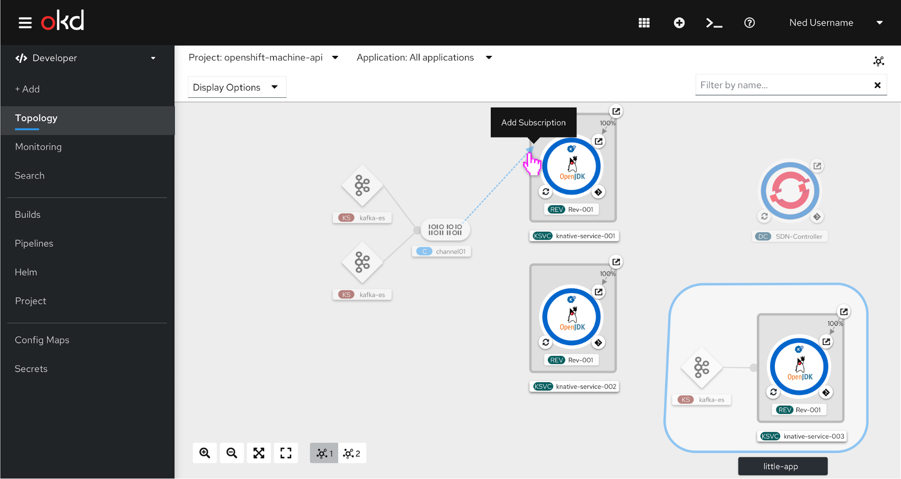

The user can drop the blue plus in open space and the option to add a subscription will appear.

## Add a subscription modal

The user can access the add subscription modal in three ways: by dropping the blue plus in open space, selecting the “Add Subscription” option from the in-context menu on right click, or selecting the “Add Subscription” option from the actions dropdown on the side panel. When the user has selected “Add Subscription” a modal appears, and this is the default form view.

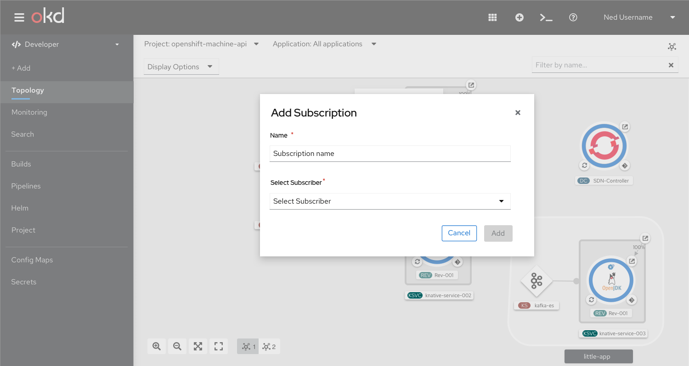

The user selects the subscriber from dropdown. If there is one subscriber, the form will default to that one subscriber. 

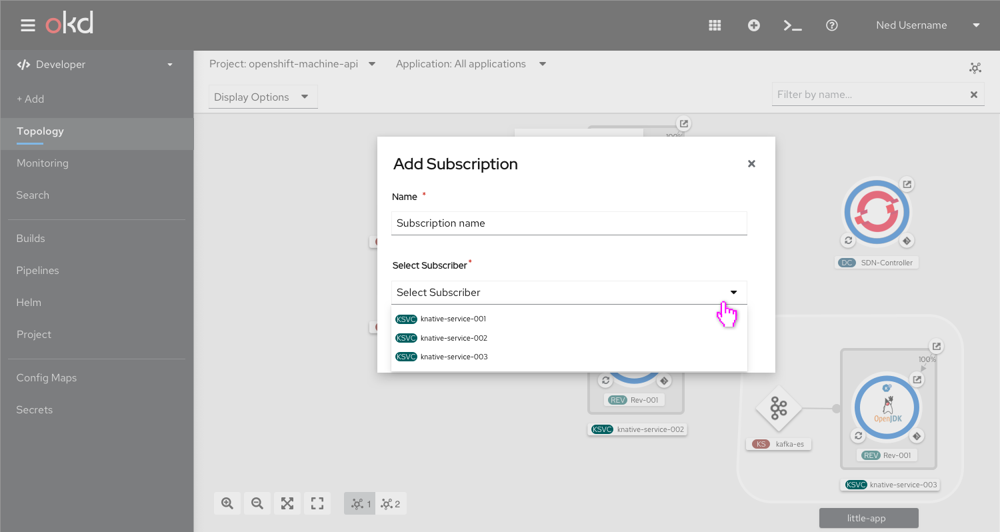

If there is no subscriber, the user should be notified that no subscriber is available, and the dropdown should be disabled.

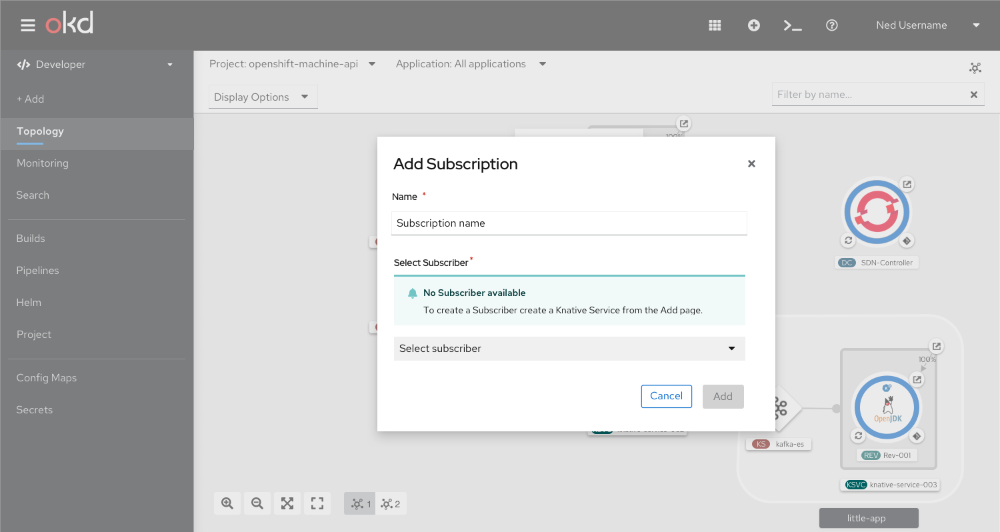

## Subscriptions

On hover, a tooltip will appear saying “Subscription”.

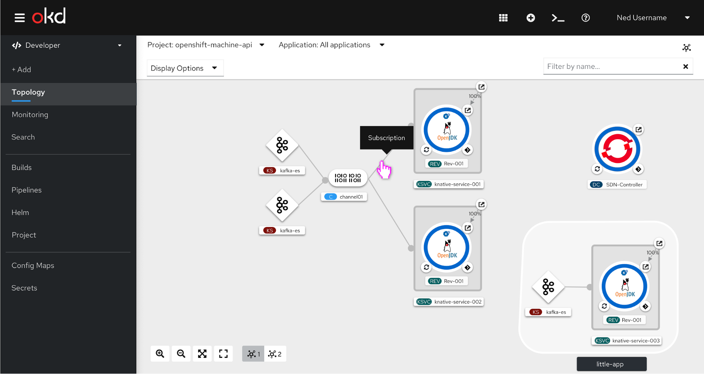

The user can also right click the subscription to access the in-context menu.

## Side panel for subscriptions

When the subscription is selected the event sources, associated channel, and subscriber are listed on the side panel.

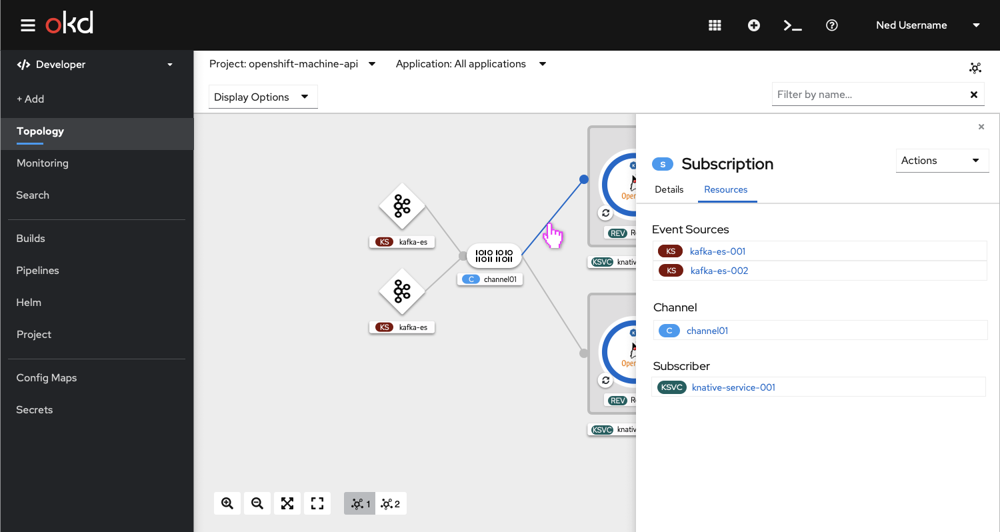

## Actions dropdown for subscription

When the actions dropdown is selected, a variety of options are available to the user, such as editing the subscription.

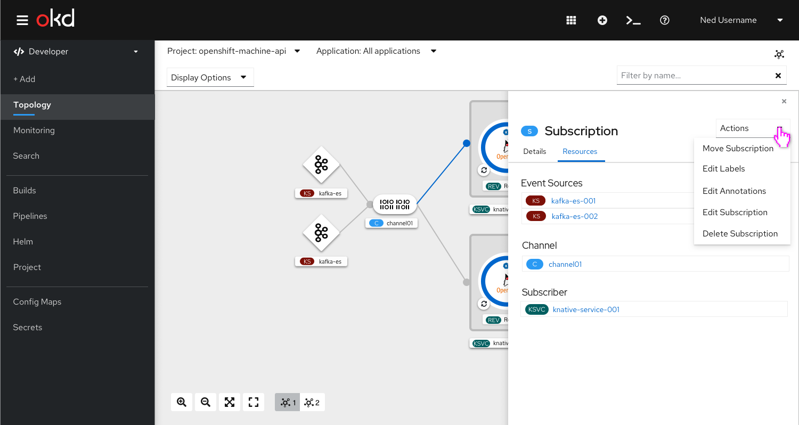

## Side panel for Knative service

When the Knative service is selected event sources and channels with their associated subscriptions are listed below the other resources. 

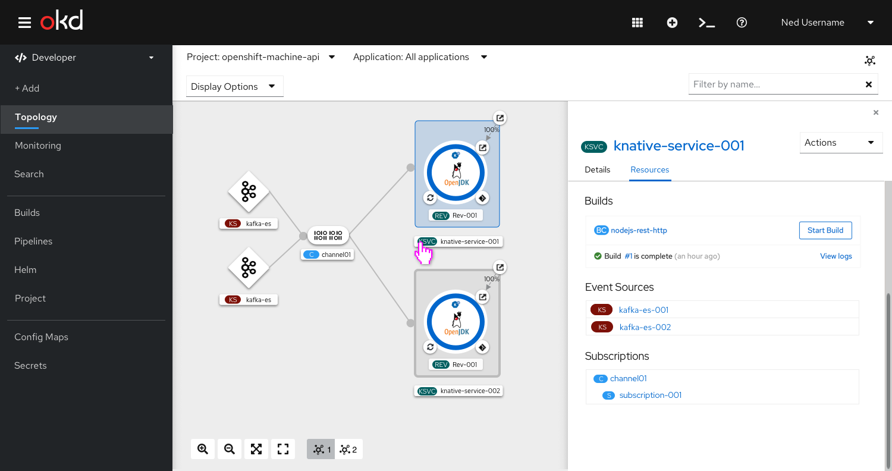

## Side panel for event source
When the event source is selected the sink is listed with the associated URI link for the channel. 

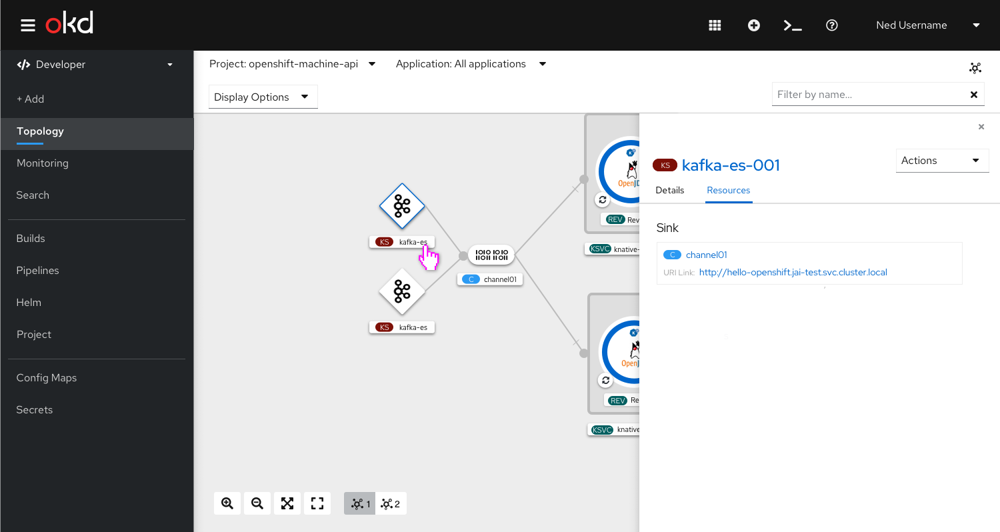

