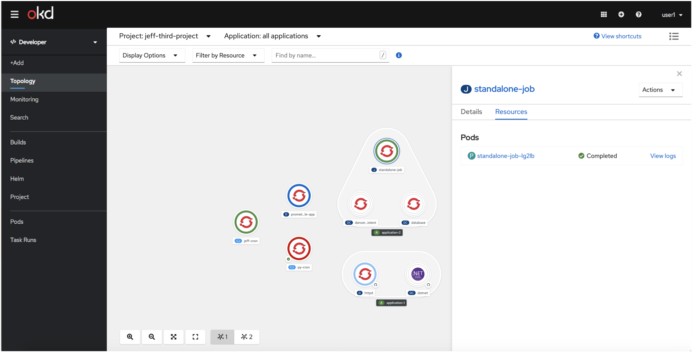
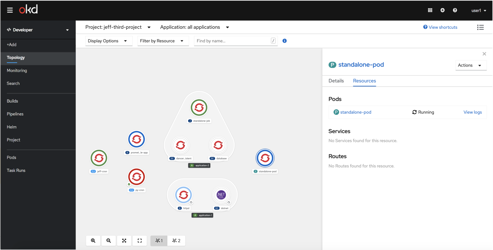
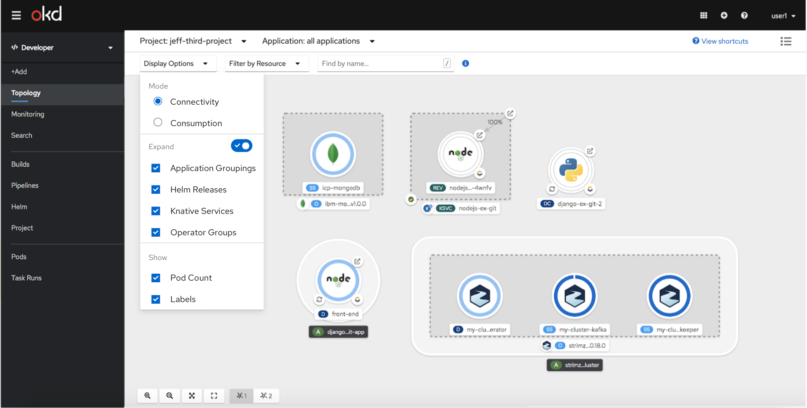
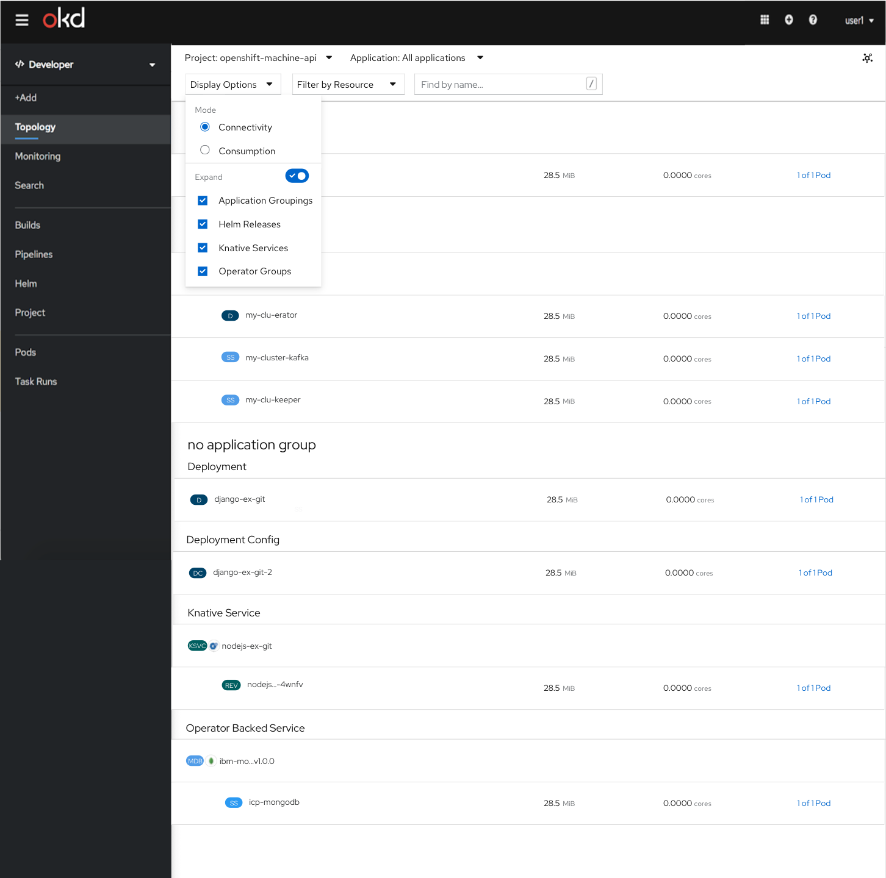
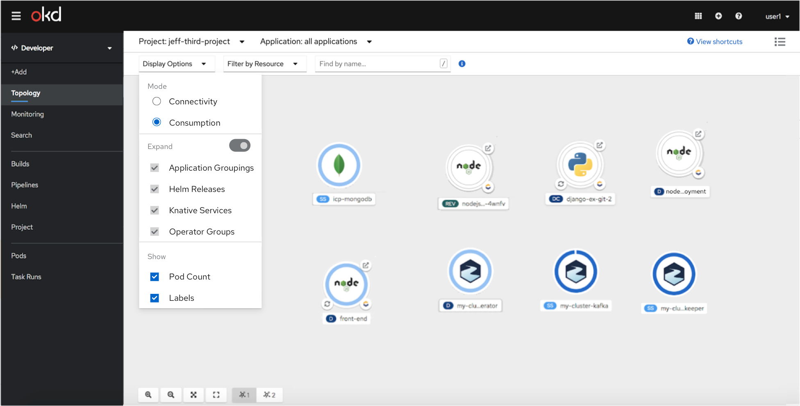
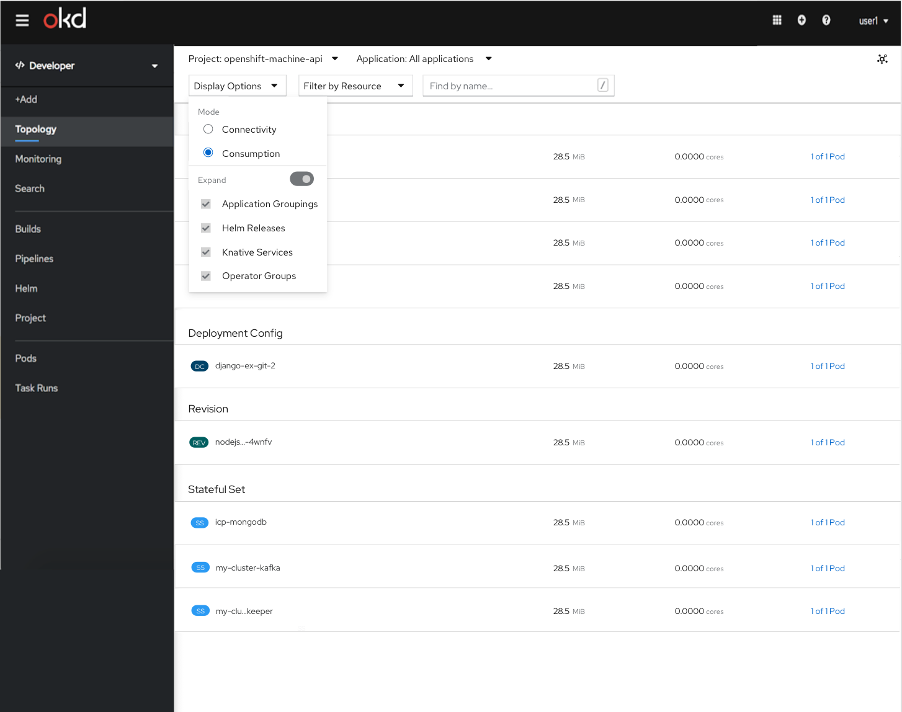
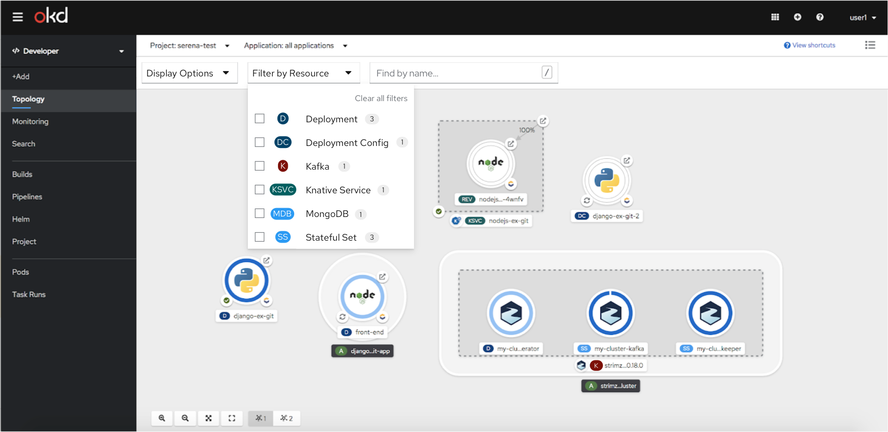
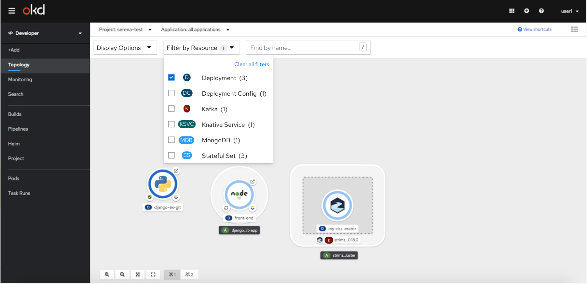
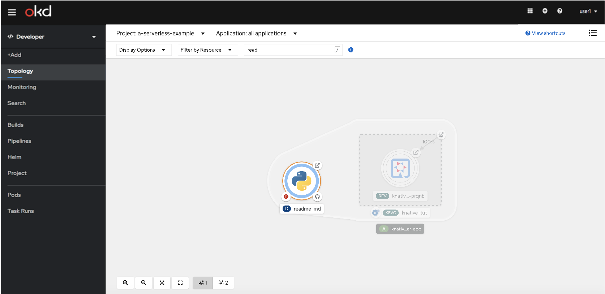
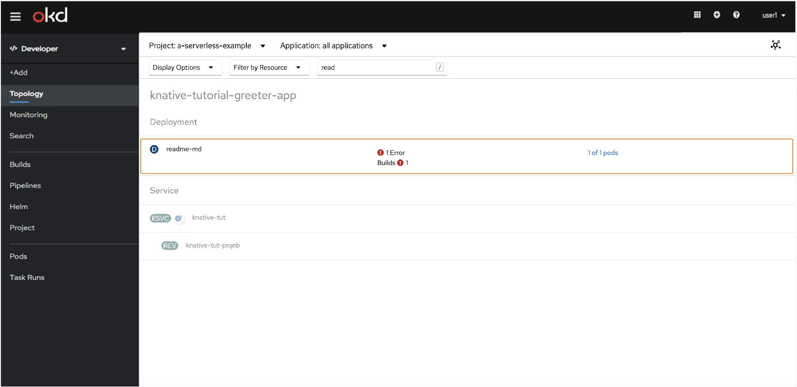

# Topology

## Description

In 4.6, there were many changes to the Topology view. One of these changes included expanding the workload types that are displayed in the Topology view by adding Cron Jobs, Jobs, and standalone Pods. The other changes included creating parity between the graph and list view, as well as creating new grouping and filtering mechanisms.

## Cron Jobs

## Jobs

## Pods

## Display Options
In the Display options there are two different modes, Connectivity and Consumption. In the Connectivity mode, expand is the default but the user can collapse. In the Consumption mode, expand is disabled. In graph view, there will be the option to show Pod Count and Labels which won’t be available in the list view.

### Connectivity
This mode shows the composition of the application - both how it's managed & connected. The expand and collapse functionality is available in this mode.

### Consumption
This mode allows you to just focus on the components consuming resources. The expand and collapse functionality is not available in this mode. There will not be any edges (Visual Connectors, Service Binding Connectors, Traffic, Subscriptions, Triggers) shown in this mode. Deployments which are part of Revisions in the traffic block and deployments associated with Event Sources will be shown.

## Filter by Resource
All resources will be unchecked by default. If the user selects a resource type, only that resource type will be shown. There will be a clear all filter to reset the filters. Only resource types in the project will be shown in the dropdown.

## Find by name
In the graph and list views, there will be an orange highlight around objects that match the search results. Users can search by the name of resources.

