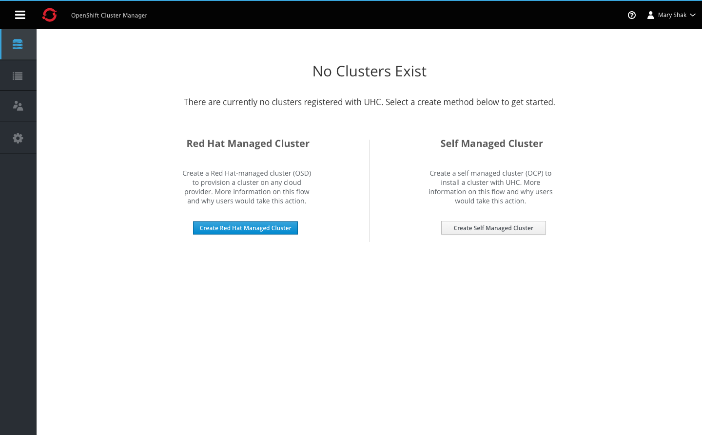
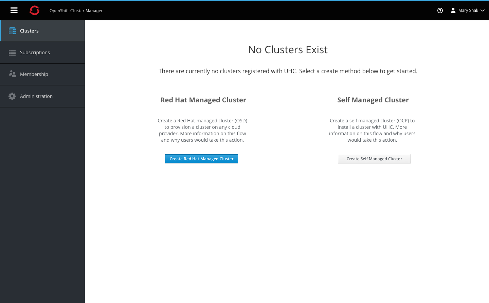
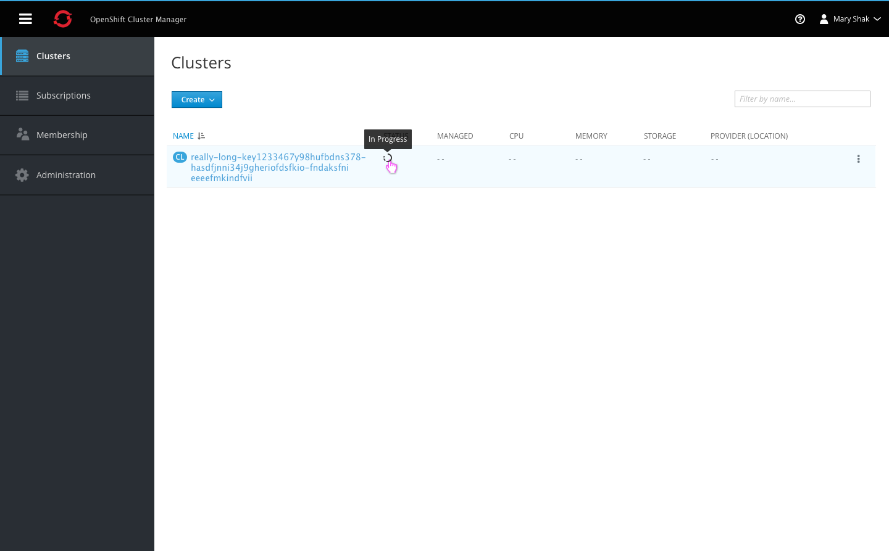
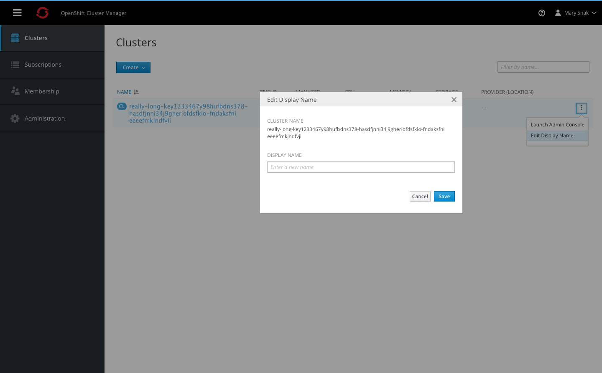
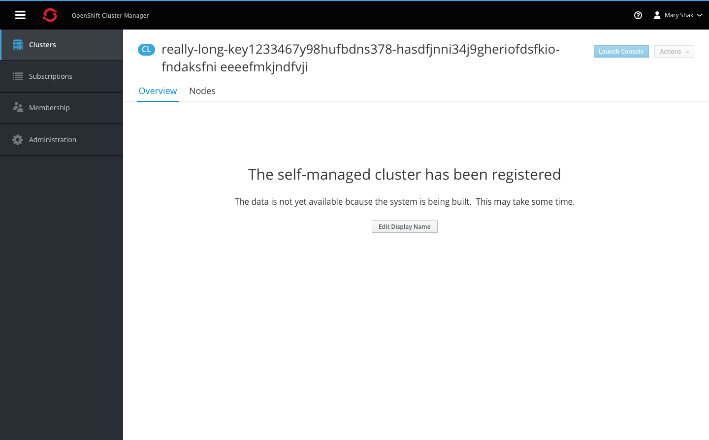
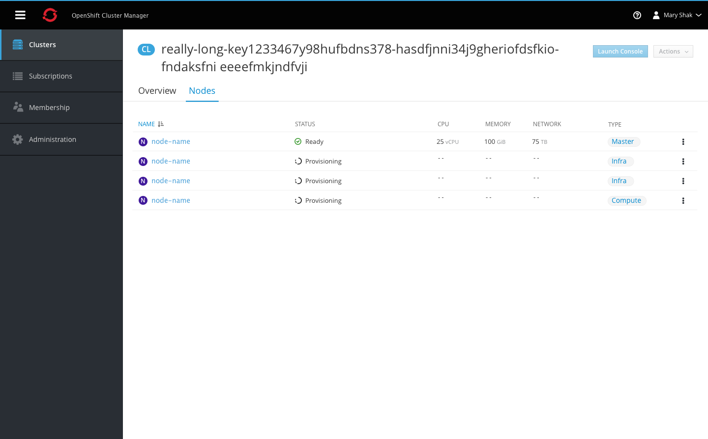
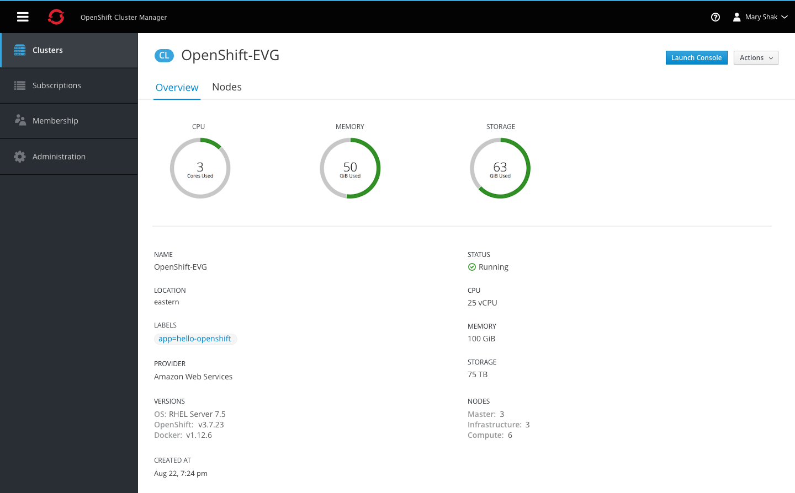
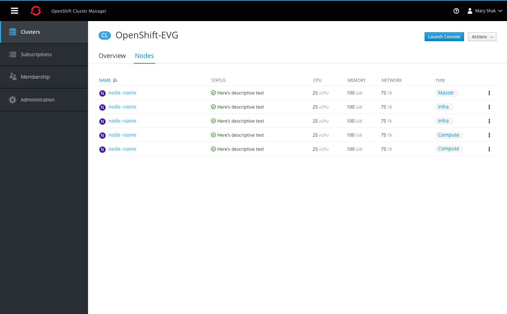

# View Cluster

## Navigation

- Each navigation item must include an icon and label.
- The hamburger icon is always displayed in the top left corner of the masthead.
- The vertical navigation should be collapsible into an icon-only view, by clicking the hamburger icon on desktop. On mobile, this action would hide the vertical navigation entirely.
- Clicking the icon again will re-open the navigation displaying the labels.

## Cluster Summary View

### Empty State

- When there are no clusters to display for this view, an empty state should be shown.
- Users can either choose to create a Red Hat managed cluster or a Self managed cluster.
- The empty state provides details and action buttons for both options with a vertical separator between the two.

### In-Progress State

- Clusters may take some time to load once users have completed the installation process.
- Some fields may not be populated at first when the data is not yet available, but the cluster name will display regardless.

- Clusters may have system generated names, so users can optionally edit the display name to be more user friendly.

### Summary List

- The cluster badge should be used with the page title.
- The filter input field is aligned with the primary create action. Users can filter by cluster name and matching results will remain visible in the list.
- Columns include Name, Status, Managed, CPU, Memory, Storage, and Location (plus provider in parentheses).
- All column headers are clickable, allowing users to sort in either direction.
- The status column displays an icon only, with a tooltip shown on hover to display the full status label.
- Each row should include a kebab for actions, starting with the Launch Admin Console action.
- The summary list does not include paging, and should use infinite scroll for loading additional content.

## Cluster Detail View

### In-Progress State

- Clicking on the cluster name will navigate users to the cluster details page.
- When the data is not yet available an empty state message will be displayed.
- The only action available at this time is the option to edit the display name. Users can access this action from the summary or details page.

- Switching to the Nodes tab will display the nodes in a list view, including when still in the loading state.
- Once remaining data becomes available the rest of the table will be populated.

### New Cluster

- Once the data becomes available, the cluster details page is populated with utilization metrics and additional fields below.
- For new clusters only, a blue box will be added above the cluster details providing the user with additional information and resources on what to do next and what is displayed on the page.
- Users can manually close this blue box or it will automatically hidden the next time a user navigates here. The message only appears on first time visits to new clusters.   

### Overview Tab

- Clicking on a cluster name from the summary view will bring the user to the cluster detail page.
- The badge should be shown with the page title at the top.
- A primary action should be available at the top to launch the admin console.
- The top section of the overview tab should display three donut charts with the CPU, Memory, and Storage utilization.
- A horizontal separator should divide the graphs from the next section of details, showing all remaining fields in a two-column format.

### Nodes Tab

- The Nodes tab should follow the same list-view format used on the cluster summary page.
- The Name column should include the node badge to the left of each name.
- Remaining columns should include the status, utilization metrics, and type.

**Note** This tab may not be implemented for phase 1.
