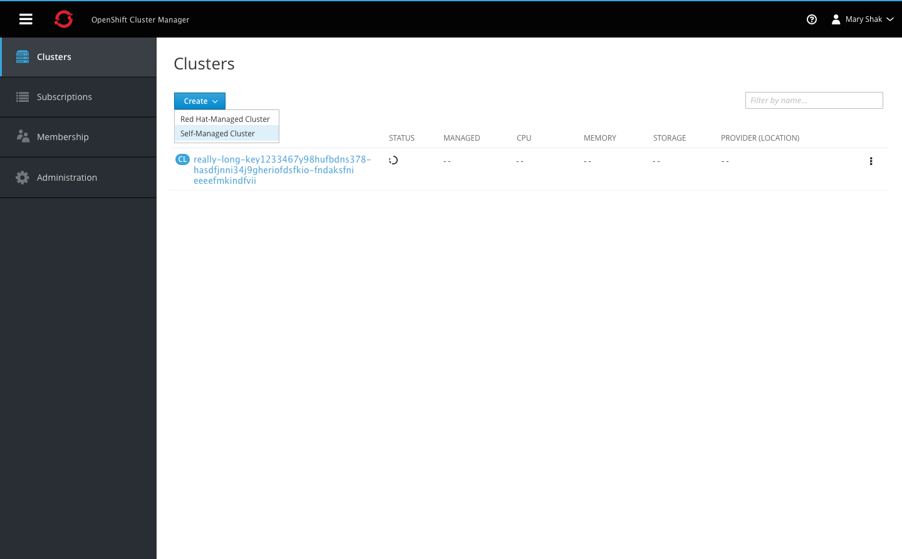
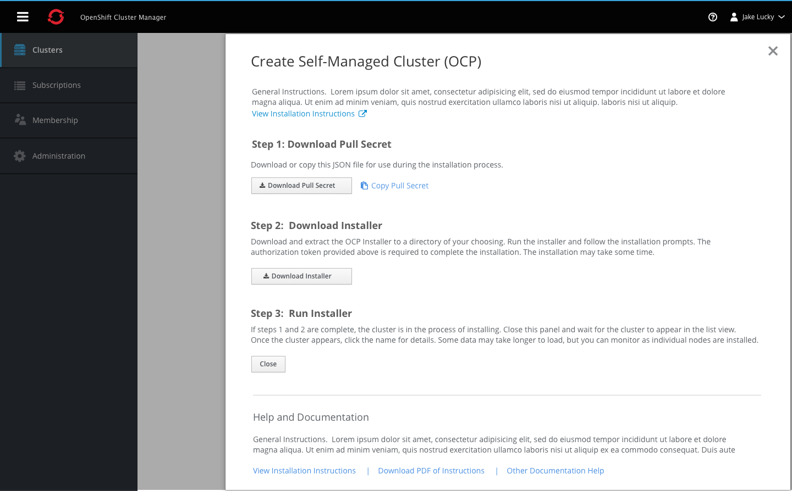
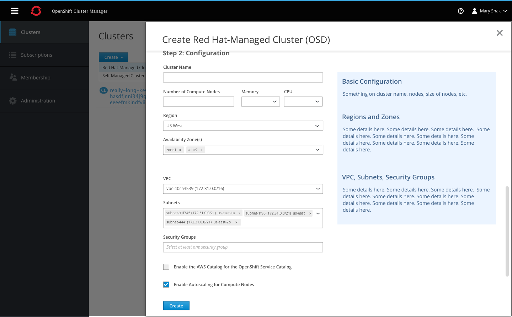

## Create Cluster

- The create action opens a dropdown with all options for creating a new clusters. All selections will open a modal side panel with step by step instructions for completing the creation.

### Self-Managed Cluster

- Clicking the create self managed cluster button will open a panel with information regarding the two-step process for installation.
- Users must download the JSON file in order to use it as an authorization token during the installation process.
- Once users follow the external installation process, the cluster will start to appear in the list in the background.
- Users can install additional clusters following the prompts in the side panel and once complete, they can close it using the X in the top right corner.

### Red Hat Managed Cluster

- Clicking the create Red Hat managed cluster button will open a panel with information regarding the two-step process for installation.
- Users must first provide credential information for the cloud provider.
- The blue panel on the right will provide additional guidance and help resources for users who need more assistance or documentation to complete the process.

- After clicking next, the panel will automatically scroll the user down the page to the second step which is the cluster configuration.
- Again the blue panel on the right will support users through the process with helpful tips and documentation guides. After completing all configuration parameters, users can click create and the panel will close as the user waits for the cluster to appear in the list.
