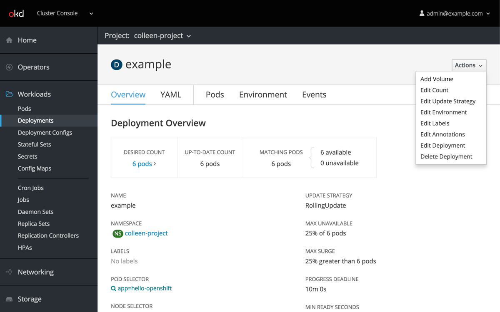
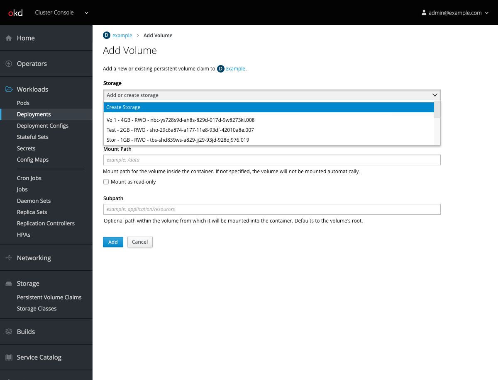
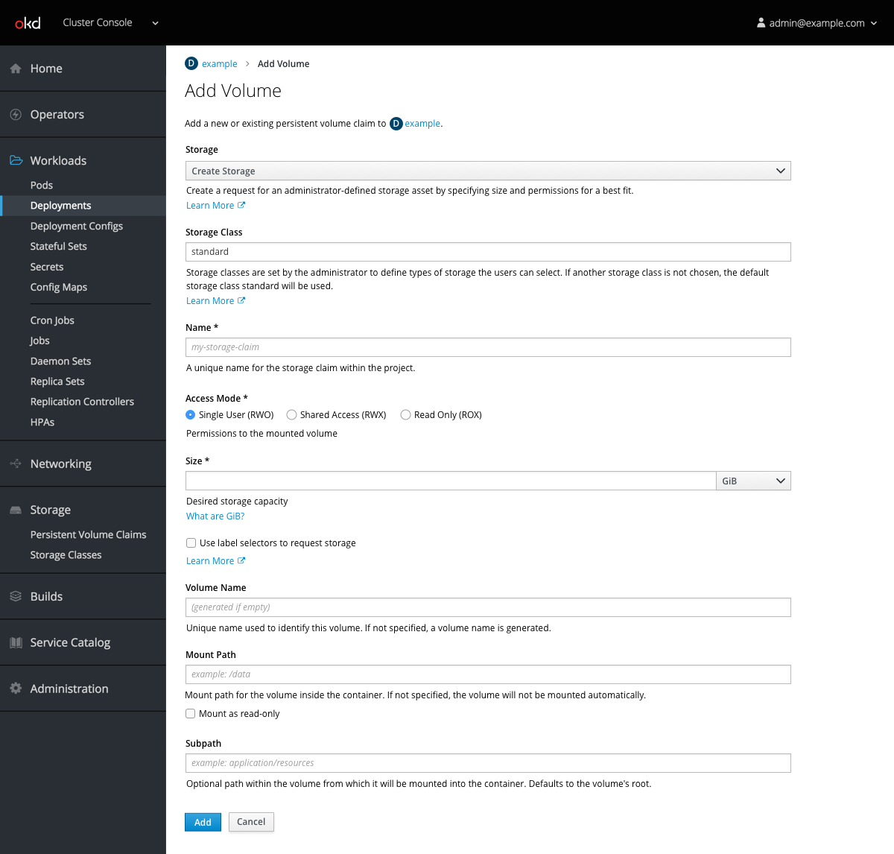

# Attach Storage

-  Deployment pages will contain a new `Add Volume` option within the actions dropdown.

- The user can either add existing storage or choose to `Create Storage` from within the dropdown.

- Selecting `Create Storage` exposes fields for Storage Class, Name, Access Mode, Size, and the label selector checkbox.
- Only access modes that are compatible should be available to select in this form.
