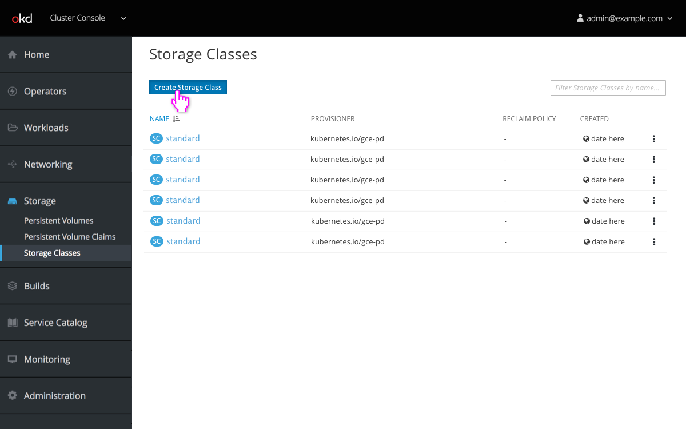
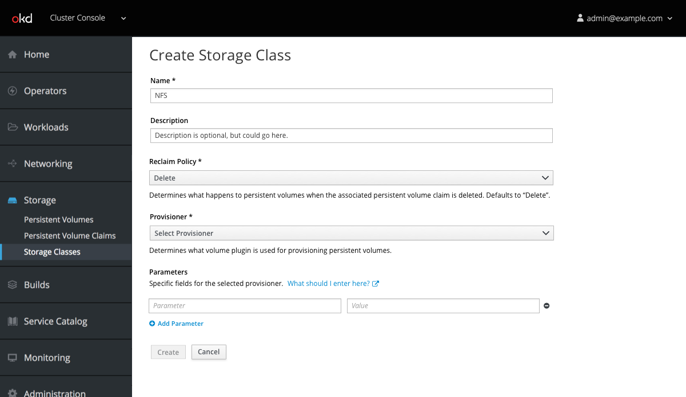
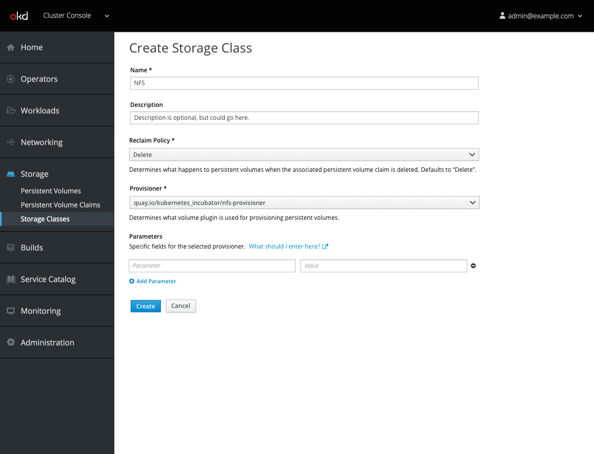
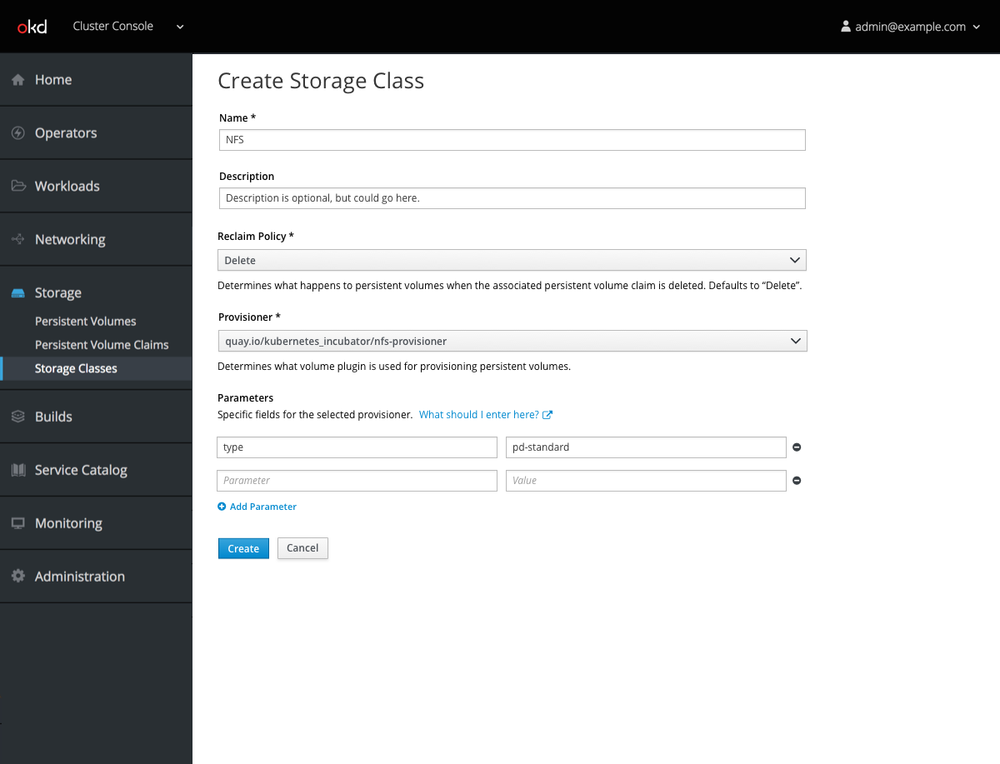
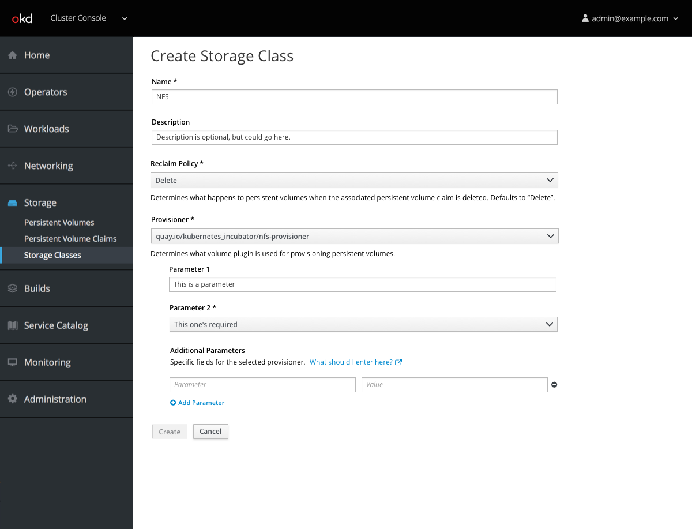

# Create Storage Class

- Users with appropriate privileges can click to create a new Storage Class.

- They are presented with a form that enables them to define the name, description, type of storage, reclaim policy, and provisioner for this storage class.

- The `What should I enter here?` link should preferably direct the user to a list of parameters for the selected provisioner, but if that is not possible, linking to the Kubernetes documentation is acceptable.

- Parameter rows can be added by clicking the `Add Parameter` button and removed with the minus button.
- Rows are not draggable.

- If it is feasible, selecting a provisioner should dynamically create fields for parameters rather than requiring that users specify them. In this case, additional parameters could still be added as needed.
