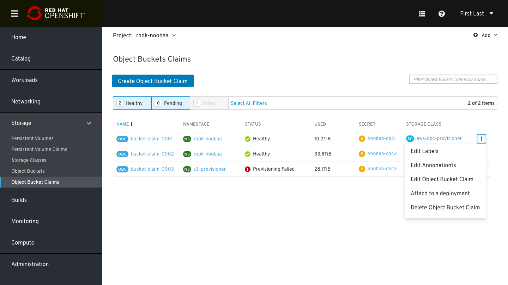
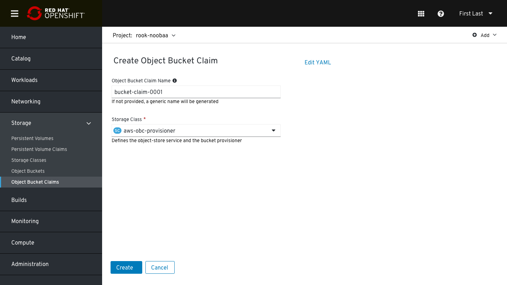
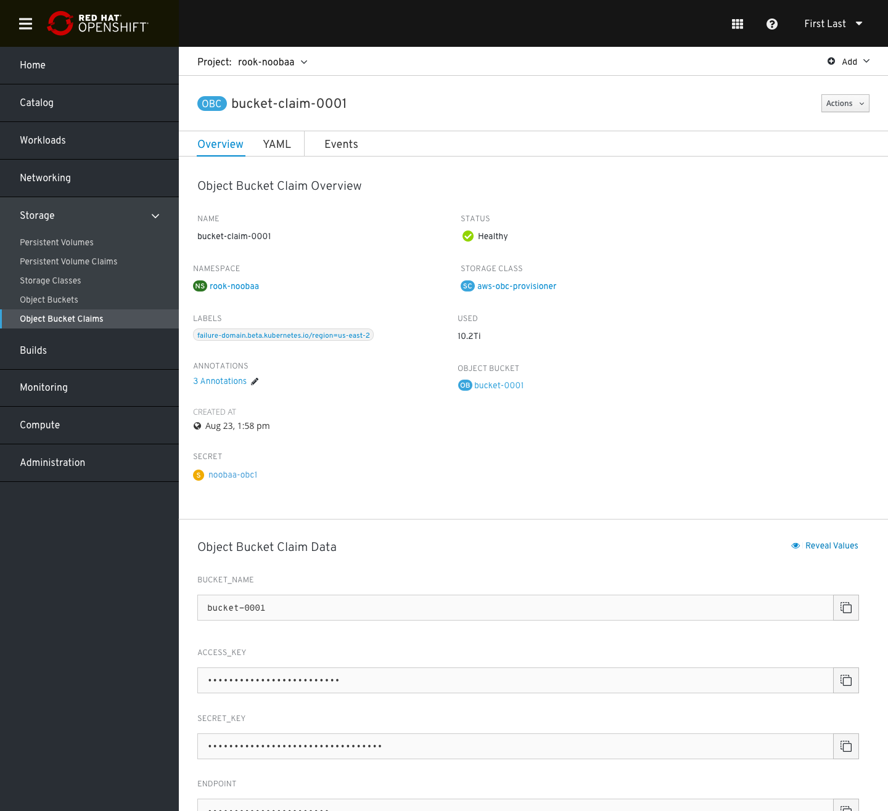
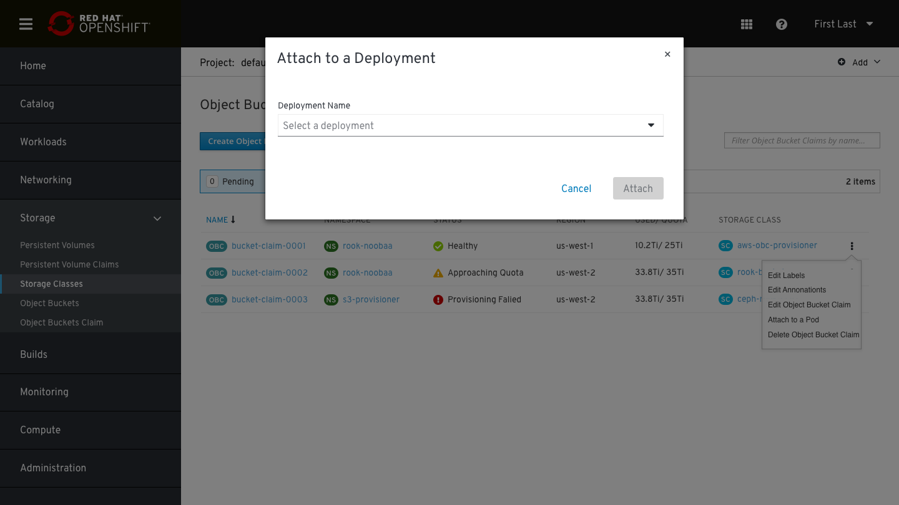
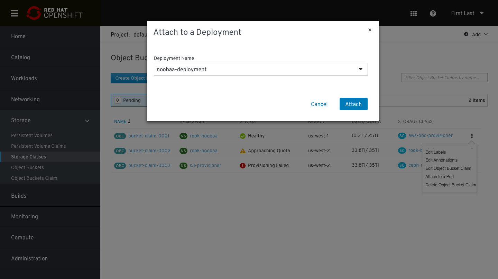
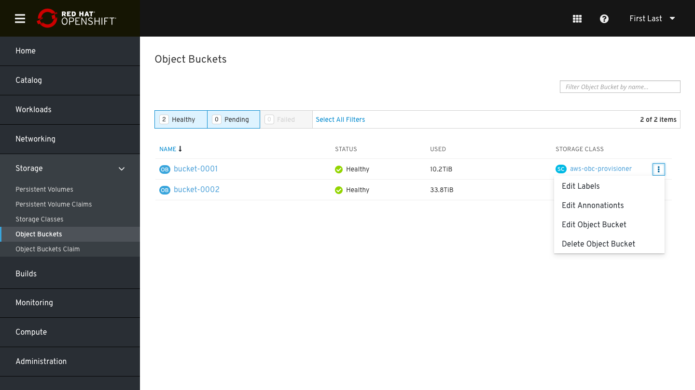
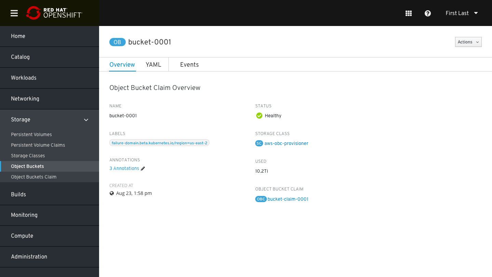
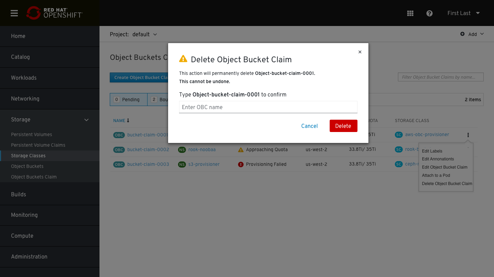

# OB/OBC Lifecycle Management Design
Support object bucket (OB) and object bucket (OBC) CRUD after an OCS installation.

## OBC

### OBCs List
The OBC list contains the following details: 
* OBC name
* Namespace
* Status
* Used
* Secret
* Storage class

The kebab menu contains the following options:
* Edit labels
* Edit Annotations
* Edit OBC
* Attach to a deployment
* Delete OBC

### Create OBC
To create an OBC the user will need to provide the following details:
* OBC name (not mandatory, a generic name will be generated if not provided)
* Storage class 

Info icon next to the OBC name text:

Object bucket claim name must follow the bucket naming conventions:
* 3-63 characters
* Starts and ends with a lowercase letter or number
* Only lowercase letters, numbers, nonconsecutive periods or hyphens
* Avoid using the form of an IP address
* Globally unique name

### OBC Details Page

In the OBC overview page there are 4 tabs: Overview, YAML, Events & Pods (Pods will be added for 4.4).
In the Overview tab:
* OBC name
* Namespace
* Labels
* Annotations
* Creation time
* Secret
* Status
* Storage class
* Used (showing only the usage without any indication of the total capacity)
* Object Bucket that was created by this claim

Object bucket claim data (for application consumption):
* Bucket name 
* Access Key
* Secret Key
* Endpoint

*all data is masked and can be revealed by clicking on “Reveal Values”

### Attach OBC to a deployment

Clicking on the Kebab menu-> Attach to a deployment will open a modal window which the user need to choose which deployment he wants to attach to.

A long list of pods could be presented in this dropdown, use a typeahead select input:

## OB
### OBs List
The OB list contains the following details: 
* OB name
* Status
* Used
* Storage class

The kebab menu contains the following options:
* Edit labels
* Edit Annotations
* Edit OB
* Delete OB

### OB Details Page
OB page contains 3 tabs: Overview, YAML & Events
Overview tab:
* OB name
* Labels
* Annotations
* Creation time
* Status
* Storage class
* Used (showing only the usage without any indication of the total capacity)
* Object Bucket claim that created this bucket

### Delete OB/ OBC

Same deletion modal for both OB/ OBC, the terminology should be changed accordingly.  

For a higher level of verification, the user will be requested to enter the OBC/OB name he wishes to delete

### OUT OF SCOPE FOR 4.3 (future plans)
* Quotas in OB/OBC lists, details and creation.
    
    Quota- not mandatory. This option is currently supported by MCG. Can be shown only if the provisioner is relevant. 
    This will apply to all environments, i.e. RGW and S3 and is implemented as a hard limit by MCG/NooBaa.
    Default quota is 100 GiB.
* Regions
* Pods tab in OBC details page
* Capacity presentation of used out of X (pie chart)
