# Object Storage Dashboard

## Vision
The main goal of the Object Service Dashboard is to provide an at-a-glance view of the Multi-Cloud Gateway (MCG) configuration, that is deployed as part of OpenShift Container Storage (OCS). This dashboard would provide health and status information as well as reporting on key performance indicators for analysis and decision making.

## Object Dashboards

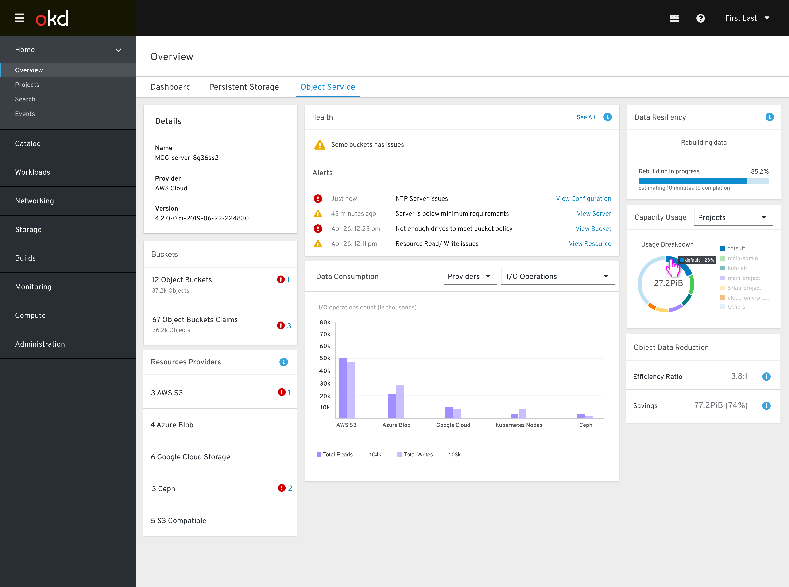

**The objects dashboard includes the following cards:**
- Details
- Buckets (Object buckets and Object bucket claims)
- Resources providers
- Health
- Data consumption 
- Data resiliency 
- Usage breakdown
- Data Reduction 

## Details Card
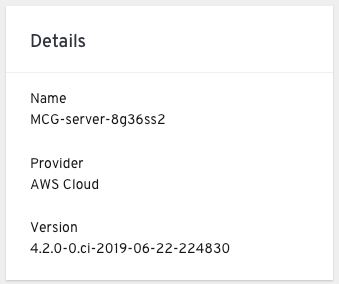

**The details card shows:**
- connected service name and offer external link to the NooBaa (MCG) system. 
- Provider name
- MCG installed version

## Buckets Card 
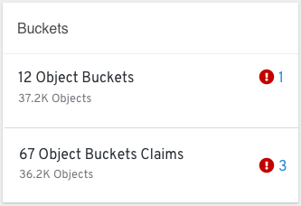

MCG - MCG/NooBaa Buckets are data containers that behave similarly to AWS S3 buckets. Users can set policies that will determine which resources will be user (per bucket) to store data.
We will show a breakdown between static buckets and buckets claim. Each bucket type will have a status indication when something is wrong with X buckets (shows the number of buckets that are currently in warning/ error status). The number link should lead to the problematic buckets list. 

## Resources Providers Card
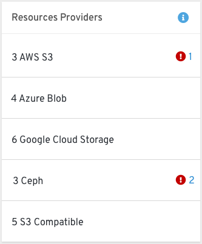

This card list the different storage resources the user have. It can be a cloud based resource and a bare metal resource. For each type (AWS, google, ceph rgw…) we will show the number of resources and their status indication if something is wrong.
**Only used resources types will be shown, no need to show types that are not in used. 

## Health Card
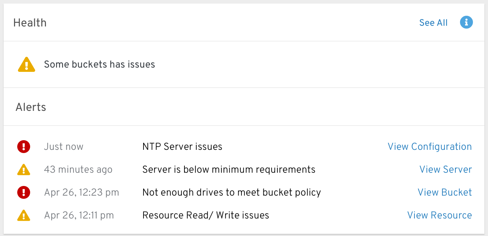

The health indication shows if the system is up and running without any major issues. When the system is in a warning or error state the alerts section will be shown and the relevant alerts will be displayed there. 

## Data Consumption Card
In this card the user can see an analysis for providers and accounts (MCG accounts) by different KPIs (physical Usage, logical usage, i/o, and egress depends on the selected type). 

### Accounts> I/O operations
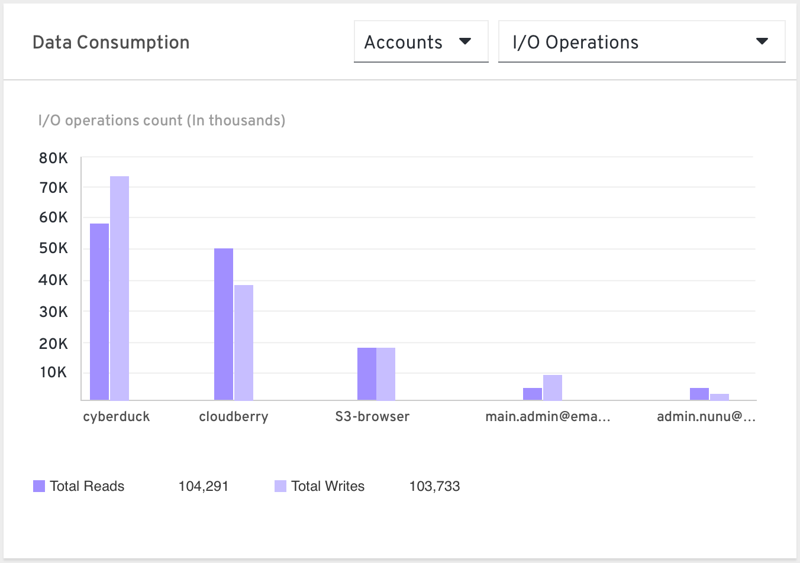

Show the top 5 accounts consumers R/W count values. At the bottom legends show the total Reads and total Writes amount of all 5. 
Why? States how connected applications utilizes the system resources. 

### Accounts > Logical Usage

Show each account total logical usage size
Why? Show how connected applications utilizes the system resources. 

### Providers> I/O operations
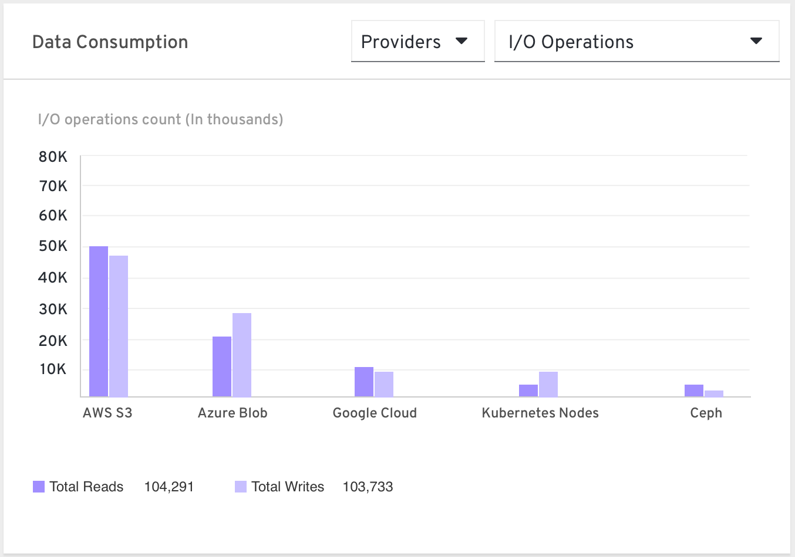

Input/Output operations sent to and from MCG to connected cloud providers
Why? What’s eating my budget? Understanding the traffic in the cloud, allowing the user to compare with the cloud billing reports, optimize and improve resources allocation according to the I/O pattern and perhaps consider changing the selected resource type.

### Providers> Egress
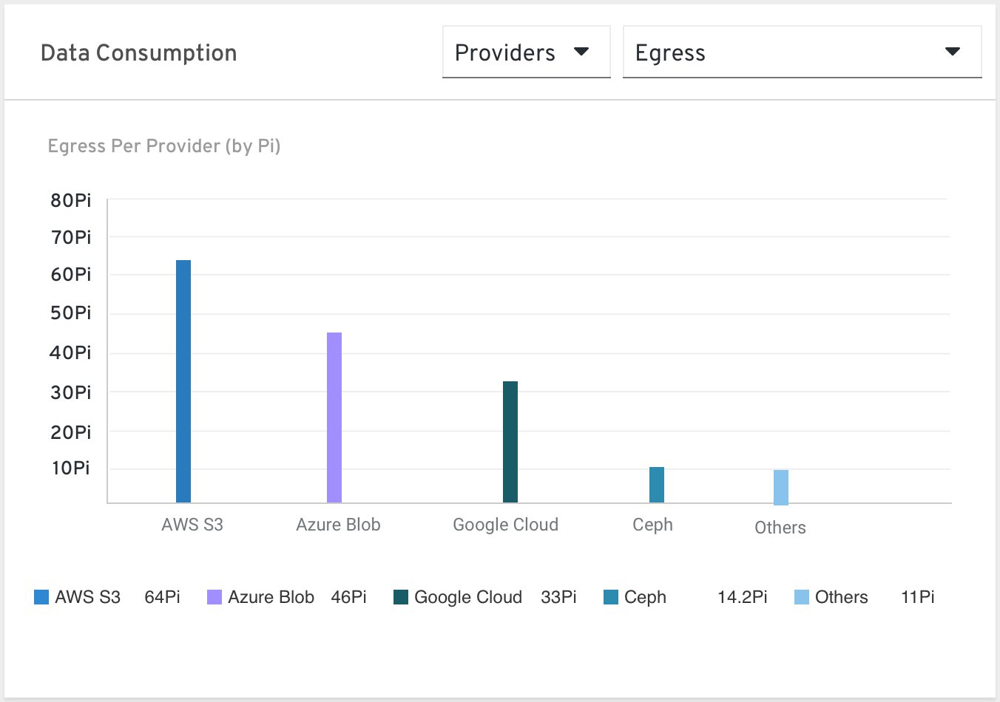

The size of the data MCG read from each provider 
Why? Cost analysis.  Understanding the traffic in the cloud, allowing the user to compare with the cloud billing reports, optimize and improve resources allocation according to the egress pattern and perhaps consider changing the selected resource type.
    
### Providers> Physical vs. logical usage

Show the data consumption in the system by comparing the raw usage (physical) vs. the logical usage. Raw usage refers to the actual size that the buckets in the system are utilizing from it's resources including data resiliency replicas or fragments. 
Why? Allows the user to control storage efficiency and allocate appropriate resources according to usage characteristics.

## Data Resiliency Card
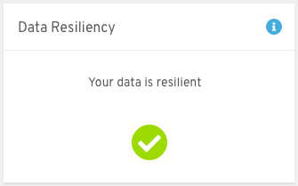 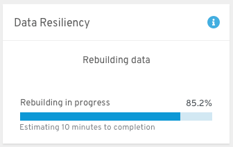

In this card we will show if there is any resiliency issue in MCG/Noobaa. For any rebuilding process we will show a progress bar that indicates the progression. Time estimation will be shown as well if available.

## Capacity Usage Card
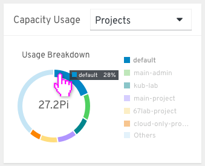

Show a breakdown by pie chart of the usage of the object storage by projects/ Bucket Class.

## Data Reduction Card
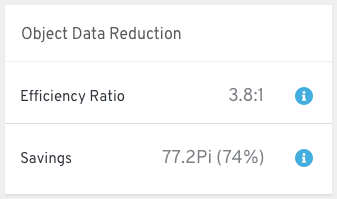

In this card we will show the data optimization in MCG which consist of deduplication and compression. 

## Info icon texts:
- **Resources Providers:**

  A list of all MCG (Multi-cloud gateway) resources that are currently in use. Those resources are used to store data according to the buckets policies and can be a cloud-based resource or a bare metal resource. 

- **Health:**

  The object storage health state consists of the system’s data availability, buckets, and resources health and functionality.

- **Data resiliency:**

  Data resiliency is the ability of stored objects to recover and continue operating in the case of a failure. 
  Certain changes in the system (unavailable resource/ change of bucket policy etc.) cause an object to require a rebuilding process in order to stay resilient. 

- **Efficiency ratio:**

  Efficiency ratio refers to the deduplication and compression process effectiveness. 

- **Savings:**

  Savings shows the uncompressed and non-deduped data that would have been stored without those techniques. 

