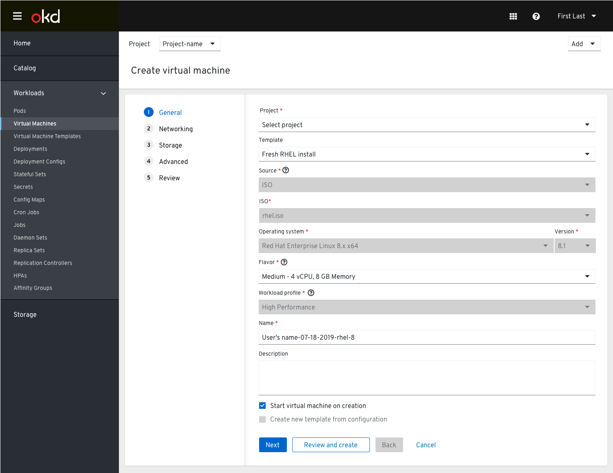
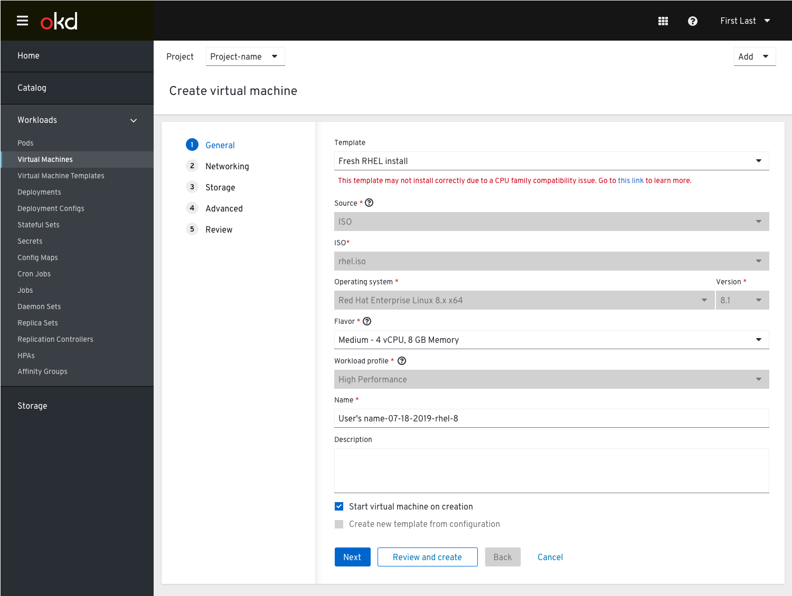
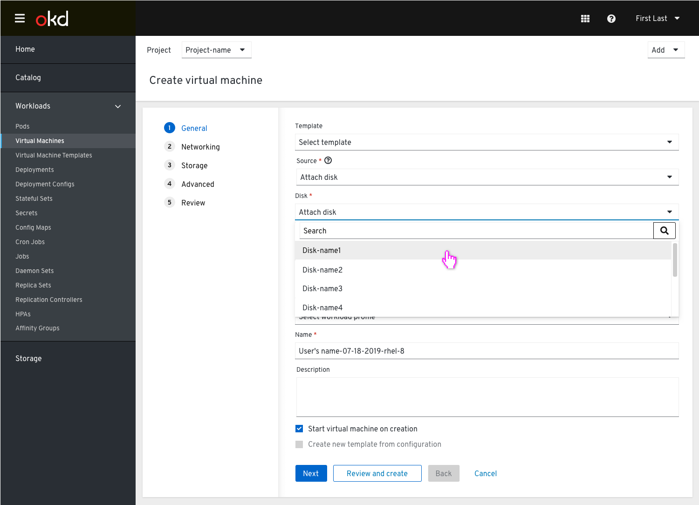
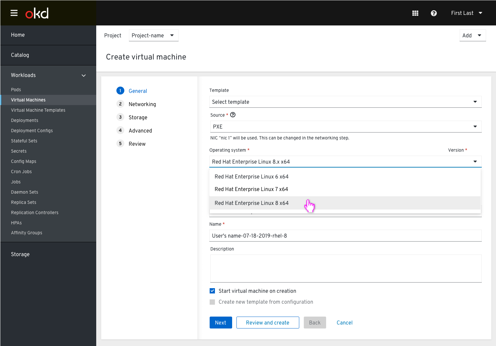

# Create VM Step 1: General

The wizard has 5 steps: General, Networking, Storage, Advanced, and Review.

The first (alphabetical) template is selected by default if available. Provision Source, Operating System, Flavor, and Workload Profile are pre-filled by the template, but only Flavor can be modified between either the predefined option or custom. The user can switch to a different template, or choose the top-most “None” option to not use a template at all.

The “Start virtual machine on creation” checkbox will do exactly that. The “Create new template from configuration” checkbox will be enabled if the user changes the Provision Source, OS, Flavor, or Workload Profile fields.

Once a name is provided the user can create the VM via the "Create virtual machine" action. Clicking this button will immediately bring them to the “Review” step and initiate the creation/import process.

If the user modifies the OS, Flavor, or Workload profile, the “Create new template from configuration” checkbox will no longer be disabled.

## Fields

## Namespace field

If the user initializes this wizard while viewing “All Projects” without a specific namespace selected, a new required Namespace field should appear above the template dropdown.

## Template Field

### Template selected

Template automatically loads the first (alphabetical) template and fills in the Provision Source, Operating System, Flavor, and Workload Profile. Only Flavor can be changed by the user between the template-defined default (Medium in this case) or Custom.

### Template error

Every template should be shown within the Template dropdown. If the selected template will not be able to run on the cluster (because the CPU family is incompatible or a Machine Type is unavailable) a warning message should be shown with a link to relevant documentation.

### Template modified

When a template has been modified the template field will reflect this by appending -modified to the template name.

### No Template State

If no templates are available the Templates field should be disabled with inner text of “No template available”.

Because a Provision Source has not been chosen, the OS, Flavor, and Workload Profile dropdowns should be disabled.

As soon as the OS, Flavor, or Workload profile fields are modified, the “Create new template from configuration” checkbox will no longer be disabled.

## Provision Source Field

### ISO (this is not implemented yet, but is planned)

Provision source tooltip content: Use an optical disk image that contains installation media for an operating system.

ISO enables the user to install an Operating System from existing installation media within ContainerDisk.

The user must select an ISO and then manually specify the OS, Flavor, and Workload Profile. None of those fields can be automatically pre-filled.

### PXE

Provision source tooltip content: Discover provisionable virtual machines over the network.

PXE enables the user to install an OS and configure it over a network. PXE depends on DHCP to find the PXE Server on an L2 Network. If one is detected, it will automatically be selected in the Networking step (see Networking section) and a note will be displayed below Provision Source.

If a PXE-capable NIC cannot be found, one will be automatically created with the name “PXE” and selected by default.

### URL

Provision source tooltip content: An external URL to the .iso, .img, .qcow2 or .raw that the virtual machine should be created from.

### Container

Provision source tooltip content: Ephemeral virtual machine disk image which will be pulled from container registry.

Container allows the user to provide an image from container registry.

The user must provide a container image and then manually specify the OS, Flavor, and Workload Profile. None of those fields can be automatically pre-filled.

### Attach Disk

Provision source tooltip content: Select an existing disk that has been previously cloned or created.

When selecting `Attach disk` the user will be prompted to select an available disk that has been previously cloned or created and made available in the Persistent Volume Claims. They must manually specify the OS, Flavor, and Workload Profile. None of those fields can be automatically pre-filled.

This list is populated by making a PVC available as a provision source for a virtual machine. This list is limited by the namespace it belongs to. These lists have the potential to be very long so a search field can help alleviate scrolling.

## Operating System Field

Recommended minor version editing

Only major version numbers are shown in the OS dropdown. The user selects one.

In situations where the minor OS version could be important (like versions of RHEL), a new dropdown for the minor version should appear next to the major version dropdown.

The latest recommended version should be pre-selected.

If the user changes the minor OS version to something else, a warning appears with a link to relevant documentation about what functionality may not be supported in earlier versions of the OS.

When a Windows OS is selected this field shows to alert the user and to allow them to see the details in the virtual hardware section of the Advanced step.

## Flavor Field

The user can choose from four flavors:

* Tiny - 1 vcpu, 1 GB Memory
* Small - 2 vCPU, 4 GB Memory
* Medium - 4 vCPU, 8 GB Memory
* Large - 8 vCPU, 16 GB Memory
* Custom

The “Custom” flavor allows the user to define Memory and vCPU manually.

## Workload Profile Field

The user can choose from three workload profiles:

* High Performance
* Server
* Desktop

