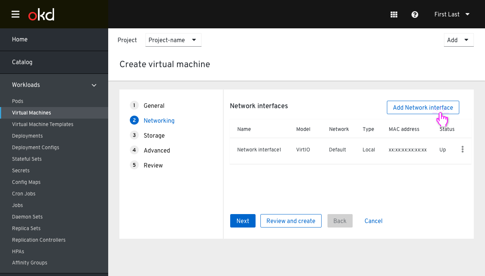
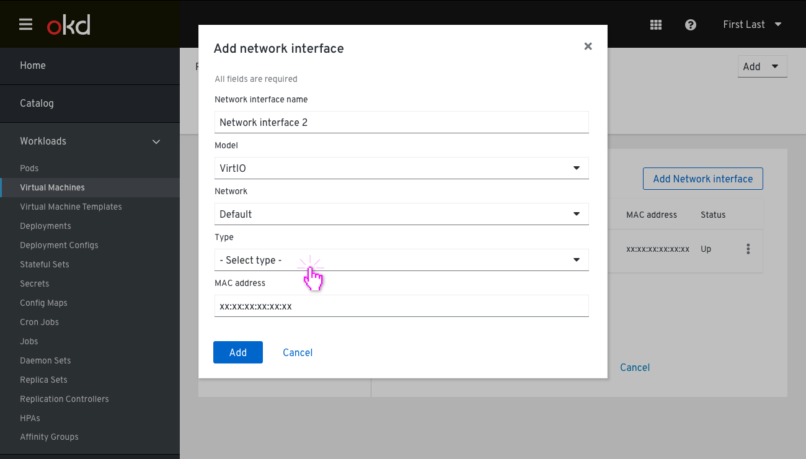
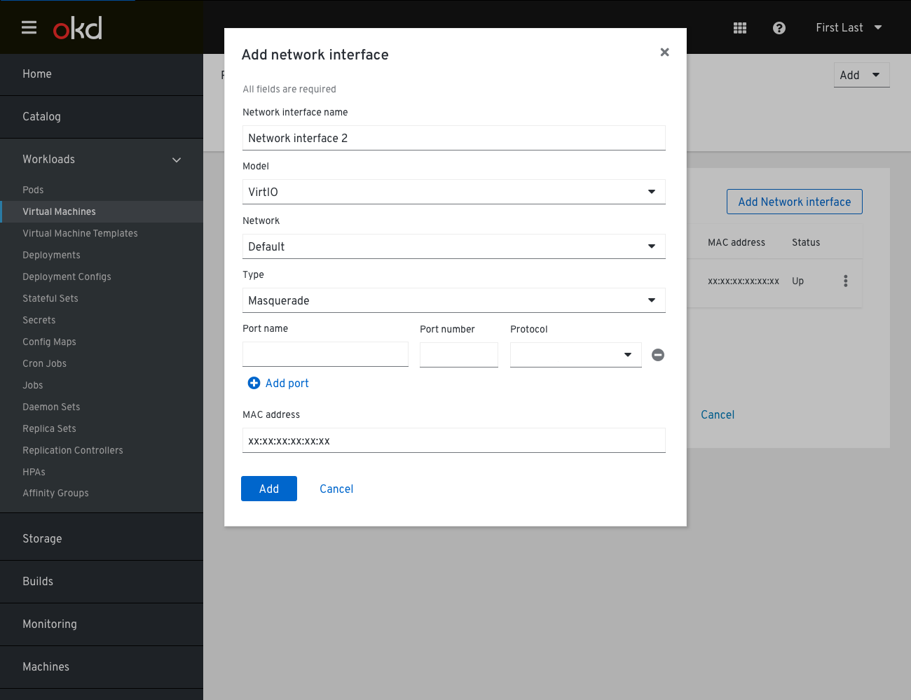
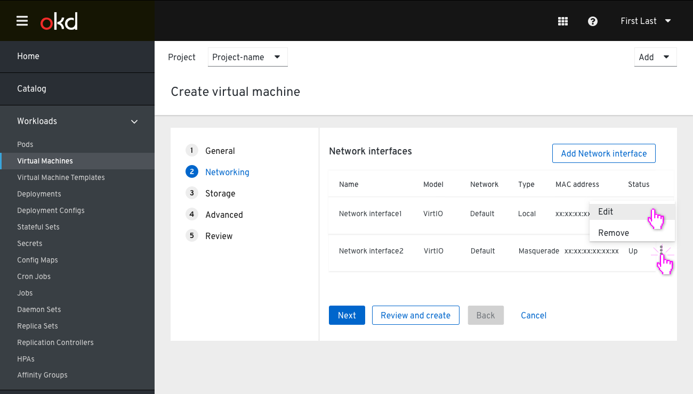
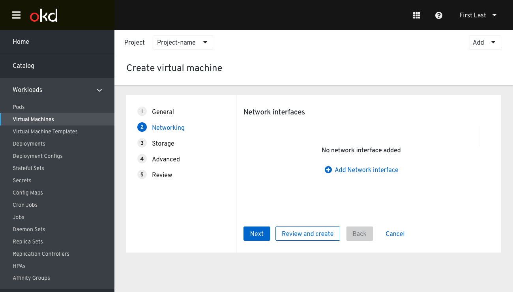

# Create VM Step 2: Networking

The user enters the Networking step with an existing  Network interface pre-defined, set to Type (local). In this step, the 'Review and Create' button is still available to skip the rest of the steps. At this point, the user can select to customize this Network interface, add new ones, or remove any they wish.

Clicking on 'Add  Network interface' will pop up a "Add Network interface" modal. The Network interface name is prepopulated with a numeric count form of existing Network interfaces on this flow but the user may change it. In order for the user to apply and add this Network interface, they must select one of the type options.
In case the user selects 'Masquerade' on the Type field, they can add multiple Ports.
In that case the user will get a list of Ports (port name, port number, protocol) which will be then forwarded and exposed to the virtual machine. The ports will be displayed in rows so the user can add or remove them.

The new  Network interface is added at the bottom of the list.
Clicking the kebab allows the user to edit or remove it.

On removing all Network interfaces, the Networking step enters an empty state.

