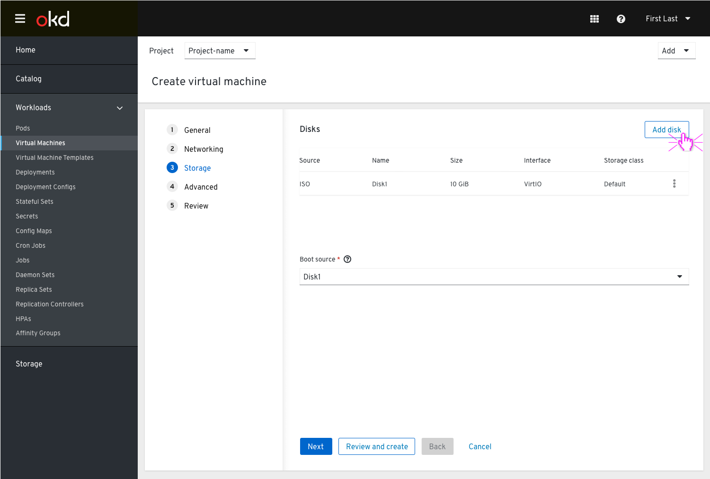
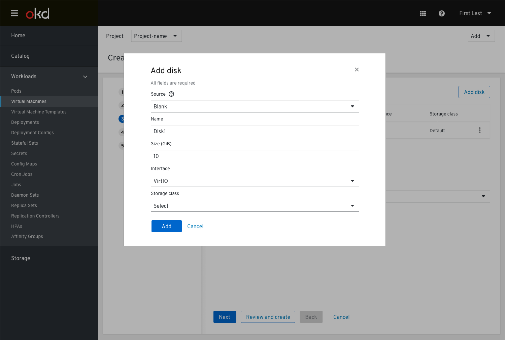
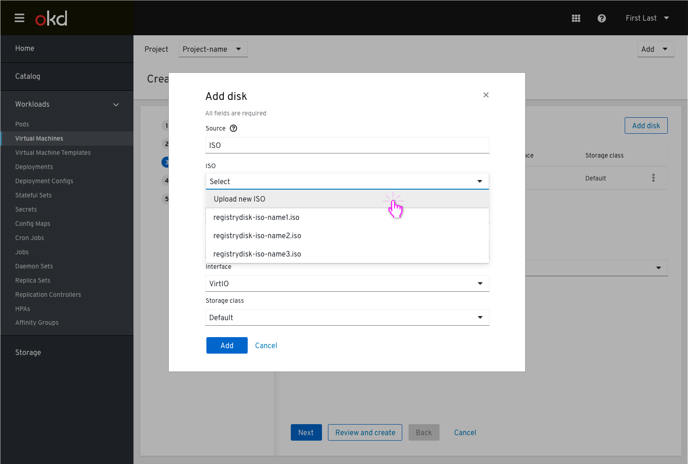
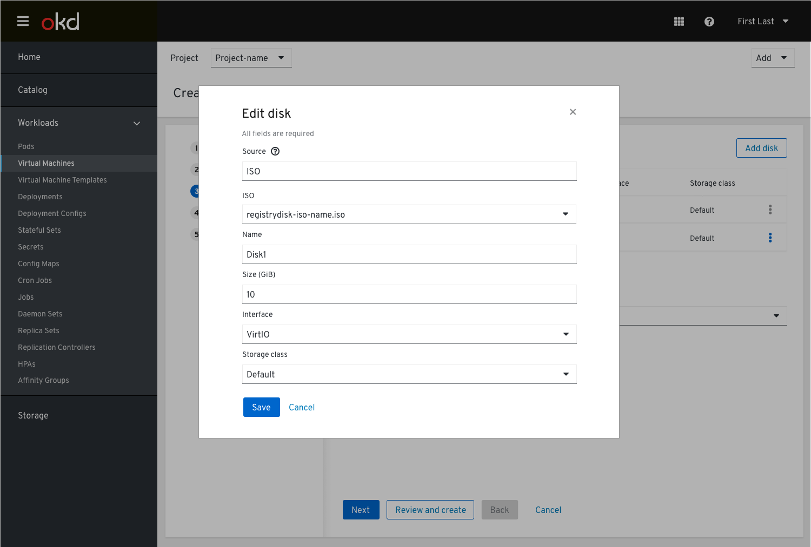
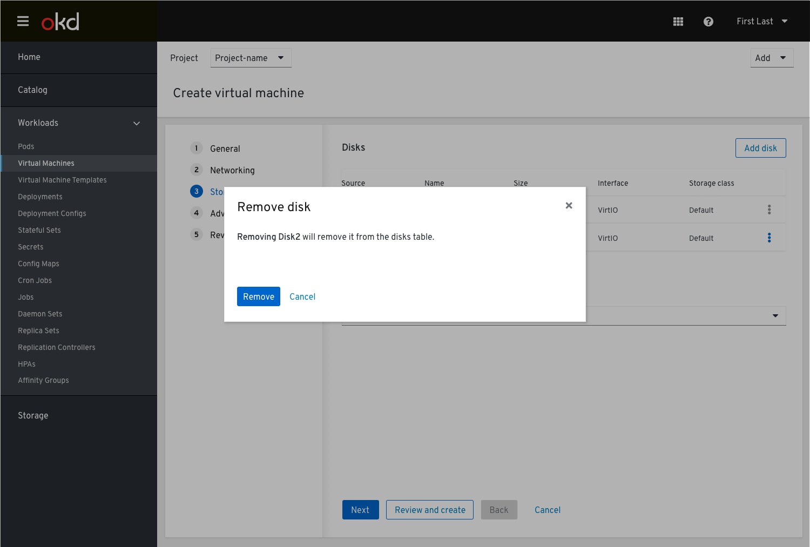
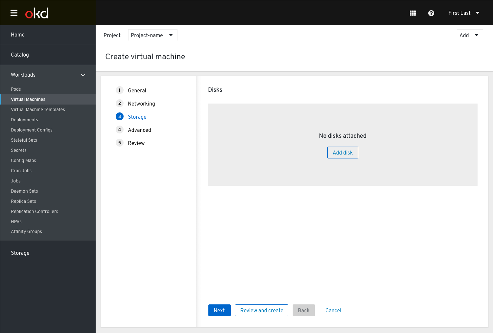
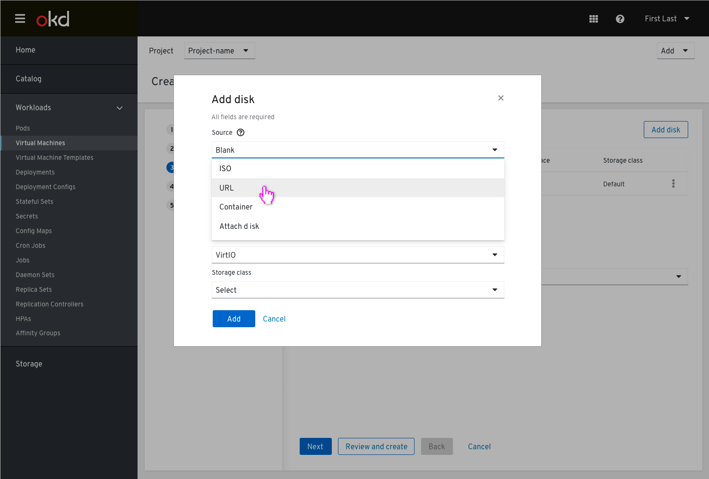
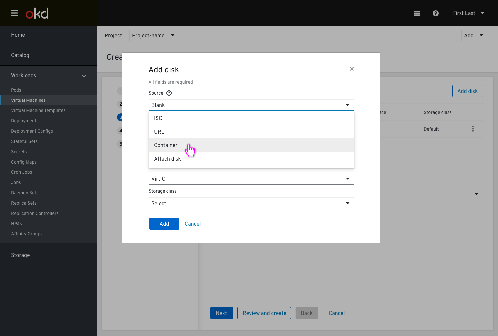
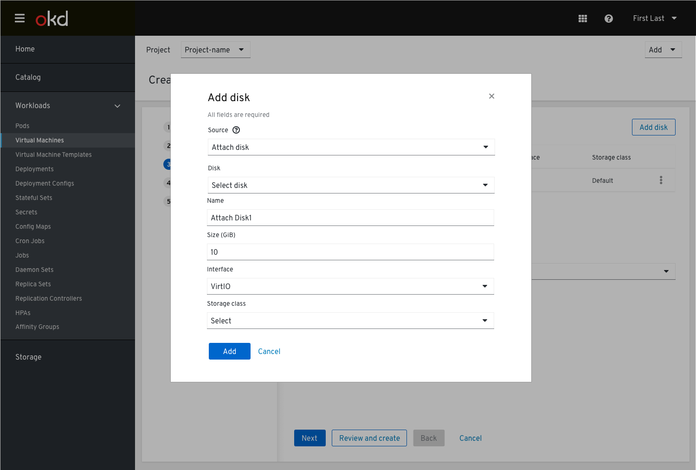

# Create VM Step 3: Storage

## Pre-populating fields

In the 'General' step, we allow the user to select the guest operating system. This could allow us to auto-fill certain fields (like disk bus and network interface).

The 1st screen of the storage section in the wizard flow will show the disks in a table view. The user can add a disk (this could be either a new disk or attach an existing one).

Once the user clicks the ‘Add disk’ button, a modal will be shown and the user can choose what kind of disk he/she wishes to add and fill in the details. The default selection will be a blank disk. The user is able to choose the type of disk from the Source drop down menu:
- ISO
- URL
- Container
- Attach disk

### ISO
In case the user selects ISO

and fills in the details in the additional required input fields that are added upon the type of selection.

The user can also upload a new ISO file that will activate the browser's file picker and then the filename would be shown in this "ISO" field.

Once the user completes the form and clicks apply, the disk is added to the top of the disks list table. Clicking the kebab will open a drop down menu where the disk can be edited in the modal form shown before.

or get removed

Before the disk is removed, the user will be provided with a notification

Any time the list of disks is empty (when no disk is available), the empty state will be shown.

### URL

In case the user selects a ‘URL’ from the data source drop down

### Container

In case the user selects a ‘Container’ from the data source drop down

### Attach

In case the user selects to attach ‘disk’ from the data source drop down

