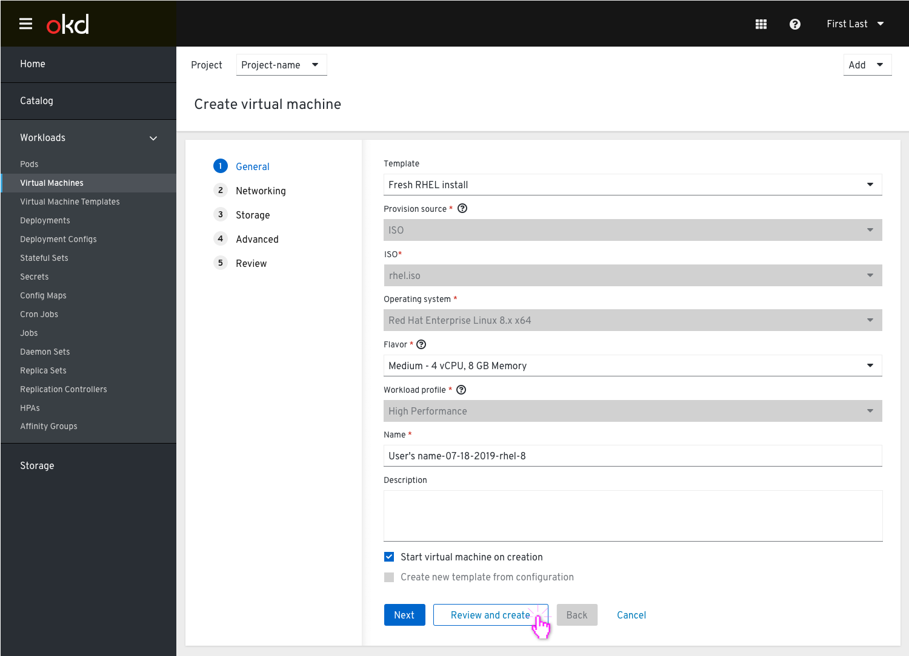
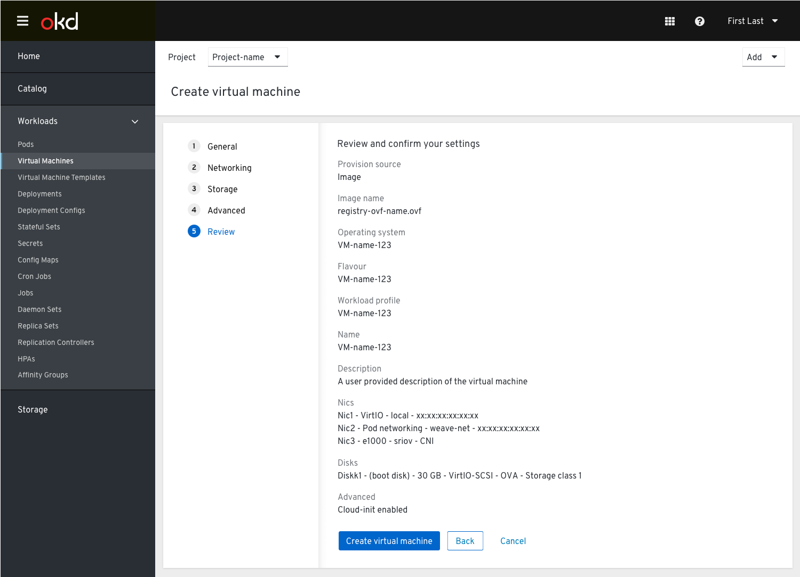

# Create VM Step 5: Review

Some things to note:

The “Create virtual machine” action has been updated to “Review and create”.
Once the user has clicked this button they will be taken to the Review screen to verify their settings.

The action “Review and create” is located in the footer with the other actions. The primary button is now "Create virtual machine" and the Next button has been removed.

The user would then see in the Results page the state of the VM (success or errors).

