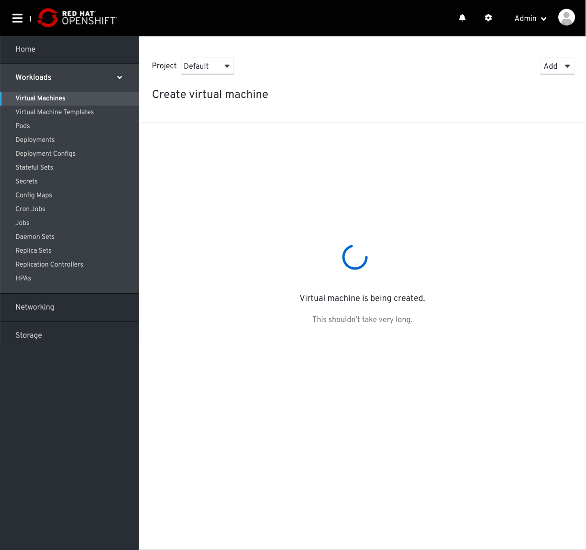
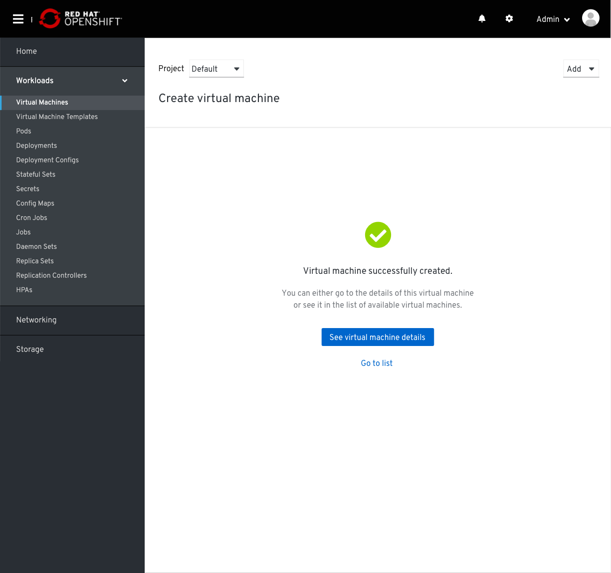
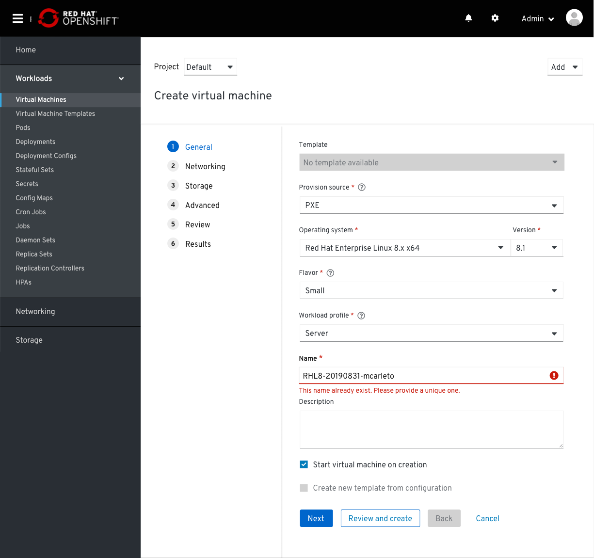
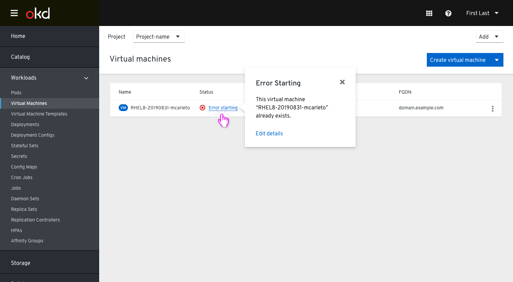
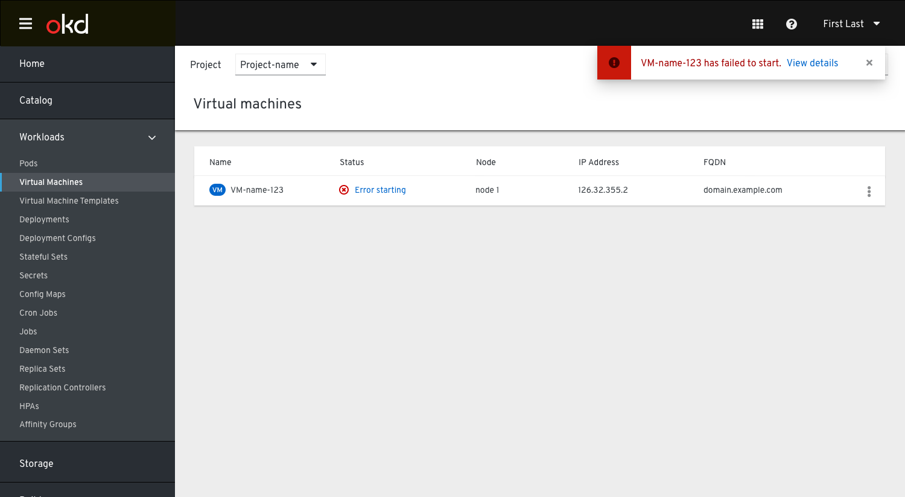
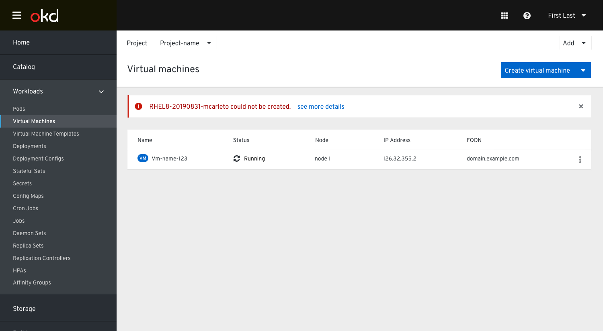

# Create VM Step 6: Results

Once the user has clicked "Create virtual machine" they will see the progress state of the VM being created.

Alternatively, The user could navigate away from this page, In that case they'd see the VM in the list in a starting state. This will rely on the VM successfully being created without issue. For more info on error/success states see below.

## Success State
If the process is successful they will see a success state on the Results page.

There is no navigation provided on this page because the user can not go back and make changes at this point. 
They are provided actions to either go to the VM details or view the VM list.

If they are looking at the list view they will see a status of `running` or `off` if the creation was successful. 

## Error State

If there is an error during the creation of the VM the results page will show a breakdown of the errors with links to the steps where the error exists. 

They will also see the YAML(s) available for review.

In the step that contains the error they would see the error state of the input they need to address.

Alternatively, The user could navigate away from this page, 
In that case they'd see the VM in the list in a error state. They would then be prompted in the status popover to edit the details and correct the issue. 

There is also the case where they could "try again" in a scenario where there was an issue with scheduling or something similar. 

This would rely on the VM being in state that it exists, otherwise it would not show in the list at all.

If they have navigated away from the list they would be alerted via a toast notification that there is an error and they need to go back to the vm to see the details.

 This toast would not be shown if they wait for the vm to be created in the wizard.

An alternative to this could also be an inline notification that shows on the list page that alerts them and allows them to go back to the VM and correct the issue.

