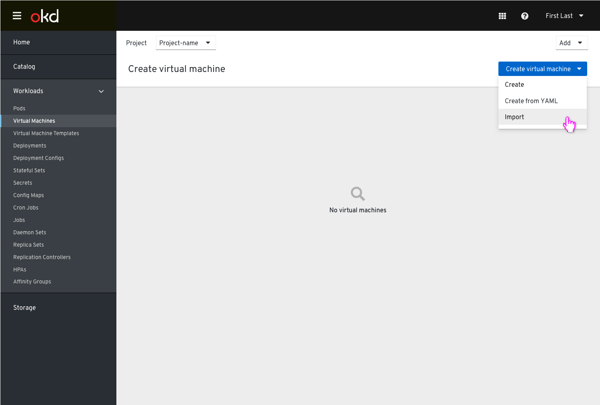
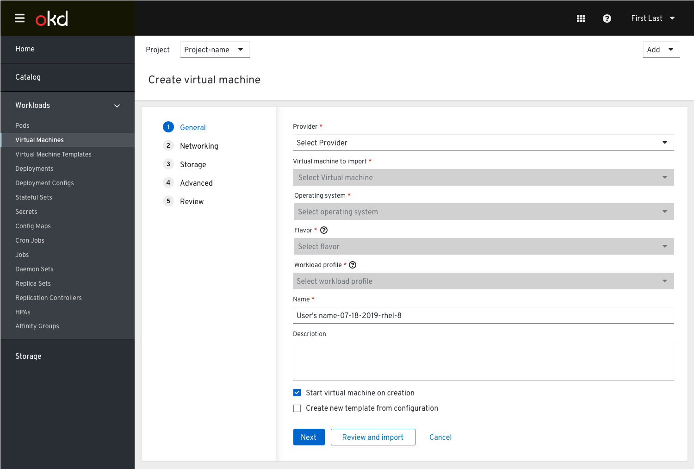
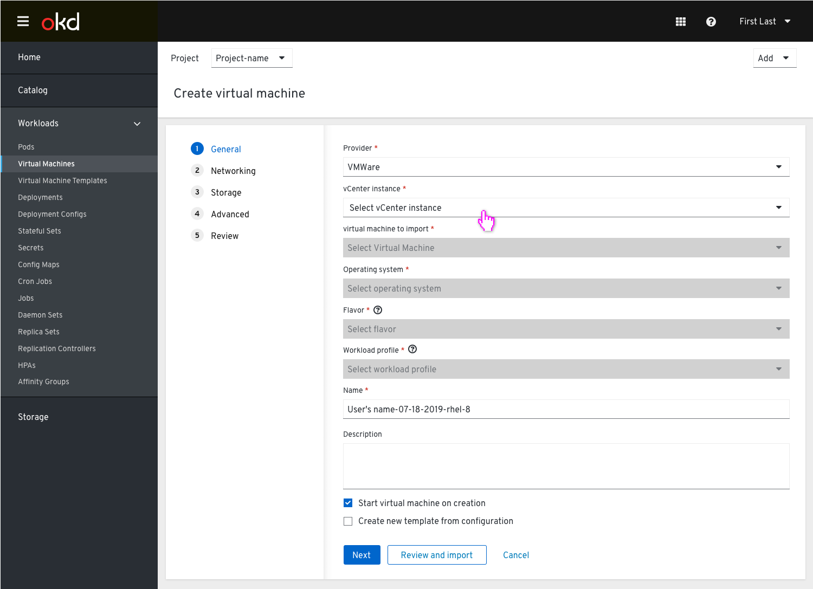
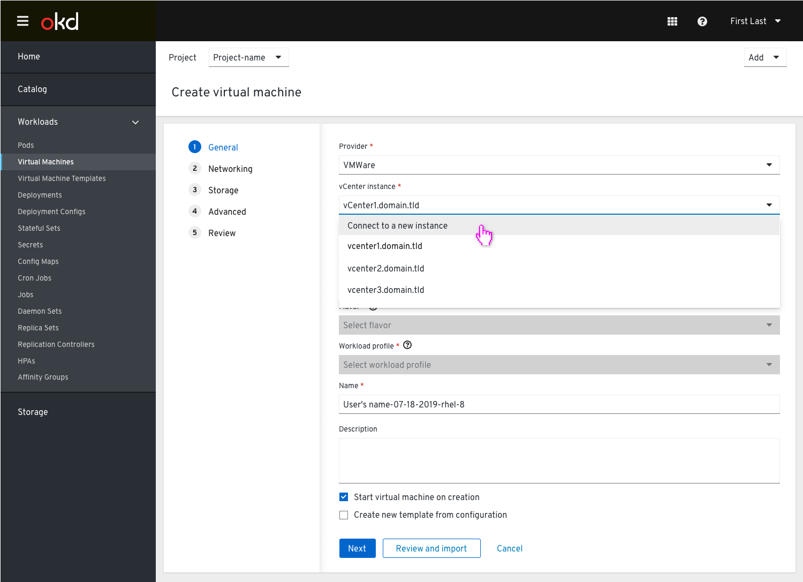
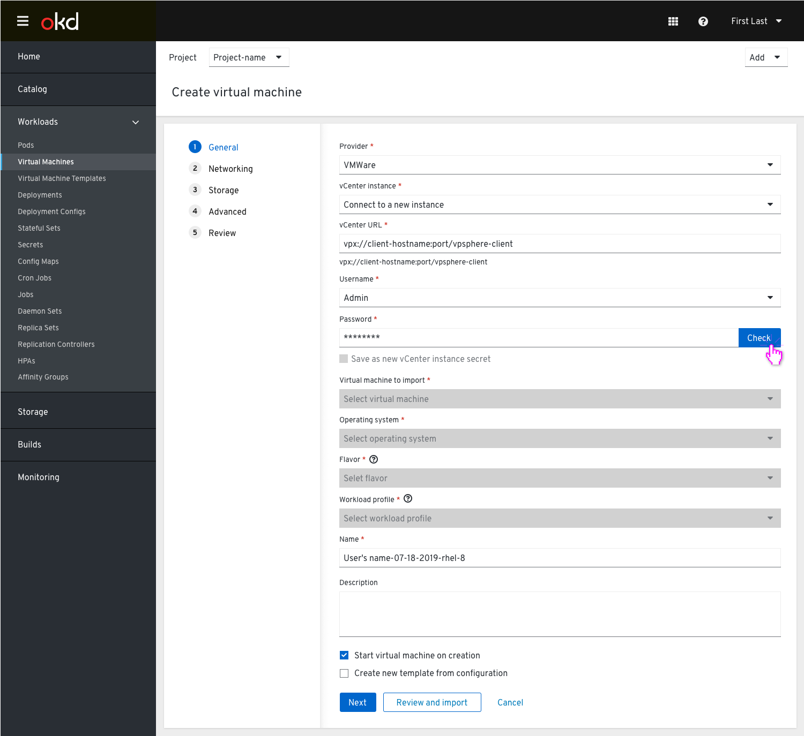
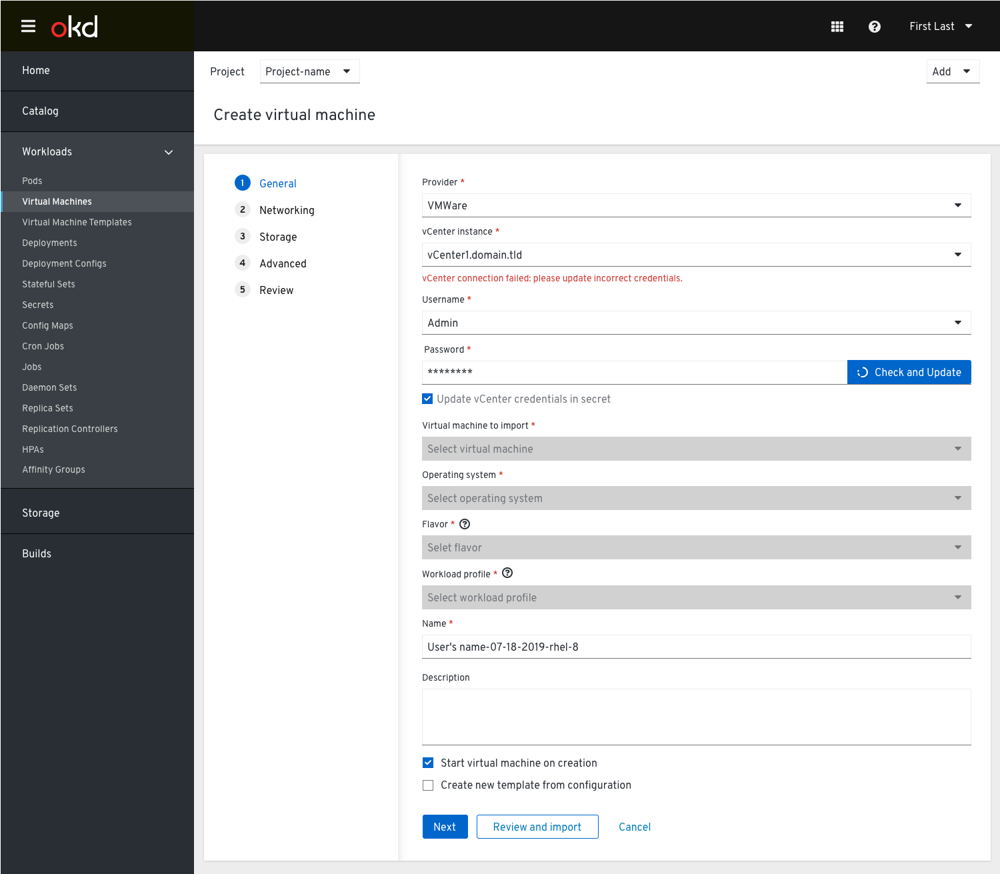
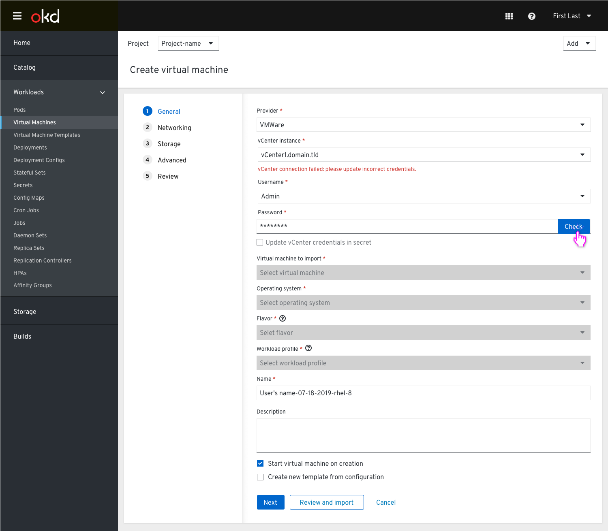
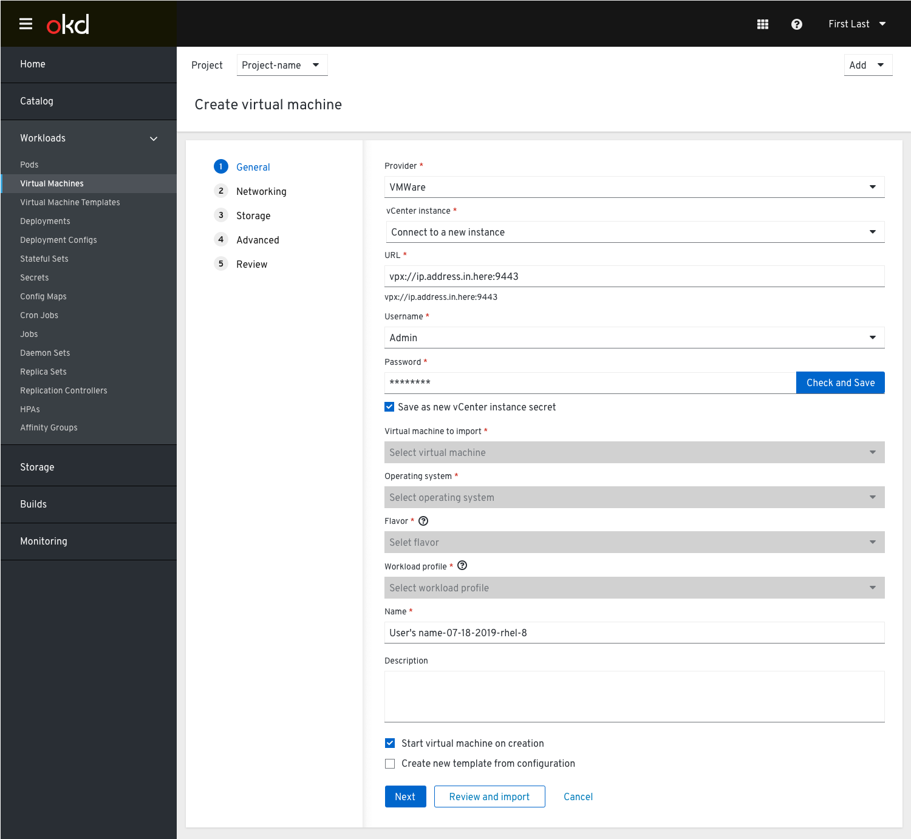

# Import VM

The ‘Import virtual machine’ action will be available in the ‘Create virtual machine’ dropdown.

### Selecting provider

The Provider is chosen (in this case VMware is the only one available).

### Selecting vCenter instance

Once VMware is selected a new vCenter instance field appears. The user clicks it to see a list of previously-connected vCenter instances that have been stored as Kubernetes Secrets. The user selects one.

### Connecting to new instance

The user can also connect to a new vCenter instance by selecting ‘Connect to new instance’ from within the dropdown.

New fields for vCenter URL, vCenter Username, vCenter Password, and VM to import appear along with a checkbox to ‘Save as new vCenter instance secret’. This would be creating a new secret so it would be unchecked by default.
The vCenter URL field should include a syntax hint with the desired formatting. The user is likely to paste a variety of URLs, so any FQDN the user submits should be validated and automatically corrected before being used to communicate with vCenter’s API.

When the user clicks the “Check” button a spinner icon appears within the button to indicate that the credentials are being checked.

### Selecting virtual machine

When a vCenter instance is selected, The ‘Virtual machine to import’ dropdown is available with all the available VMs.

### vCenter connection error

If the wizard cannot connect to the vCenter instance using the credentials stored within its Secret, an error message will be displayed. If the credentials are incorrect they can update them. If they check ‘update vCenter credentials secret’ the action will be ‘check and update’. This should be the default because they have already created this secret. This allows them to update the secret without having to leave this flow.

Once the credentials are checked and updated the username/password fields collapse, and upon successfully updating the credentials, a "Credentials successfully updated" text will show under the vCenter instance dropdown.

If the user un-checks the checkbox the action label will become ‘Check’.

### Save credentials

The Save as new vCenter instance secret checkbox becomes enabled to allow the user to save them as a new Kubernetes Secret.

If the wizard fails to connect to vCenter using the provided credentials, an error similar to the one above for an invalid vCenter instance should be displayed directly below the vCenter Password field.

### Virtual Machines available from new instance

If the connection to vCenter succeeds, the instance details collapse (URL, Username, Password). The ‘Select virtual machine to import’ dropdown will then be populated with the available VMs.
With a virtual machine selected, the user can either quickly skip to Step 5 “Review” by clicking the “Import Virtual Machine” secondary action button, or click “Next” to proceed through the rest of the wizard.

