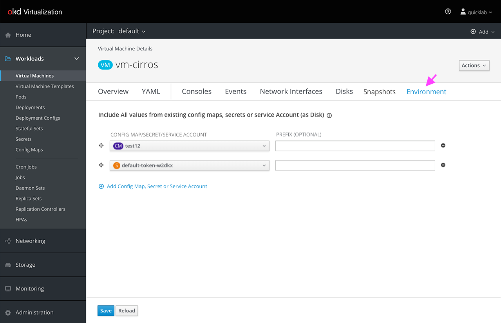
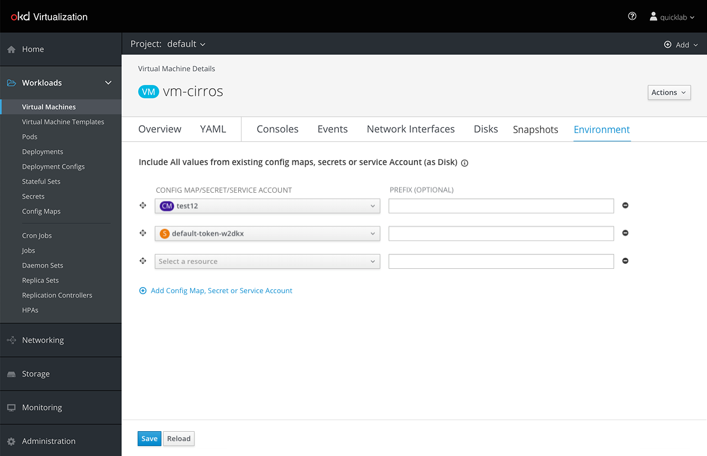
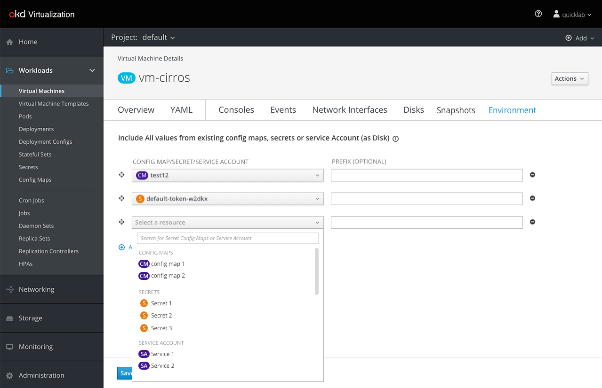
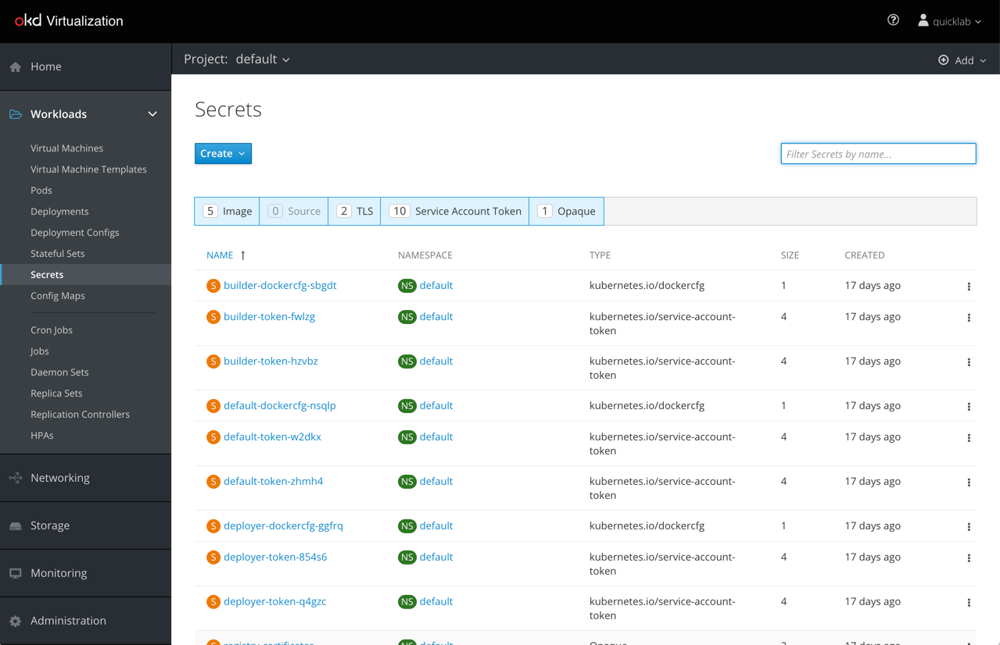
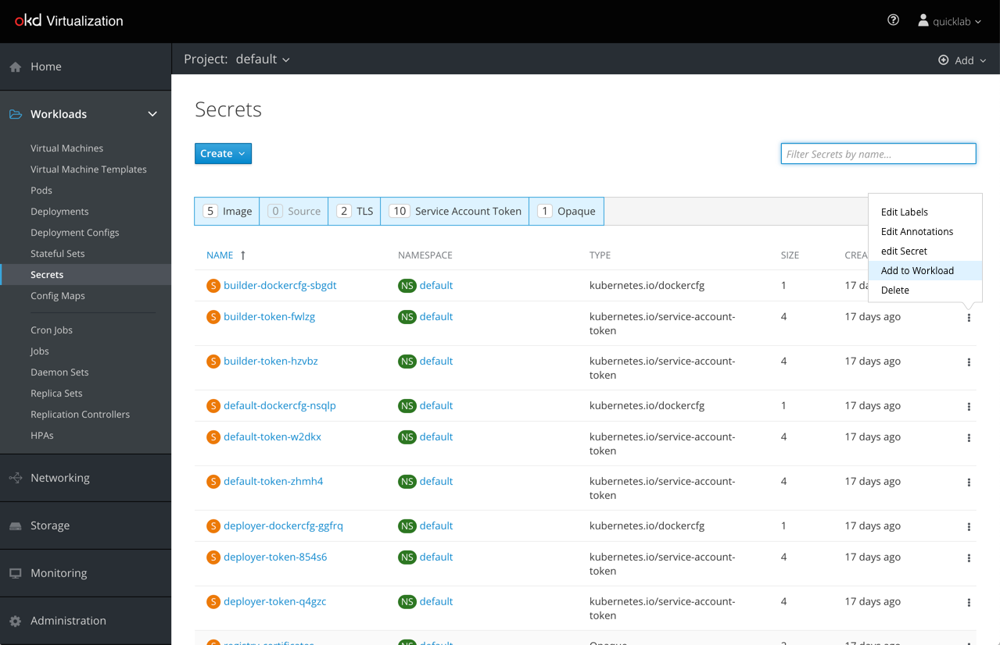
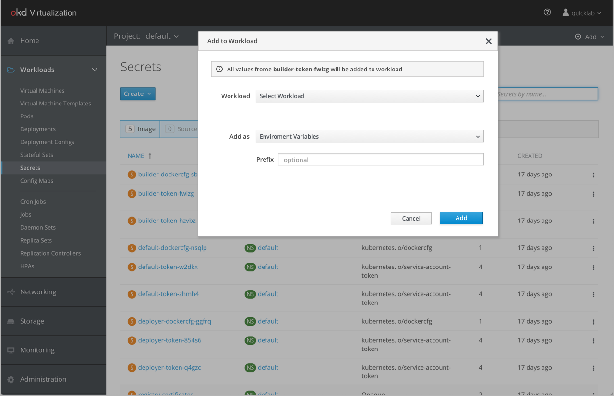
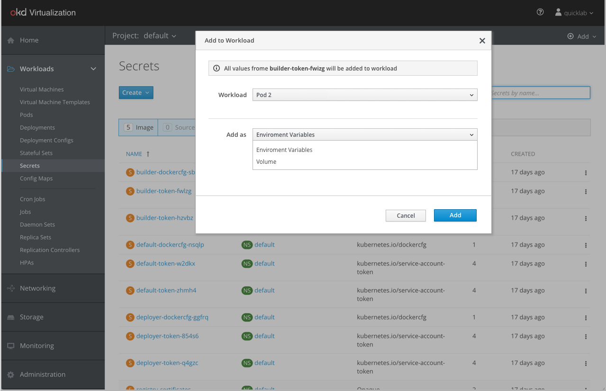
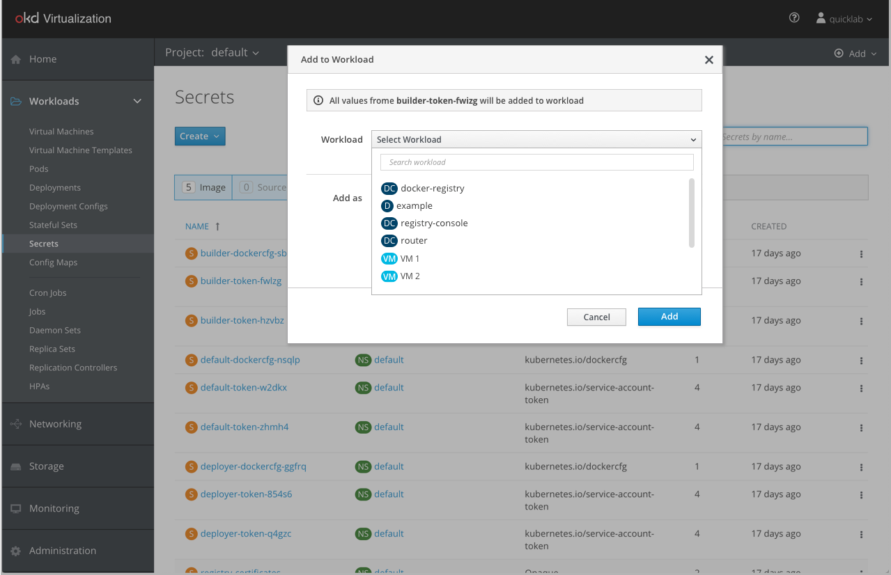
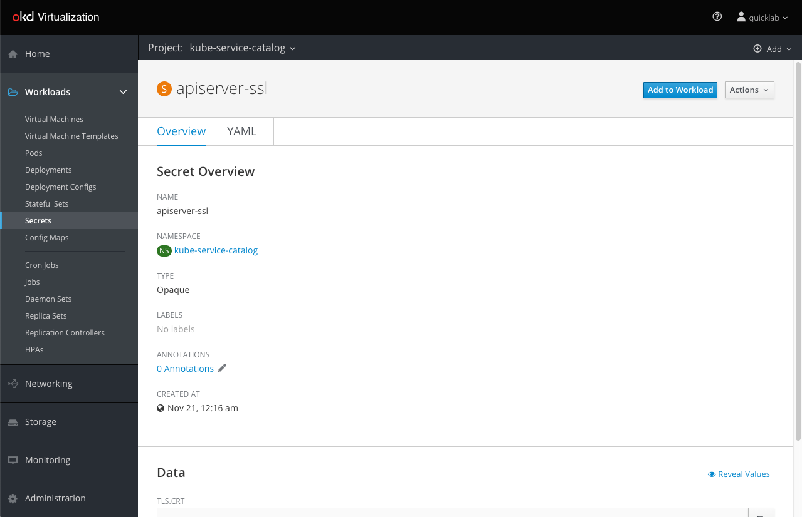
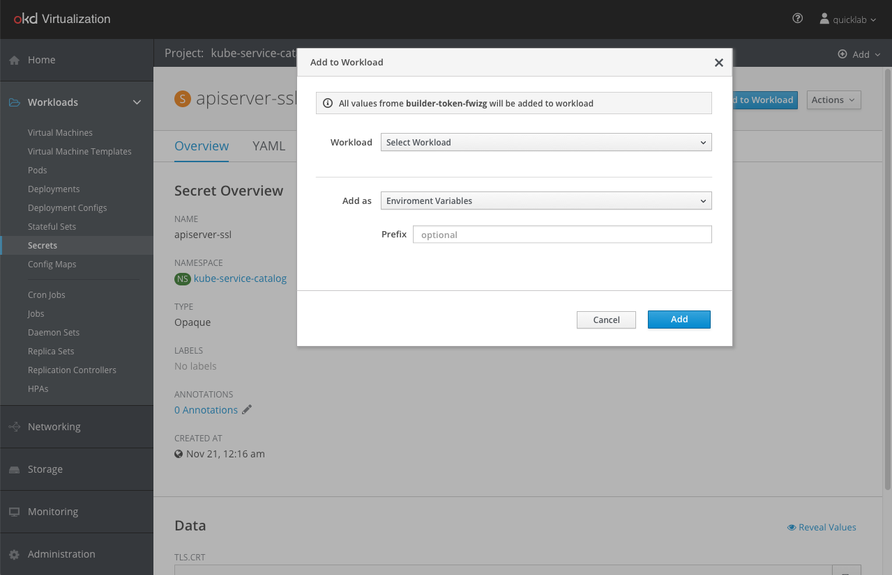

# Expose Secret, Config Maps and Service Accounts as Disks

Kubernetes Secrets, Config Maps, and Service Accounts can be exposed as VM disks allowing better integration of Virtual Machines with Kubernetes resources.

A similar process already exists when attaching Secrets or Config Maps to a deployment config. This happens in the “Environment” section under deployment and deployment config. The Secret/Config Map can be added as an environment variable or as a volume.
The idea is to be consistent by doing similar processes in the same way across the tool. To support that, we added an “Environment” tab under the VM to handle the attached Secrets, Config Maps and Service Accounts.

## Add “Environment” tab to handle the attached Secrets, Config Maps and Services Account

The user can add more Secrets/Config Maps/Service Accounts:

## Expose From Secrets/Config Maps/Service Accounts Lists

The "Add to Workload" kebab menu action brings up the "Add to Workload" modal.

In OpenShift, there were two ways for attaching Secrets or Config Maps to a workload: 1) as an environment variable 2) as a volume.
We added a third option to support VMs that is called “Disk”. This option will be available only when selecting a VM in the workload dropdown.

When selecting a VM in the workload dropdown the selection in the “Add as” menu will automatically change to “Disk”. The “Disk” option won’t be available for Deployment or Deployment Config workload.

## Expose From Secret/Config Map/Service Account Detailed Page

The process is practically the same as adding from the list, only now we are doing it from the detailed page of the Secret/Config Map/Service Account.

Clicking the “Add Secret to Workload” button will open the same menu we saw in the lists section above.

