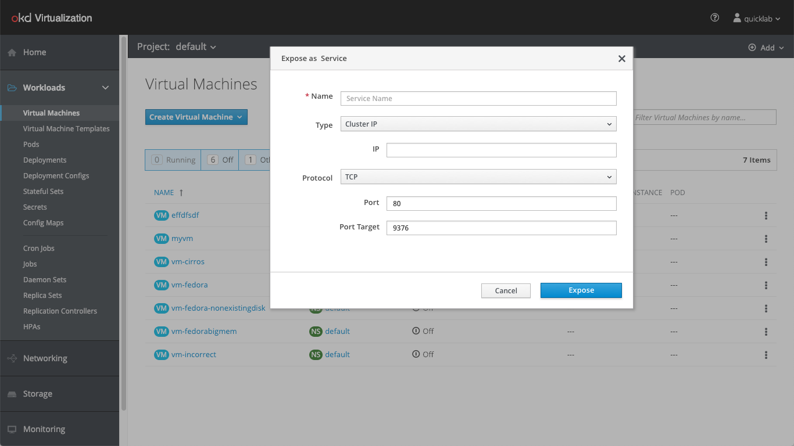
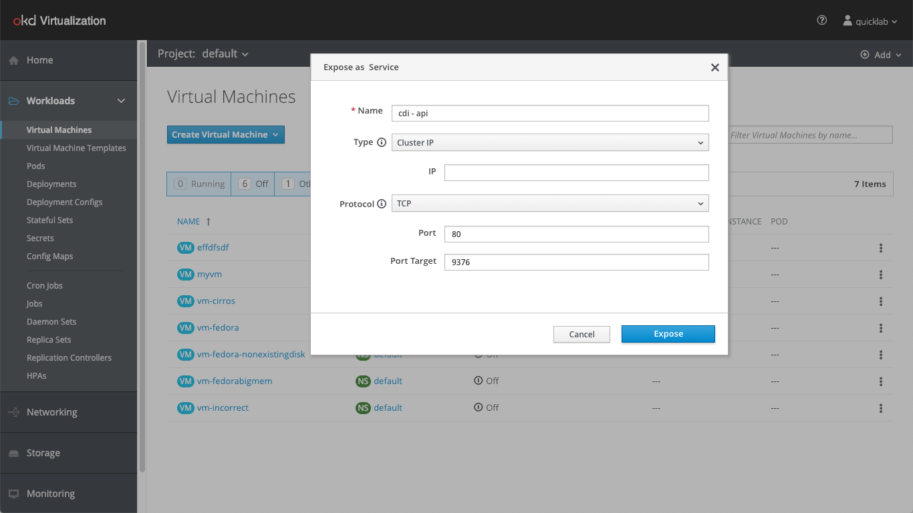
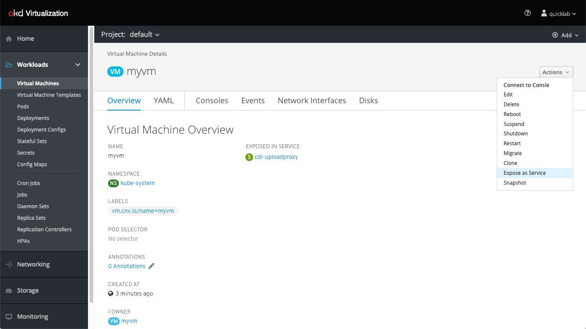
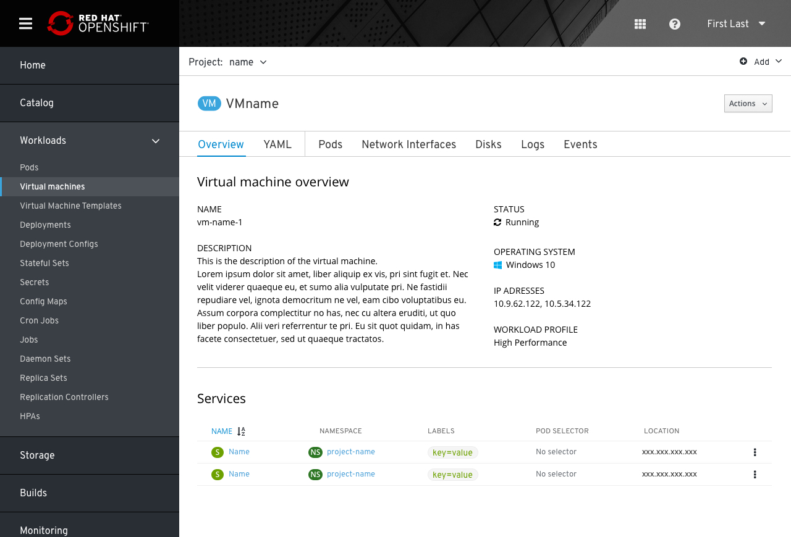

# Expose VM as a Network Service

The user should be able to expose VM as a Service. This means that they would be exposing some of the ports on its default interface to the cluster internally or to the outside world.
In order for it to be actually useful, we need to bind it to a service.

## Expose From VM List

We added a new action called “Expose as Service”. Clicking on that will open the Expose as Service popup.

The user can select between 3 Service types:
-  Cluster IP (Default) - Exposing the VM to inside the Cluster 
-  Load Balancer - Exposing the VM to the Internet 
-  Node Port - Exposes the Service to the Internet on the same port of each selected Node in the Cluster
Depending on which Type is chosen, then options will change (f.e. some indented options are only required when certain options are selected from the dropdown).

The user can choose between TCP or UDP protocol. 
TCP (Transmission Control Protocol) guarantees delivery of data and also guarantees that packets will be delivered in the same order in which they were sent.
TCP is connection oriented, whereas UDP (User Datagram Protocol) is connection-less. This means that TCP tracks all data sent, requiring acknowledgment for each octet (generally). 
UDP does not use acknowledgments at all, and is usually used for protocols where a few lost datagrams do not matter.

The name is the only required field in the menu. All other parts can be predefined, meaning they will have a default value using Kubernetes capabilities.

The Service is ready for use. The user can see it in the Services list.

## Expose From VM Page 

The user would go through the same flow.
The Service is ready for use, and the user can see it in the Services list.

### Services on the Overview tab
With this placement the user can view what services are exposing a resource, if any. The user can also take actions with any service or create a new one

- Services exposing a VM will be displayed in the overview tab of that VM, in a dedicated section.
- Services section will use the same list view as in Services tab on the primary navigation
- Users will be able to create a new service and expose the VM by using the main action button on the top right of the VM page
