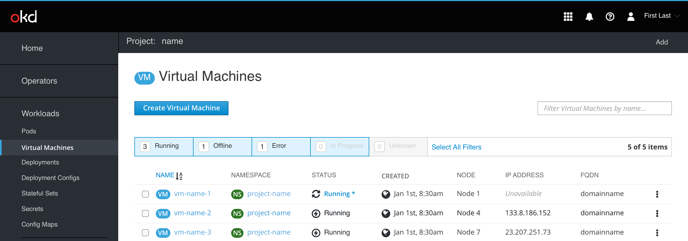

# Guest Agent not installed

The purpose of this document is to show what a VM would look like without the guest agent installed. 

In the list view we show the Running* status text in blue to indicate that it's clickabe. Clicking on it will show a popover with additional info and a "Learn more" action at the bottom-left corner, that would link to documentation about installing guest agent.

 
