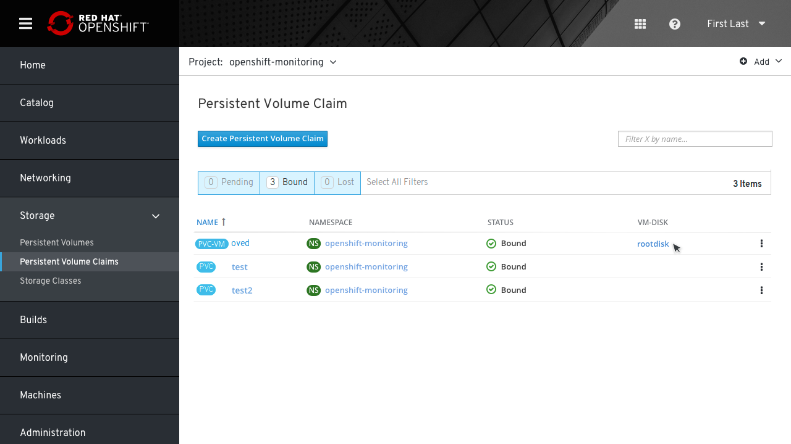
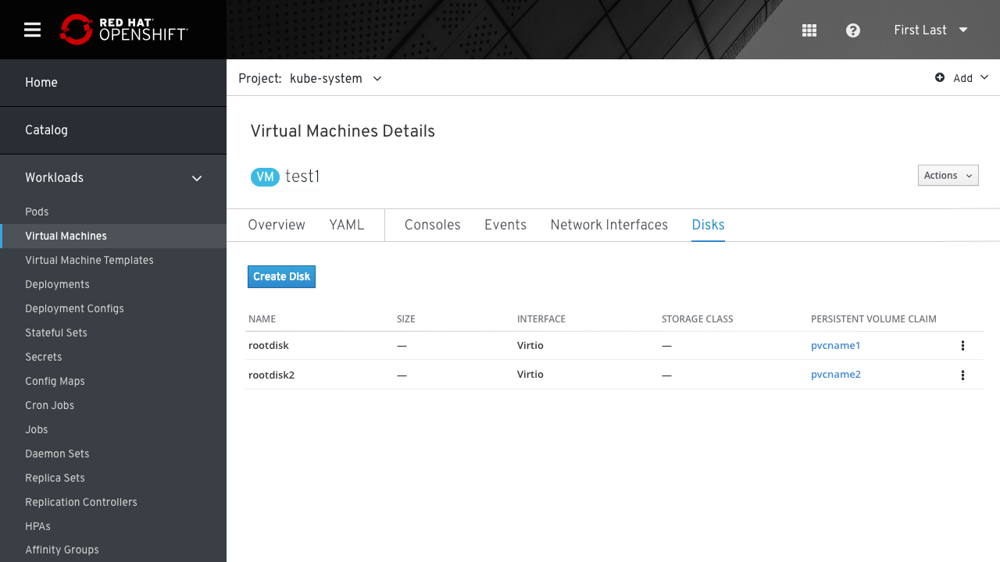
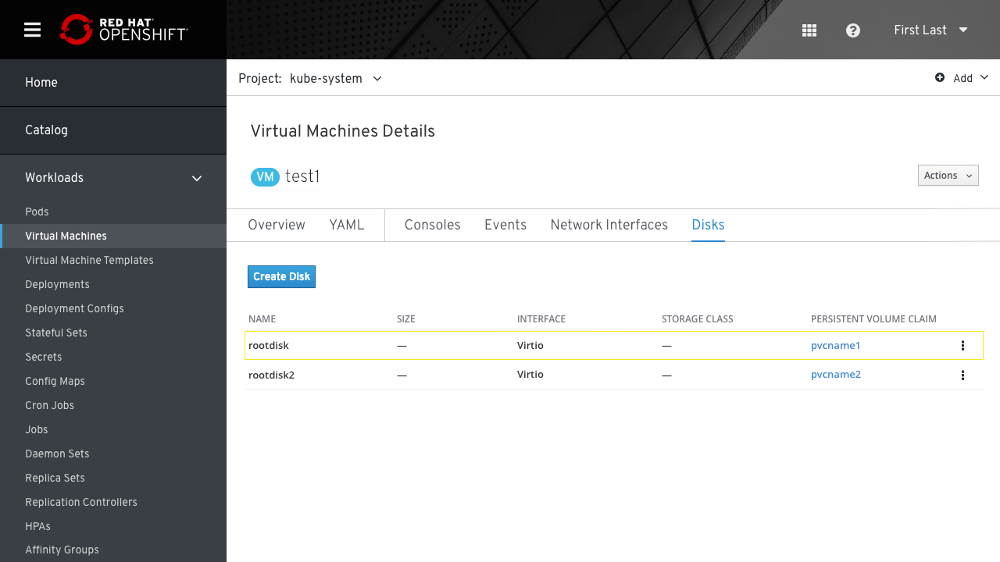

# Link between PVC and VM Disk

In some cases, a disk is being backed by a Kubernetes Persistent Volume Claim (PVC).

We need to show that a Disk is backed by a PVC and then link over to that PVC.

We also thought to link the other way: if the user happens to be looking at the PVCs, we would want to link to a VM making use of a PVC.

## Linking from PVC to Disk

From the PVC page, we add a link to the table only if CNV is installed (or maybe even only if there are VMs) that will link to the VM.
Under the "VM DISK" column there will be a link to the Disk name.

## The Selected VM Disk

Since we can't link directly to a specific VM disk details and can only link to the disks list page, we add a link to the PVC back up details in another column of the table.

We can highlight the row of the selected VM disk for a moment and then fade it.

