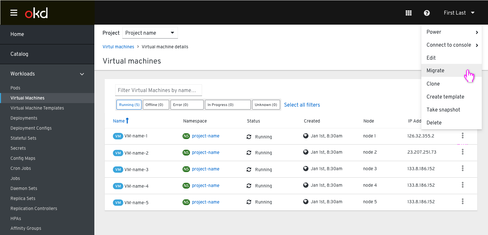
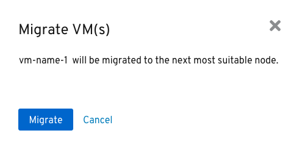
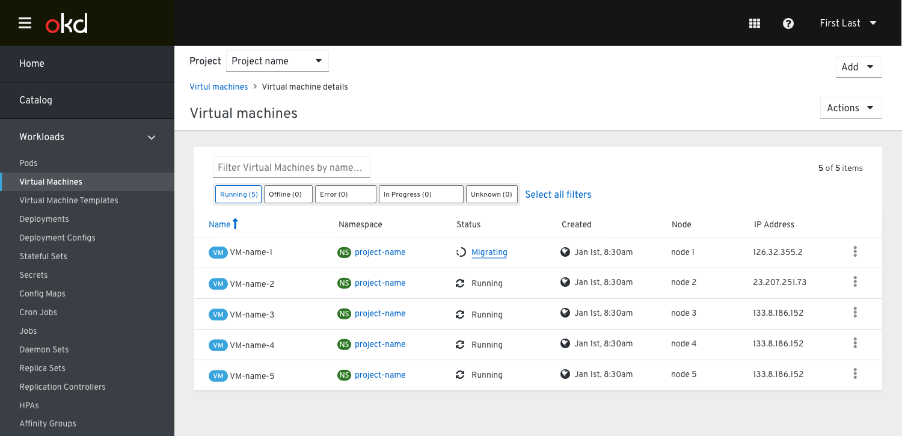
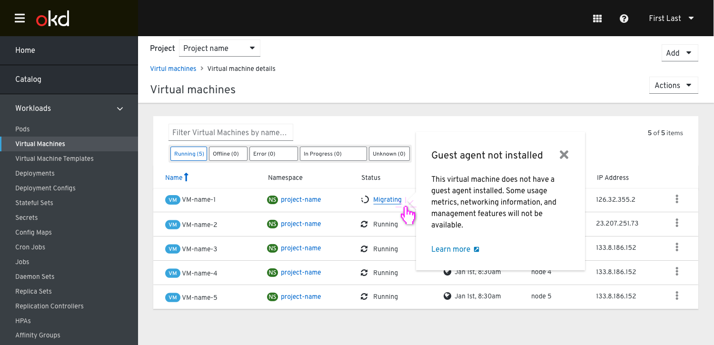
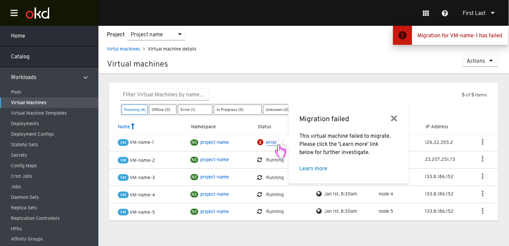

# Migrate VM

Clicking the action button next to any Virtual Machine in the List will present the user with the option to migrate the VM to another node.

When `migrate` is selected the user is presented with a confirmation dialog that requires them to confirm the migrationlet and clarifies that this VM is migrated to the next most suitable node.

 After the migration had started, the status of the VM in the list view will be updated to reflect that the migration has already started.

 

 Clicking on the status will show a popover with additional explanation and an option to click on the link below to learn more.

 

Once the migration has finished the 'migrating' status icon will be changed back to 'running'.

There will be no notifications for succssfully completed actions.

On error, the user will be provided with a toast notification letting them know the migration failed. This will also get reflected in the VM's status (updated to an error state) and clicking on it will show a popover with additional explanation and a link to learn more.

