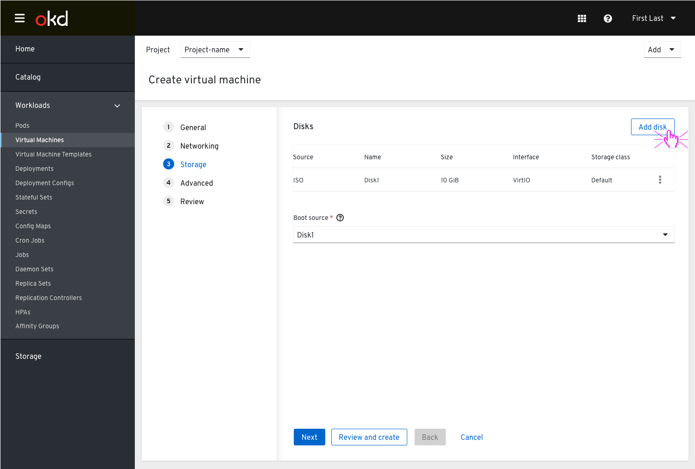
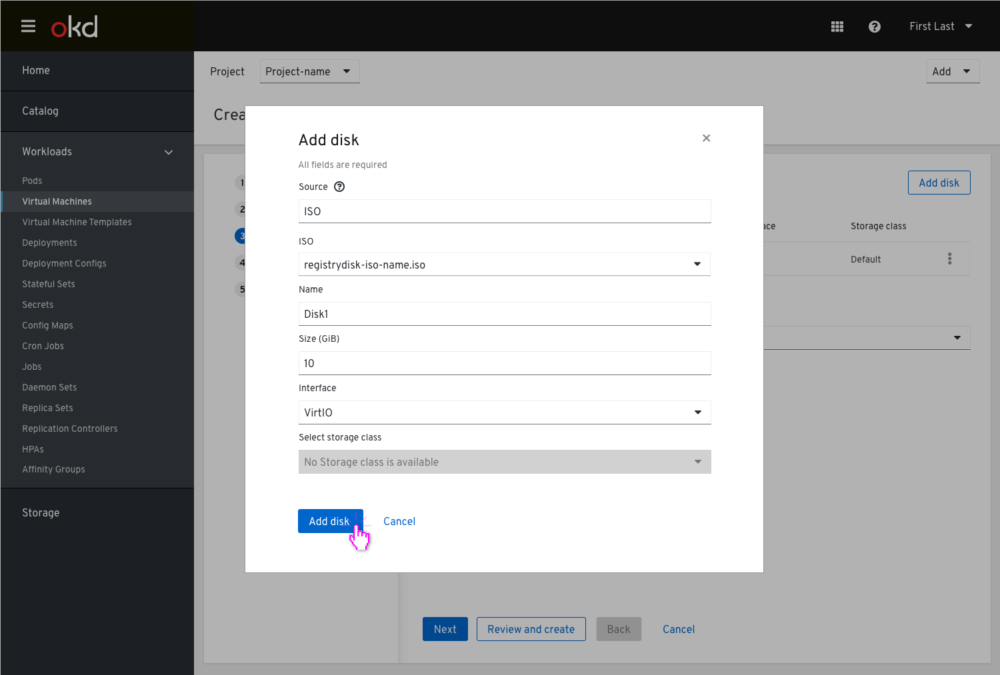
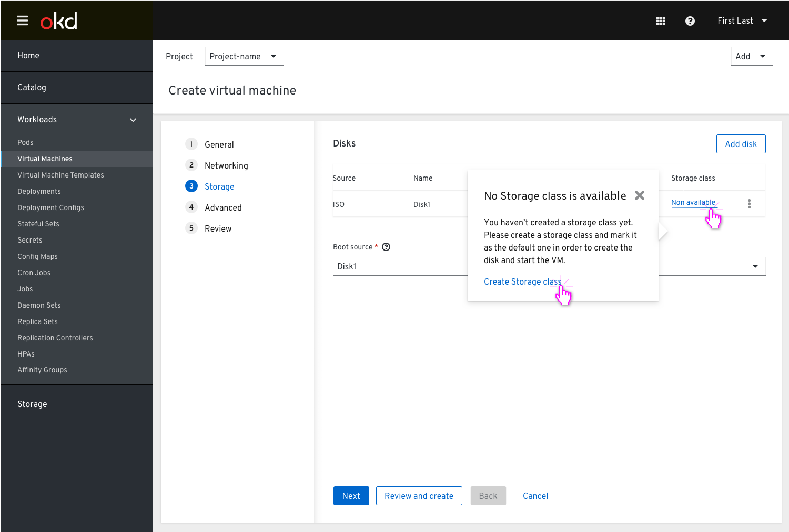
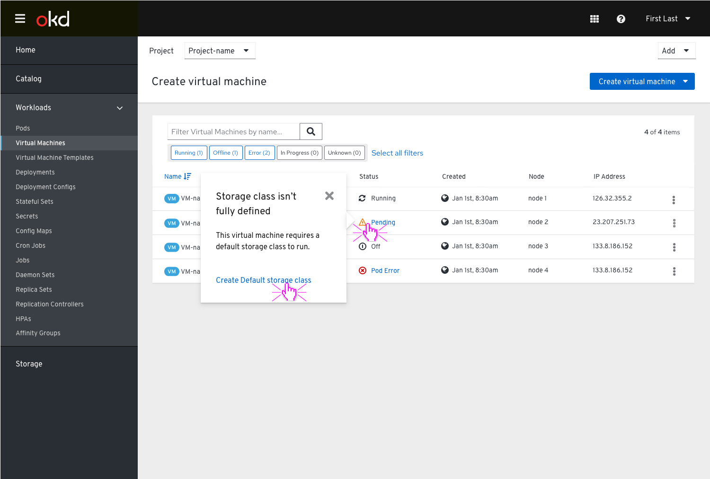
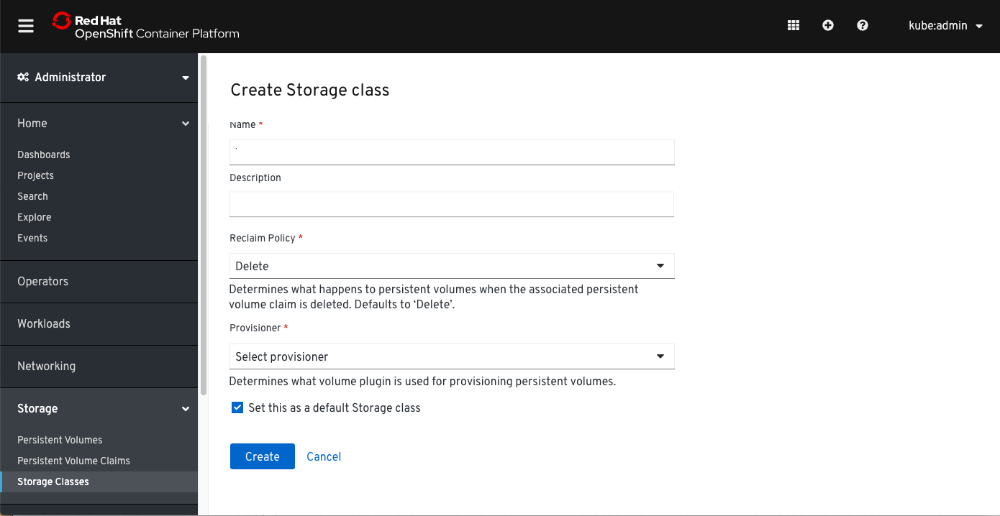

# Storage class isn’t defined

This design covers the state of no storage class selected and determines how the user should be notified.

During the process of creating the VM, in the Storage step, the user adds a disk.

Clicking the ‘Add disk’ button will open a modal, where the user is asked to fill in the disk’s details.

Clicking the ‘Add disk’ button at the bottom will add the disk to the list view, but the Storage class will be shown in the disks table as ‘Non available’.

Clicking on the ‘non available’ Storage class will show a popover that explains to the users they need to create a storage class and mark it as the default one in order to create the disk and start the VM.
The popover will have an action link which will take the user to the ‘Create Storage class’ modal.

In the VM list view, the status of the VM would still be pending untill the user would create a storage class and mark it as default.

Clicking on the ‘pending’ status of the VM will show a popover with more info and an action link which will direct the user to the storage class page with the Storage class already marked as 'Default' and allow them to create a new one there.

'Create Storage class’ section

After the storage class is created successfully, the VM will spin up.
