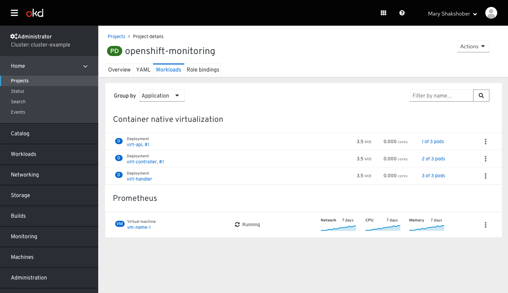
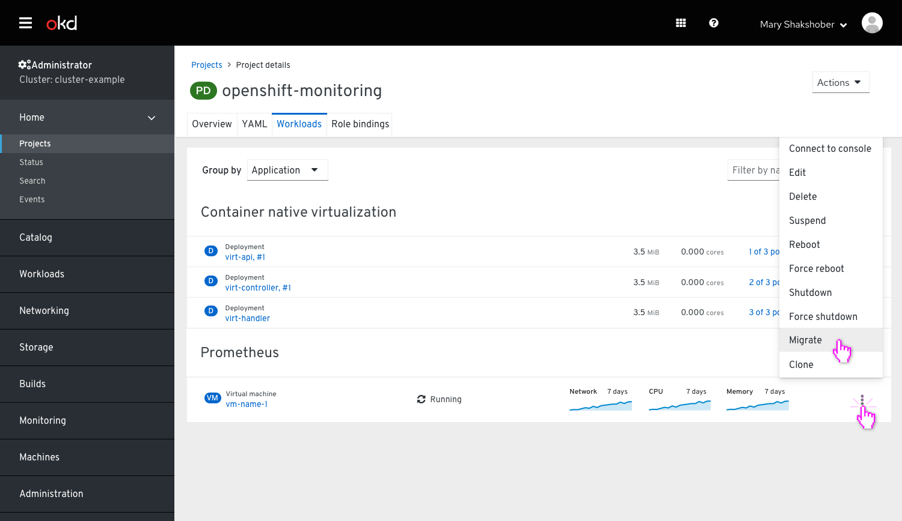
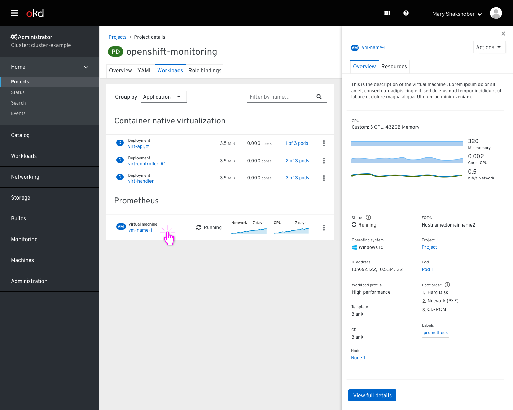
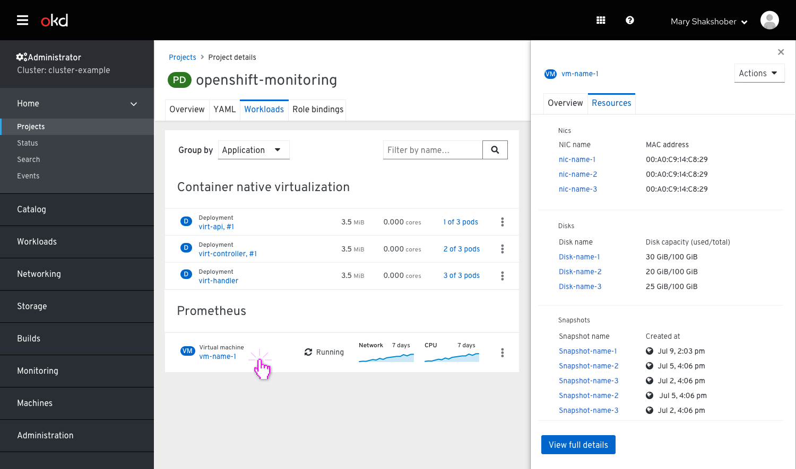

# OpenShift VMs Overview

Through the Workloads page the user can see the VM’s based on the application it is associated with via it’s label and and also see some sparkline charts that illustrate the usage of Network, CPU and Memory for the past 7 days.

Clicking on the Kebab would offer a list of options depending on that state of the VM.

When the user clicks on the virtual machine it displays the side bar with 2 optional tabs: Overview and Resources. The selected item should have a blue highlight.

## Overview tab

In the Overview tab the user can see a summary of what is shown in the virtual machine details. There is a call to “View full details” which would take the user to the Virtual machine details full page view.

## Resources tab

The Resources tab wasn't finalized yet, so this is only a very initial idea.
