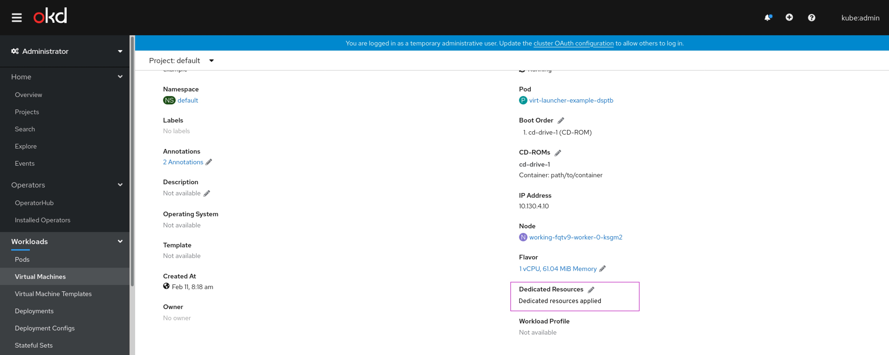
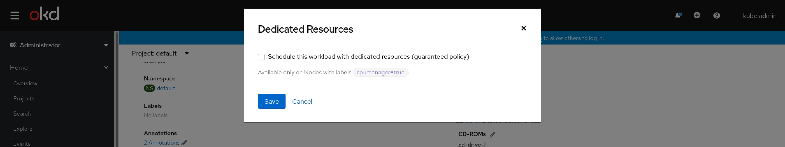
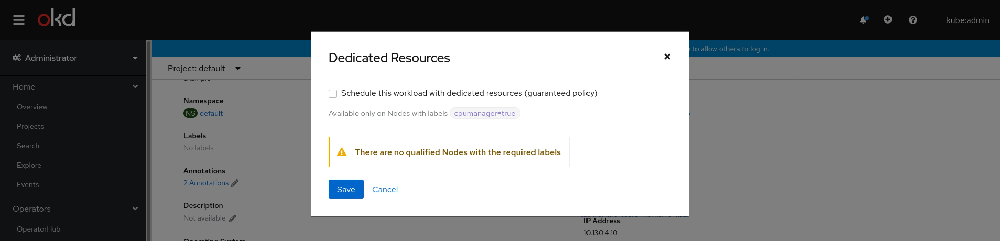

# VM details - dedicated-resources

### note
The original design was CPU Pinning. It changed to workload Isolation, now it is Dedicated Resources.

## In-page placement

Within the VM details page > Details tab > Overview section we added the “Dedicated Resources” field.
The default state is “No dedicated resources applied”.

When activated the field will display "Dedicated resources applied"

## Edit

Clicking on the edit pencil will pop up this modal.
This modal includes only one checkbox. Checking it will “schedule this workload with dedicated resources (guaranteed policy)”.
A supporting text exposes to the user that this feature is available only on nodes that contain this node label: cpumanager=true

In the case that a node matching the criteria cannot be found, a warning notification will present itself, mentioning there no such nodes. The reason we allowed to create dedicated resources where there are no nodes is that it is a general stand we took that we do allow the user to create policies that will end up in scheduling failure, in case that user wants to achieve some scheduling policy state and want the workload to fail in case that policy’s requirements cannot be met. Another reason is to allow the user to create policies that will cause scheduling failure and fix the problem later from another policy.