# VM details - boot order

## Entering edit mode
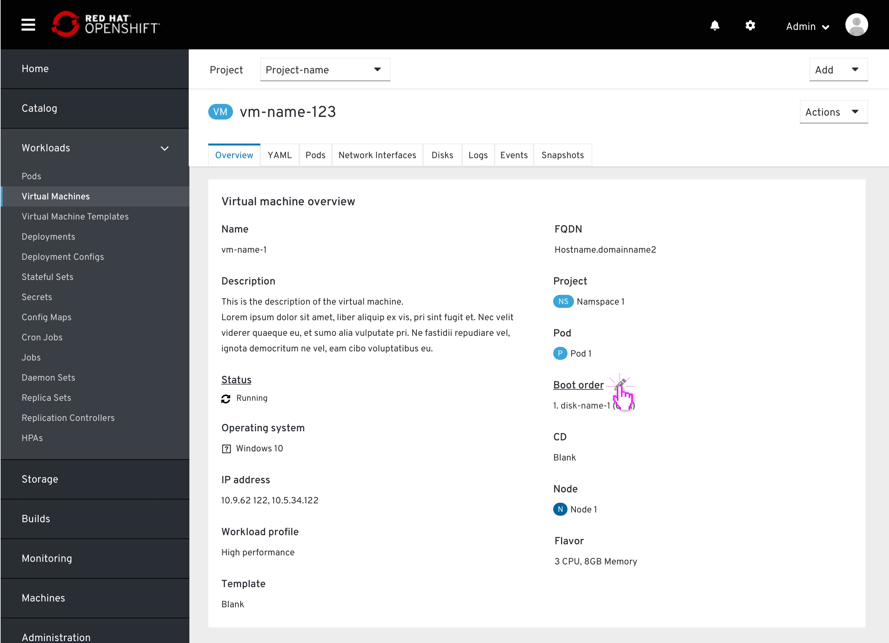
From the VM details page > Overview tab, the user views the list of resources the Vm will attempto to boot from, by order.
Clicking the pencil icon will pop up the boot order modal.

## Default source list
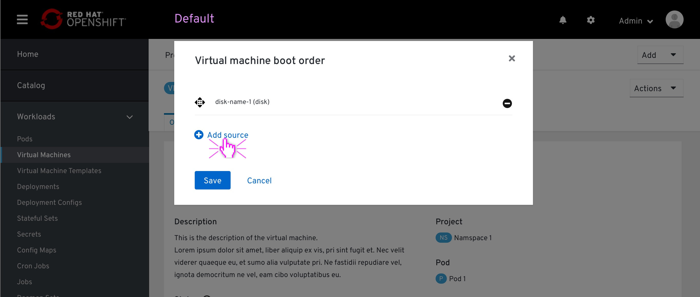
The modal pops up, displaying the listed items by order of boot attempt.
This order was automatically set on the VM creation (currently set only to one source).

Each item will be displayed in the following format:
[drive Type] [# of created]: [drive name]
CD-ROMs are included in this list.

## Adding source items
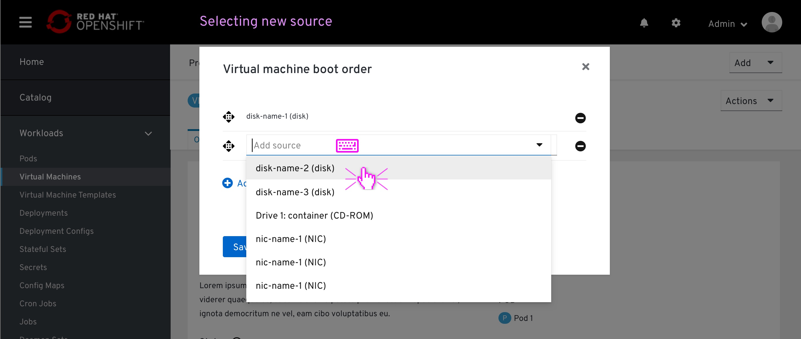
The user clicks the '+ add source' button at the bottom of the list.
A new item at the bottom of the list will appear, marking its location on the list. 

This item will also contain a type-ahead dropdown, which is already in focus, ready for the user to select an available item from the dropdown menu or filter the list by typing.

In case the item added has only one option, that item will be already selected to that option.

## Removing source items
The user can remove an item from the list by clicking on the 'remove' icon at the left of each item. By doing so, the user will be adding it to the available sources inventory.
The 'Remove' icone will be available for all items.

## Drag & drop source items
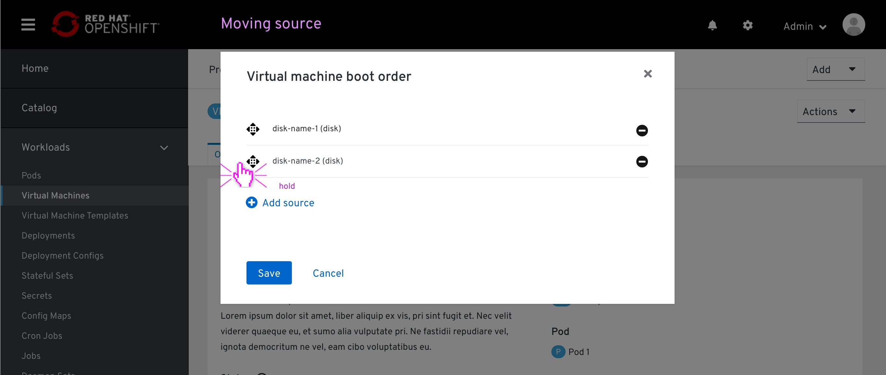
The user grabs an item by clicking and holding the 'drag-drop' icon.

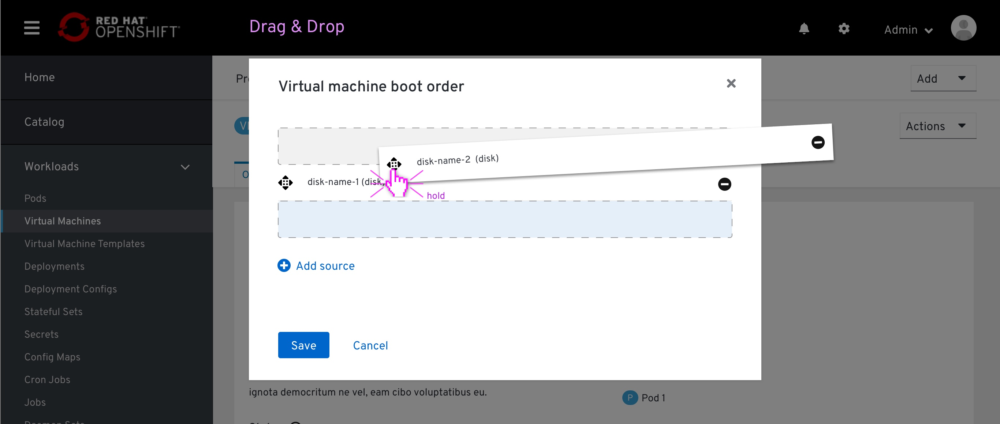
While holding the item between other items on the list, a blue Separator will mark the place where that item will land on the list after releasing it.

## Empty state

An empry state occures when the VM is created via YAML, without specifying any boot order priority.
It is also achieved when the lasg item on the Boot-order modal is removed.
With an empty state, the colsole will notify the user that "No sources selected", and "Boot from disks by order of appearance in YAML file"

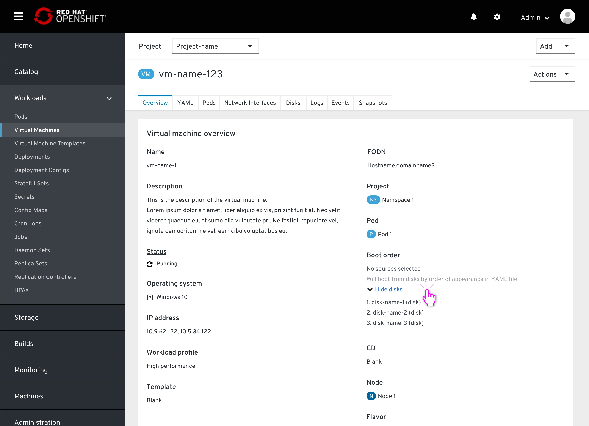
From the VM page the user will be able to see the disk list by order of appearance on the YAML

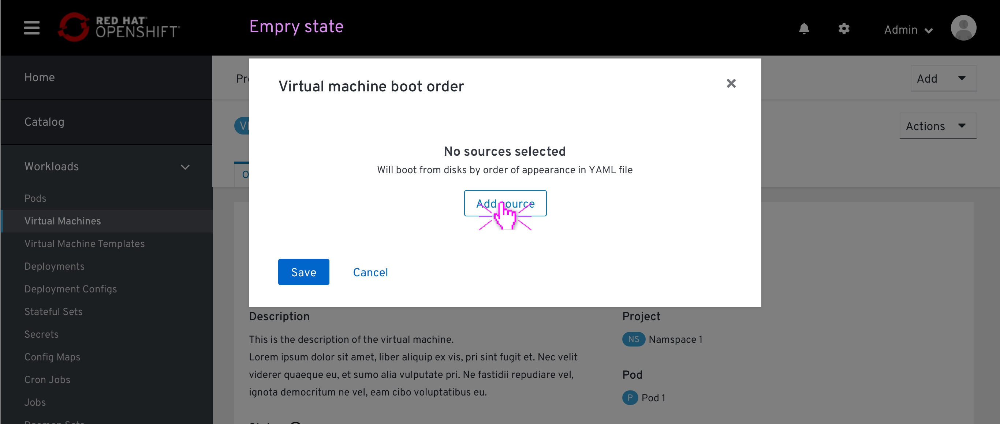
An empty state within the modal.
Viewing the disks by order of apperance is not available as it is not a desired state.

## Drag & drop accessibility
This section specifies the drag-drop behavior using a screen-reader. The copy specifies outlines that behaviour, it is not the final copy.

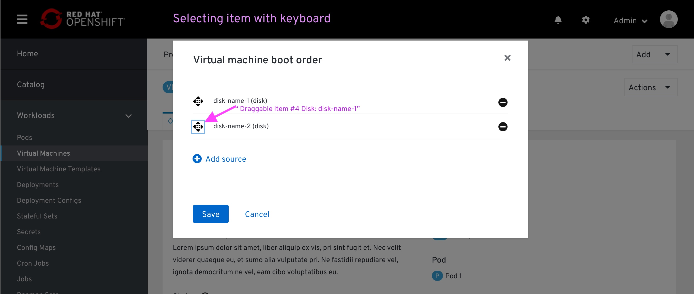
The user scans the page with a screen reader, hover over the drag-drop icon

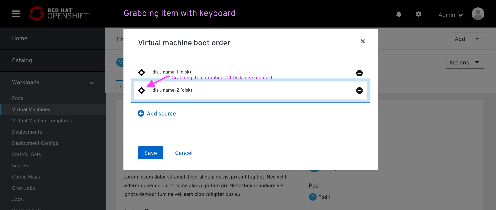
The user grabs that item

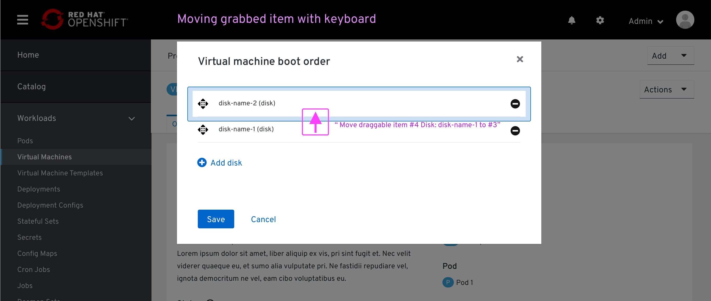
The user moves that item with up/down arrow (the screen reader reads the potential slot)

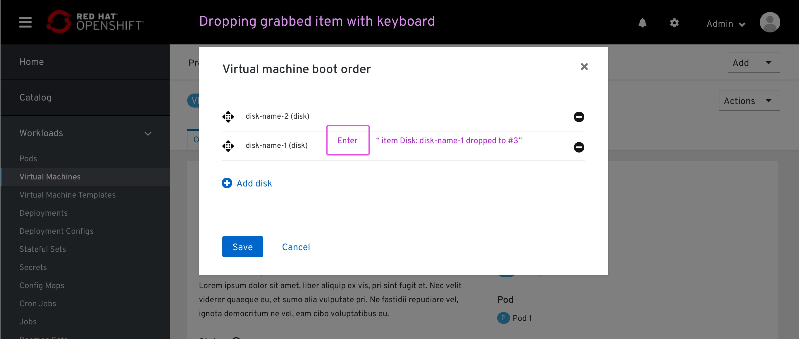
The user drops that item on the selected spot

## Spec

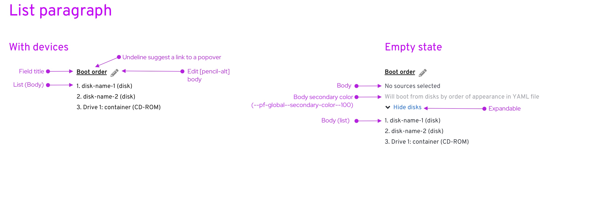
Environment:
- VM details page > ‘Overview’ tab > ‘Overview’ section

Components:
- List https://www.patternfly.org/v4/documentation/core/components/list#page-sidebar
- Expandable https://www.patternfly.org/v4/documentation/core/components/expandable/#expandable-title
- Secondary color https://www.patternfly.org/v4/design-guidelines/styles/colors
- Title: Should be aligned with the rest of the field title on the page. These are being pulled from different sources, and not just PF4, I believe it is better to let the developer the decision if this should be a PF4 CSS or align with the majority of the CSS within that page. 
- ‘Edit (list) will be applied for the entire list, so the edit pencil is placed next to the title (we have that)
- Each drive specified within a list consists of the drive's name followed by the drive type within brackets.

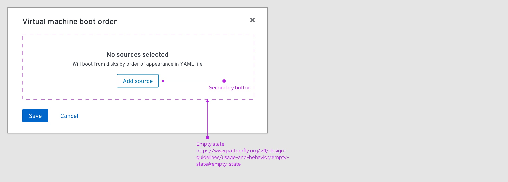
Environment:
- VM details page > ‘Overview’ tab > ‘Overview’ section > ‘Edit’ modal

Components:
- Empty state https://www.patternfly.org/v4/design-guidelines/usage-and-behavior/empty-state/#empty-state
  - Secondary button https://www.patternfly.org/v4/design-guidelines/usage-and-behavior/buttons-and-links

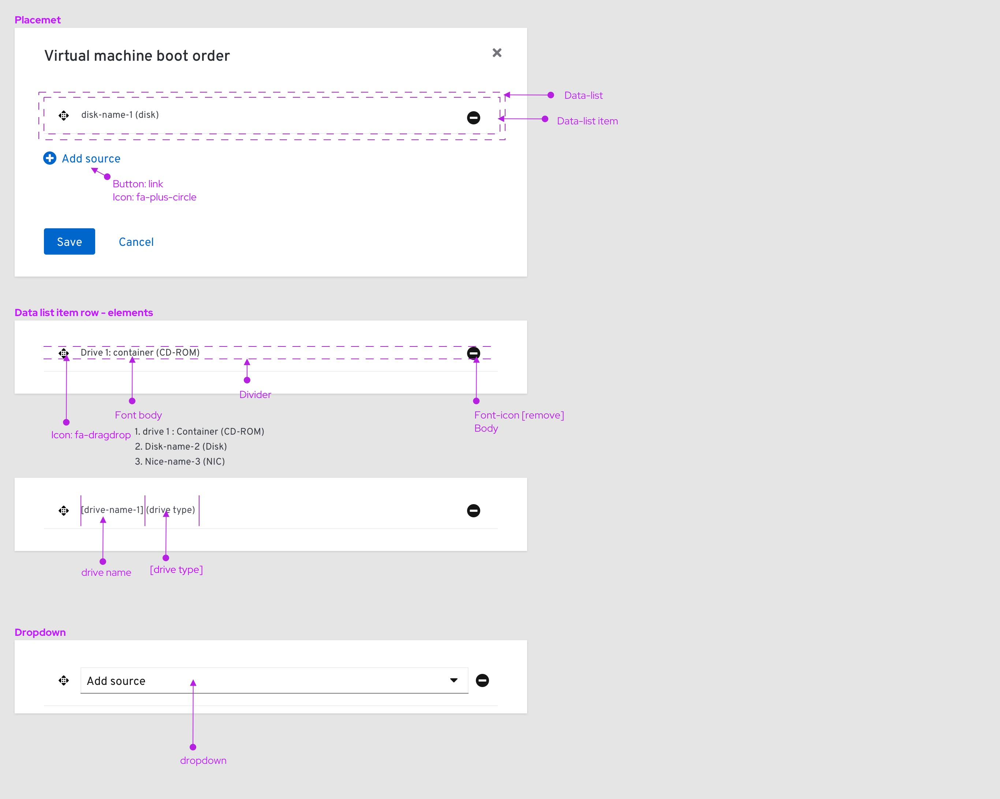
Components:
- Data list https://www.patternfly.org/v4/documentation/core/components/datalist#examples
  - Data list item:
  - Icon: fa-dragdrop
  - Icon: fa-remove
  - Font: body
  - Divider https://www.patternfly.org/v4/documentation/core/experimental/divider
  - Dropdown https://www.patternfly.org/v4/documentation/react/components/dropdown/#dropdown-with-initial-selection
  - Each drive specified within a list consists of the drive's name followed by the drive type within brackets.
- Button: link
  - Icon: fa-plus-circle

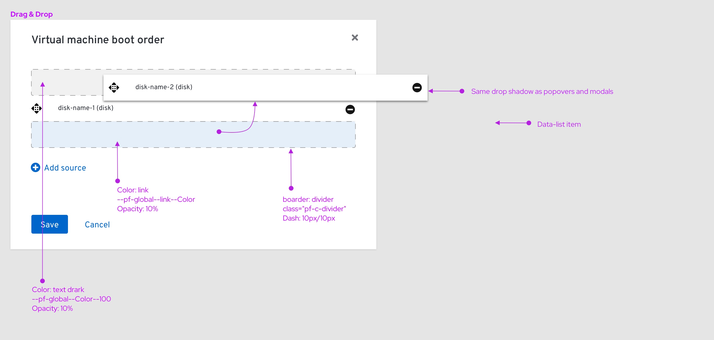
Location:
- VM details page > ‘Overview’ tab > ‘Overview’ section > ‘Edit’ modal

Note:
In general, I rather have to implement the same Drag & Drop behavior we have on PF3. Found on DeploymentConfig > Environments tab

Components:
- “Popover” container with the same drop-shadow CSS Custom
- Exit slot: 
  - Background: Color: link (--pf-global--link--Color) opacity:10% Custom
  - Border: Divider (class="pf-c-divider"), Dash: 10px,10px  Custom
- Entry slot:
  - Background: Color: text dark (--pf-global--Color--100) opacity:10% Custom
  - Border: Divider (class="pf-c-divider"), Dash: 10px,10px  Custom

