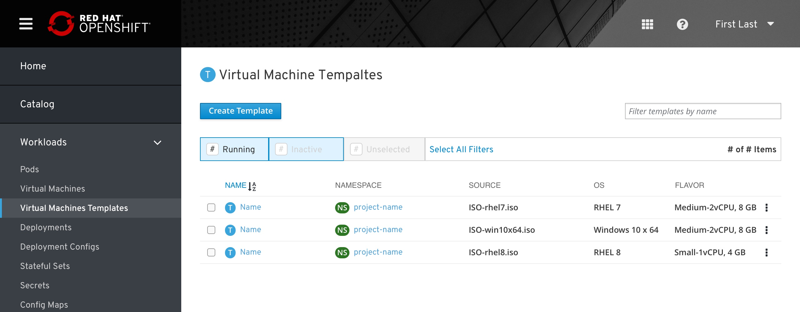
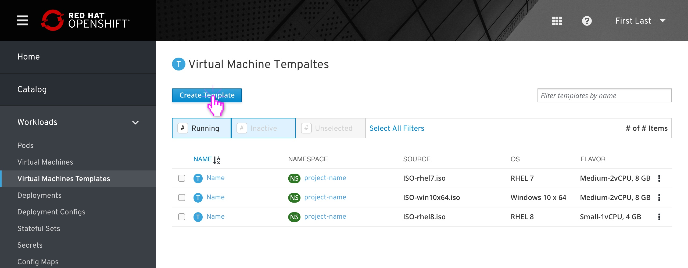
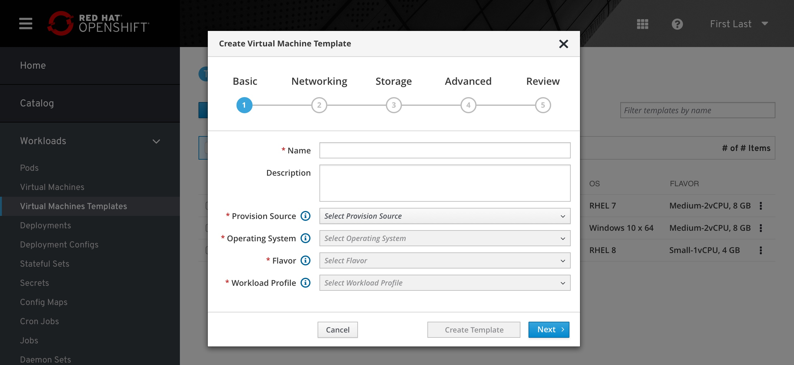
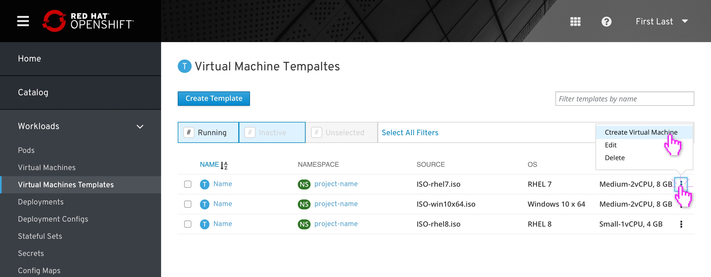
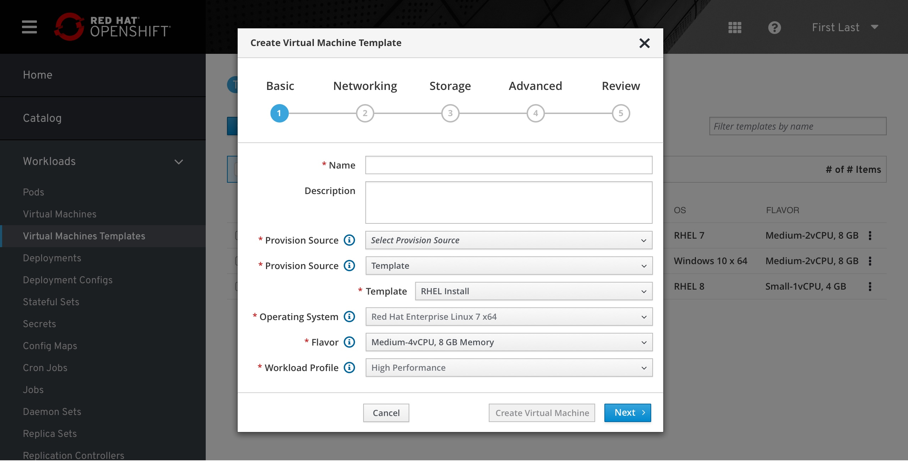
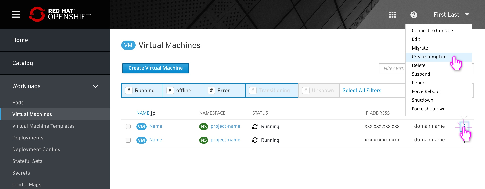
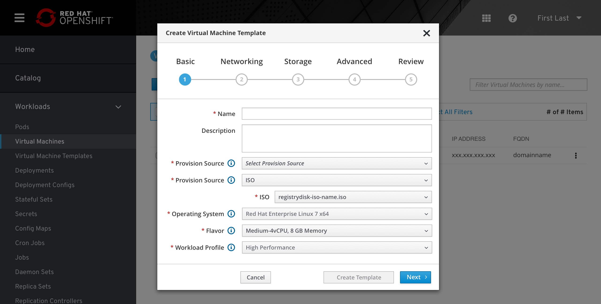
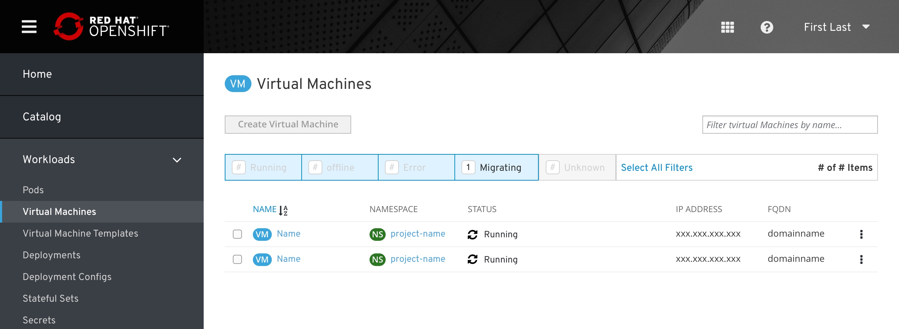

# Virtual machine templates

### Summary

- "Virtual Machine Templates" are located under "Virtual Machines" in the primary navigation.
- VM-templates displays a list view similar to the VM list view with relevant changes in columns and actions.
- From this list the user can create a new template, create a virtual machine from a template, edit a template, or delete a template.
- Clicking on a template will bring the user to the template’s Overview tab (TBD).
Creating or editing a template will display a wizard similar to the “No Template state” wizard from Create VM but with slight adjustments.
- Users can also create templates based on existing VMs from the actions menu of any VM within the VM List View.

## Template list view

The user will be able to view a list of all templates that exist. From this list the user can create a new template, create a virtual machine from a template, edit a template, or delete a template.

### Create template from primary button

Clicking “Create Template” will display a wizard similar to the “No Template state” wizard from Create VM but with slight adjustments.

1. Modal title changes to “Create Template”
2. Choosing a template from a dropdown is not available
3. The two checkboxes for “Start virtual machine on creation” and “Create new template from configuration” are removed
4. The quick action button at the bottom is now “Create Template”
5. In Step 5 “Review”, references to “Virtual Machine” are replaced with “Template”

    a. Create/Creating Virtual Machine -> Create/Creating Template

    b. Virtual Machine creation failed -> Template creation failed

    c. Virtual machine created successfully -> Template created successfully

Everything else remains the same.

## Create VM from template

Users can initiate the Create VM wizard from the actions menu of a VM template.

The template they choose is preselected and the Provision Source, OS, Flavor, and Workload Profiles are filled in.

After successfully working through the Create VM Template Wizard, user returns to the VM Templates page (no toast notifiaction).

## Create template from VM List

Users can also create templates based on existing VMs from the actions menu of any VM within the VM List View. 

The VM they choose pre-fills the Provision Source, OS, Flavor, Workload Profile, and all other Networking, Storage, and Advanced settings of the Create Template wizard.

[

After successfully working through the Create VM Wizard, the user returns to VM list page.

## Template details (coming soon)

Clicking on a template will bring the user to the template’s Overview tab.

The YAML tab allows the user to edit the template’s configuration.

Editing a template will also be possible using the 'Edit' modal, just like editing a VM.

The Virtual Machines tab displays a VM List View with only the VMs that were created using the template. This list behaves the same with the relevant actions available in the kebab (no Create Template button, for example)

## Editing a template (coming soon)

Brings up the same creation wizard, but with any mention of “Create” changed to “Save” instead.

