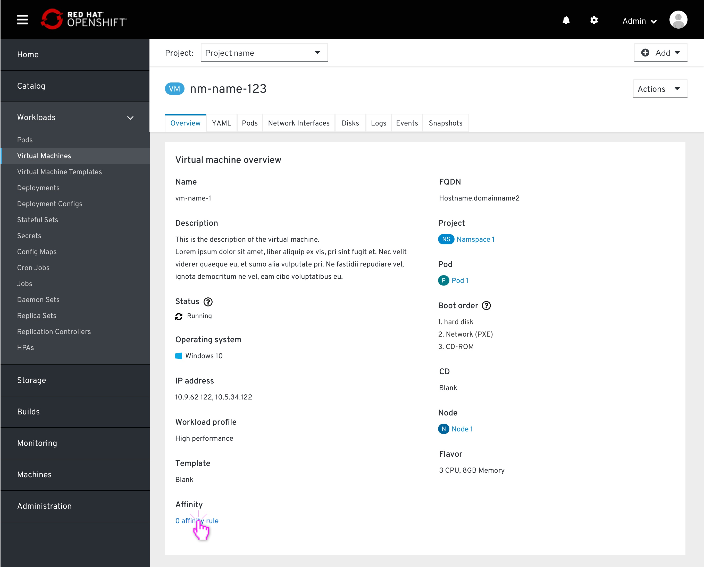
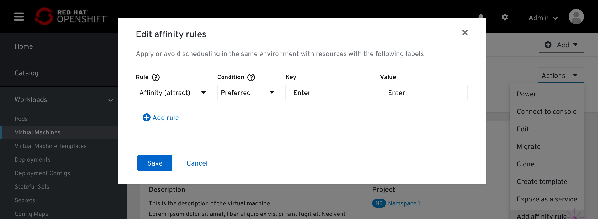
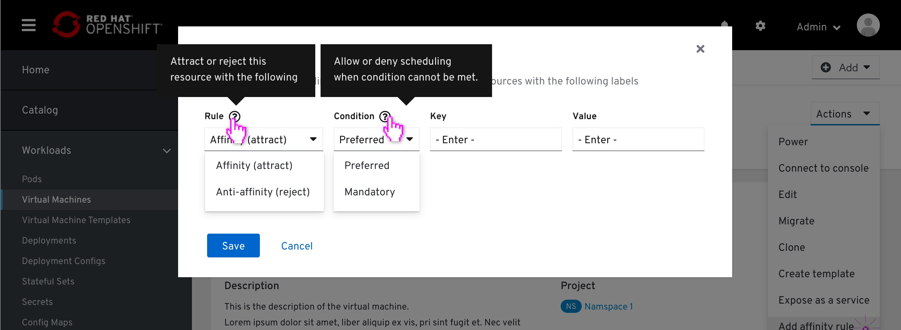
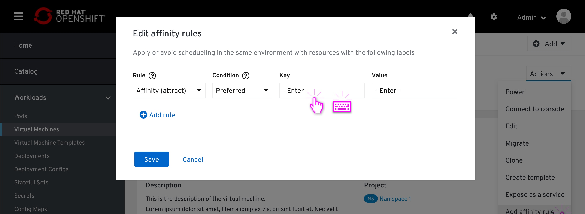
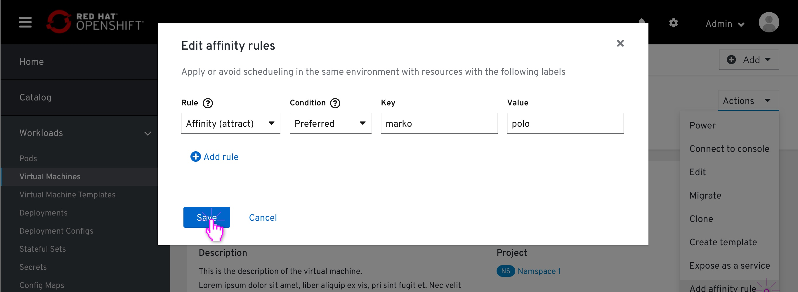

# Affinity

### About Affinity
Affinity allows the user to create a relationship between two resources when scheduling them on the cluster.
There are two high level relationship types:
Affinity - attaching a group of resources together, making them run together in the same environment.
Anti-affinity - creating a rejection relationship between a group of resources, thus avoiding scheduling any of them in the same environment.

Besides defining if we want to attach or reject resources to one another, we can choose to "force" this rule we are creating.
"Forcing" a rule means that the conditions of this rule must met, even if it means that some resources just won't be scheduled at all.

### Technical Definitions
Affinity rules are pod properties, written in the pod deployment file. When a pod is scheduled, the deployment file states that there is an affinity rule condition which needs to be met.
Applying an affinity rule to a resources is done via labels. Objects in OpenShift are ephemeral, and the way to target the same object which keeps crashing and regenerating is by its label.

## Affinity rules list on a resource details page

Affinity is located in the resource details page, on the overview tab, on the Overview section (same placement order as Node Tolerations)

## Creating an Affinity rule from a resource details page

Clicking on the "[#] affinity" button pops up the "Edit affinty" modal.

Viewing the options and tooltips within the dropdown fields.

The user leaves the "Rule" field to default - "Affinity (attract)".
The user leaves the "Condition" to default, so scheduling this resources will still occur even if the this rule cannot be achieved.
The user selects the resources he wishes to apply that rule to by adding their representative labels to the "Select resources by label" field.

The user clicks 'Save' and returns to the resource details page, where he left off.

The counter within the Affinity field is updates to indicate the added rule. 