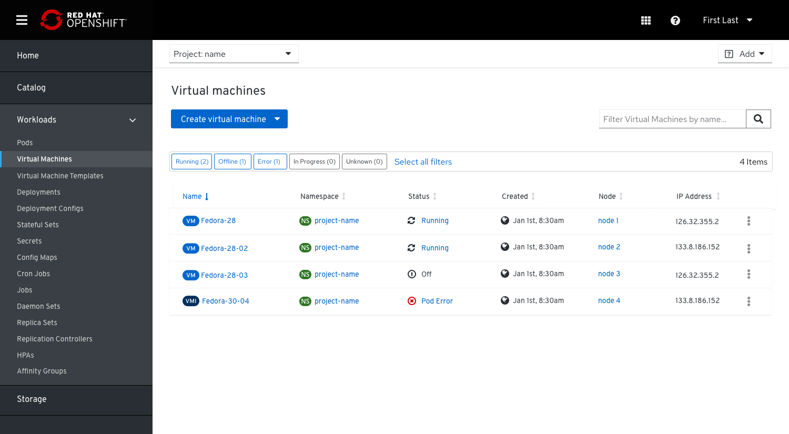
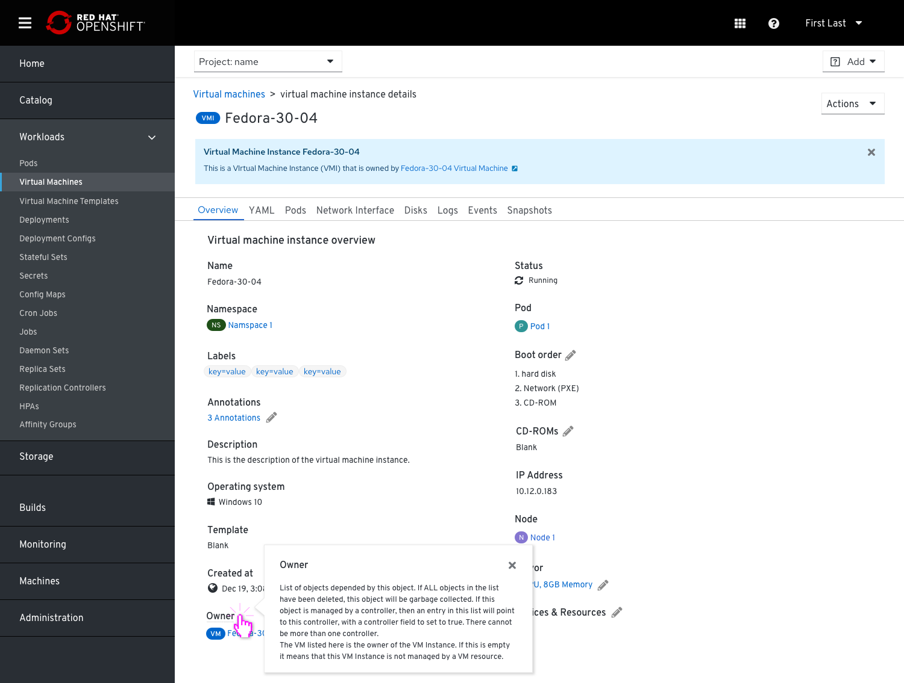
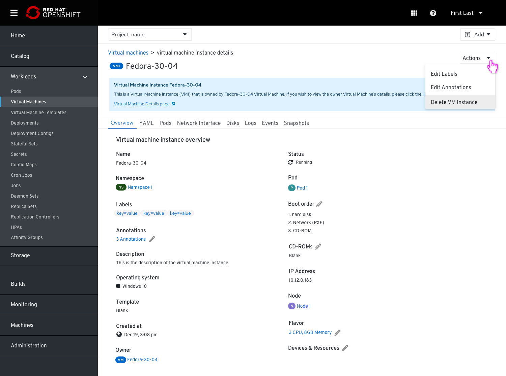
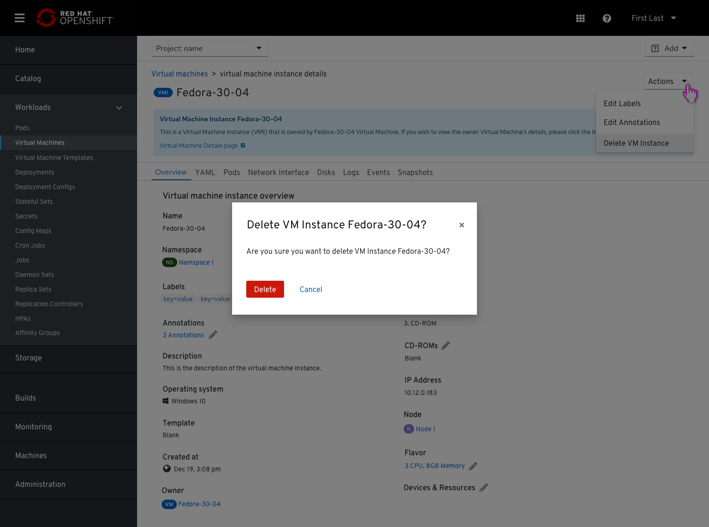

# Surfacing VMIs in the UI

A virtual machine instance(VMI) is the representation of a running virtual machine.

## Use Cases

1. Debugging -  Previously if a user was trying to resolve an issue caused by a VMI that didn't have an owner it would not be possible to discover it in the UI. Including orphaned VMIs indicates to a user that there could be an issue that they need to address.

2. On Bare metal machines installed with Kubernetes or users who install Kubevirt for CNV - On these VMs there are clusters that can be scaled up and down and they create the VMIs (and not the VMs).

## Mockups

In order to avoid duplication and unclutter the UI, we had finalized into an option that presents VMs and VMIs in a single list view.
We don't surface VMIs in the list if they are owned by a VM.

VMIs and VMs will be distinguished between different color badges. VMI badges color are darker (#002F5D) in order to provide proper contrast for low vision users.

## Hints

To better educate users about VMIs, we will provide hints, whenever it is appropriate.
The instance name link will take the user to the instance page (VM/VMI).

## VMI's details view

VMI and VM in the list view will lead to the VM and VMI details page.
The details page link from VMI to VM (or note that there is no managing entity=owner) and from VM to VMI (or note that there is no VMI).

VMI's details page is similar to the VM’s details page and acts in a complementary manner.

The VMI's details page will provide a hint with a general explanation about what VMIs are as well as allow drill down to further details.

In the VMI’s details page, the owner VM will be represented with a link, so users can click and get there and vice versa.

## Adding a link to the VMI from the VM details page

In order to let the user get to the VMI even when there is a VM around it, we added a link in the VM details page.

## Actions available for the VMI

If the user chooses to delete a VMI, they will be asked via the common pop up if they are sure they want to delete it.

In case the VMI has an owner, they will also be notified that the owner may automatically rebuild the VMI.

