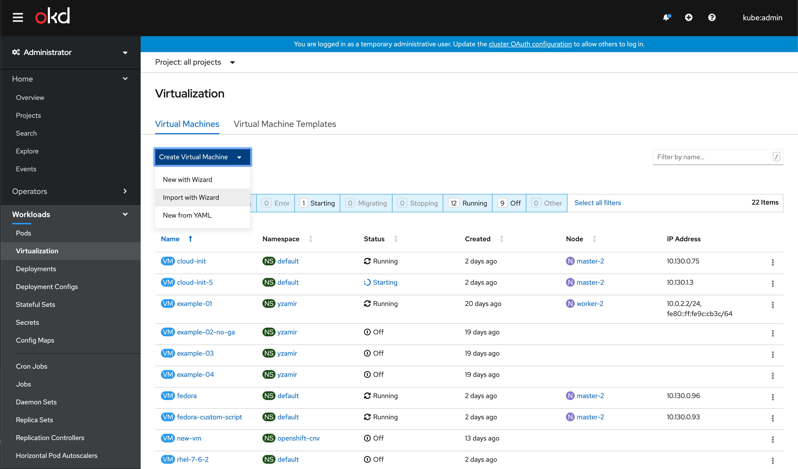
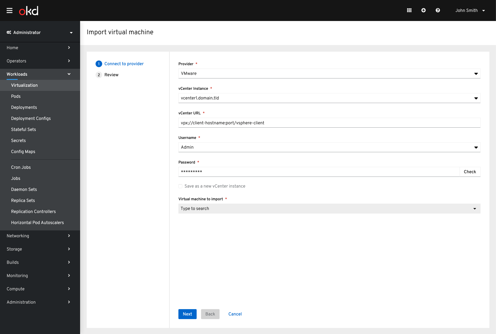
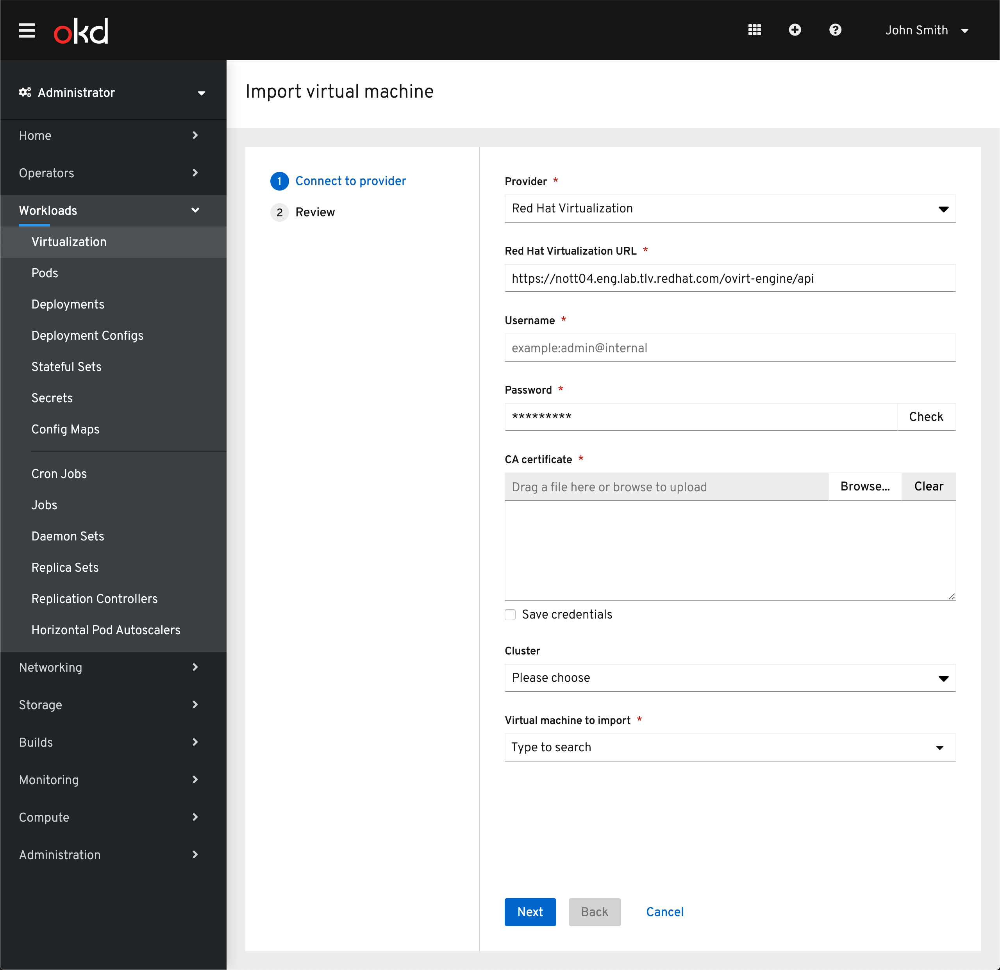
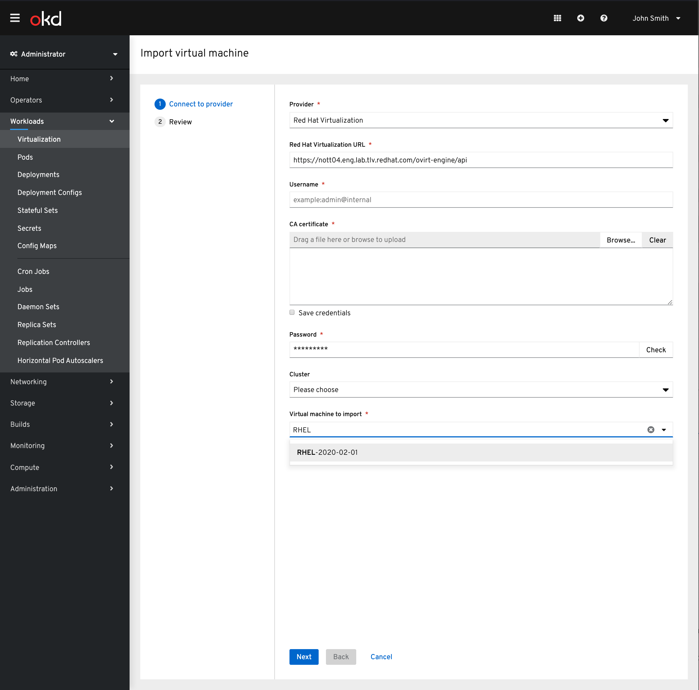
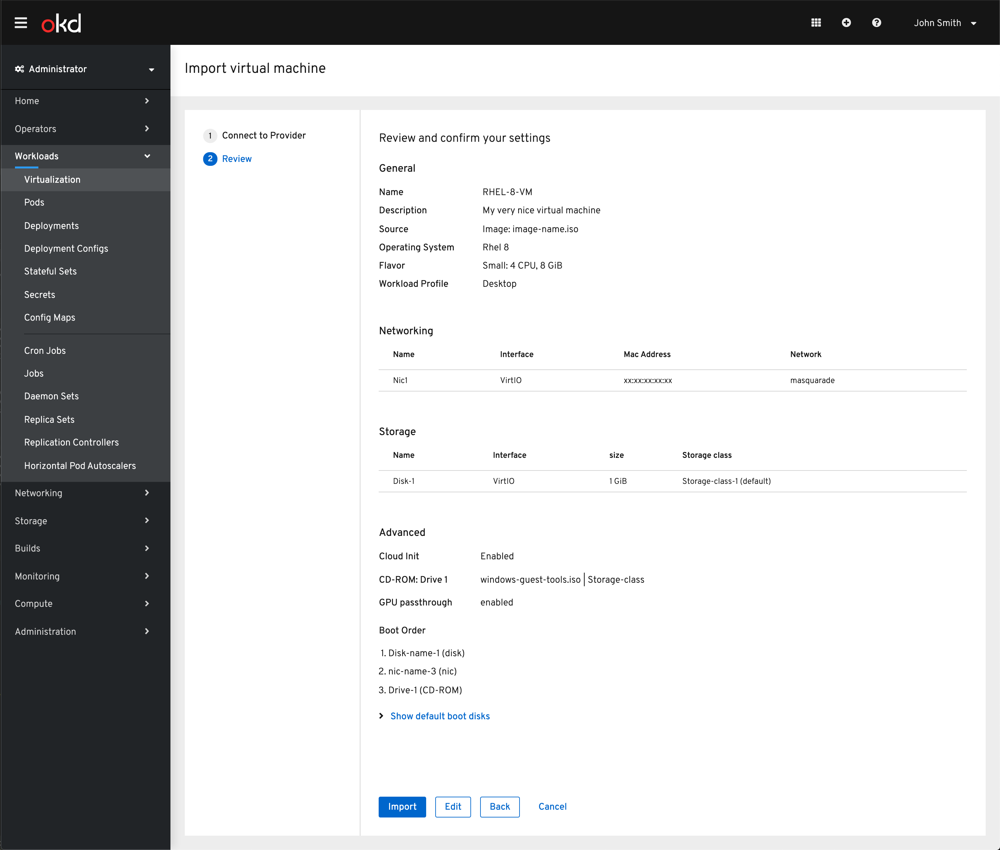
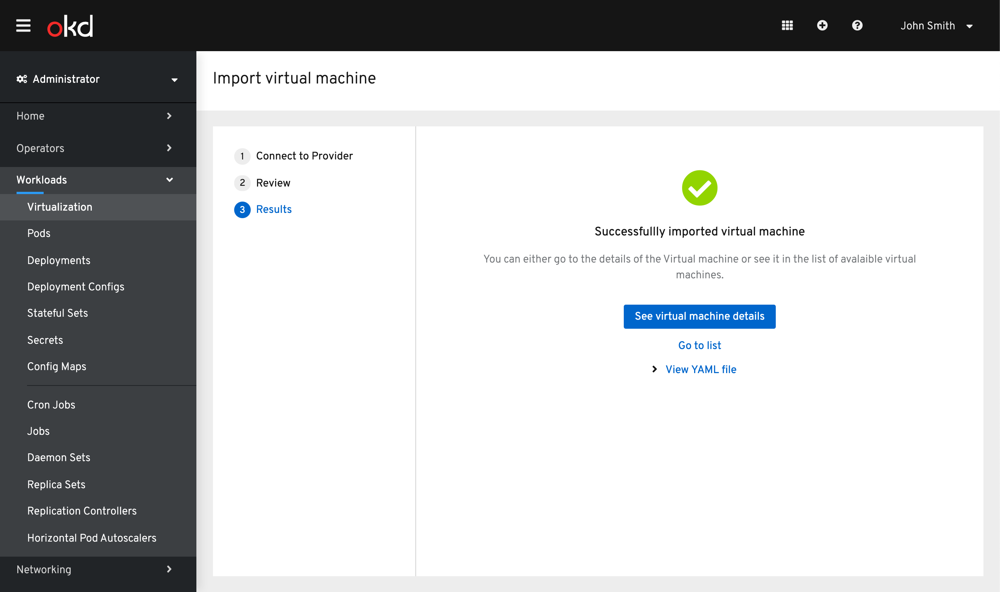
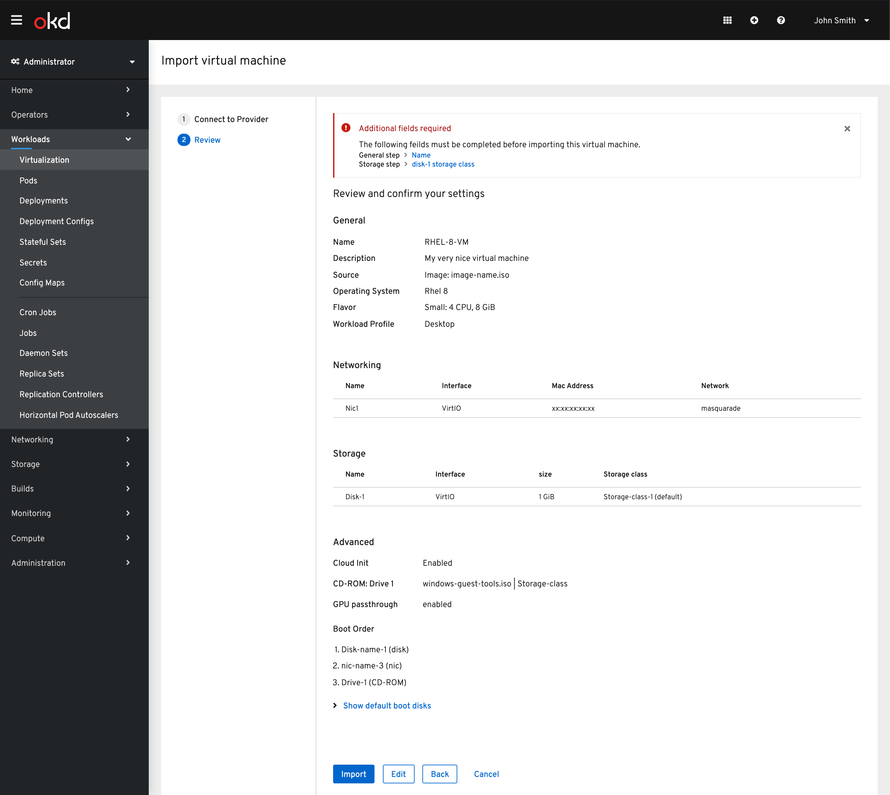
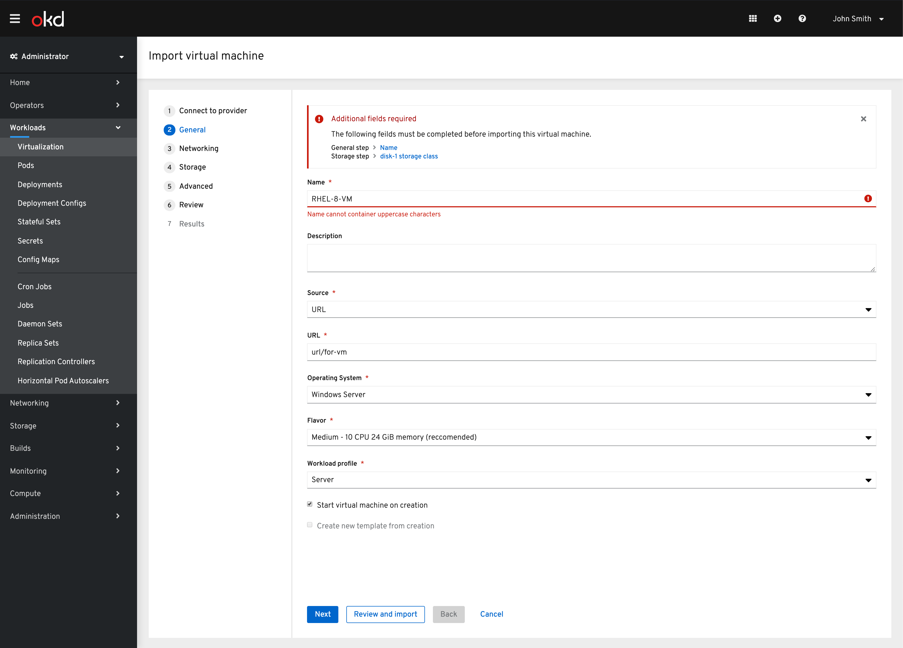
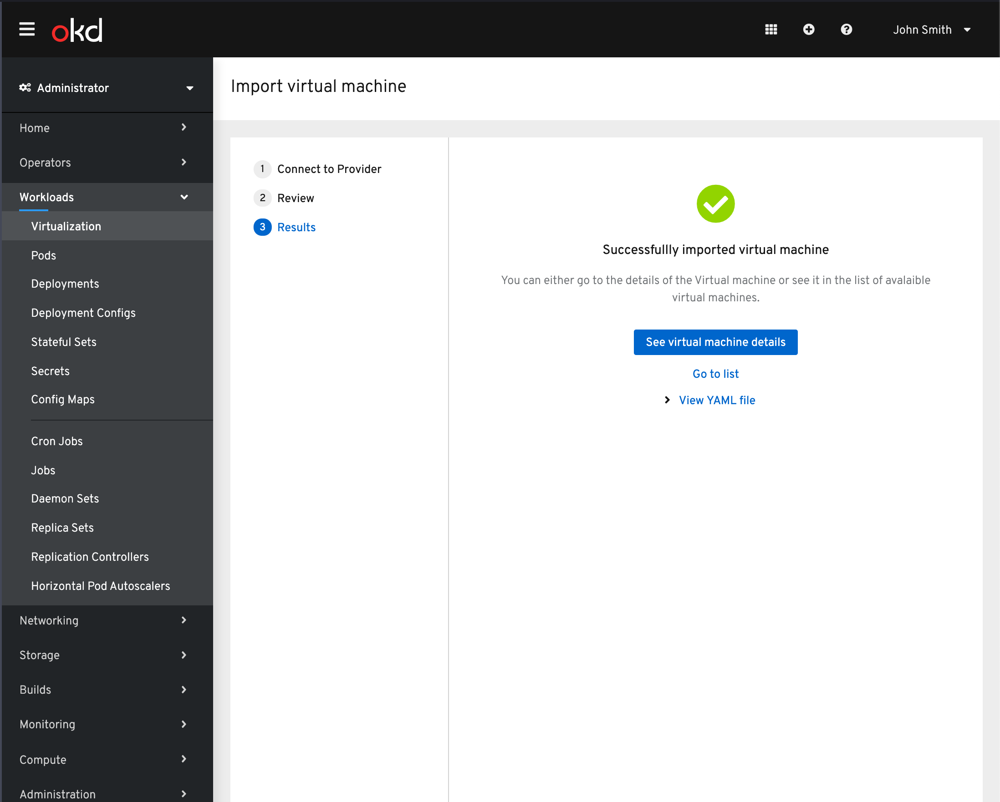

# Importing Virtual Machine
The latest update for importing a Virtual Machine has simplified the flow.
We don't want to over complicate a flow that should be fairly straight forward. The goal is to present the user with what is required and not overwhelm them with details/configuration.

The user we are designing for is one that is new to OpenShift and most likely unfamiliar with the workings of OpenShift and possibly Kubernetes in general. They are also not likely interested in highly customizing a VM that is being imported that they were otherwise happy with. They should only be presented with required settings.

## Import
The user is able to import the Virtual machine from the Create dropdown available under the virtualization area.

## Selecting provider
A simplified wizard is presented to the user with the option to import from either VMware or Red Hat Virtualization.

### VMware Import

With VMware chosen the required credentials are presented to the user. To see a more in depth view of these steps see [here](designs/virtualization/4.3/create-vm/wizard-import/).

### Red Hat Virtualization Import

We have now added the option to import from Red Hat Virtualization as well. With the Red Hat Virtualization option chosen as the provider you will then be provided the fields required to connect to RHV.

Once connected, the Cluster can be chosen to narrow the results of the virtual machines provided. Note: The cluster field is not required.

The virtual machine can be found via a type ahead field.

## Reviewing import details

Once the virtual machine has been selected the details are then provided for review.

The goal of the import is to not block the user from importing their virtual machine if they are lacking CNV specific settings so defaults are used if available. See the storage class as an example.

From here the VM can be imported.

### Alerts

There are cases where a virtual machine does not successfully import. In this case the user will be prompted to make updates to the settings of the vm before import can be completed.

The required fields will be listed in an alert with links to each step for the user to navigate to and resolve.

They will then be provided the full wizard to navigate to solve any errors that have surfaced.

### Editing

At any point the user can enter the edit flow to make changes to the virtual machine before it is imported.

## Successful Import

Once the Import has succeeded the user will be able to view the VM details or see it in the list view. They can also see the YAML file for the VM.

