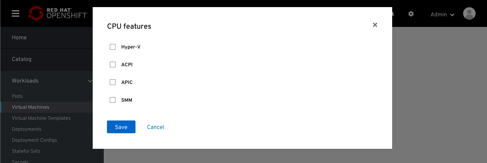

# Fine Grained CPU Features

Enabling fine grained features for VM, including:
- Hyper-v - includes sub features that will all be enabled on enabling this parent feature
- ACPI- enables/disables ACPI insidejsondata guest. Defaults to enabled
- APIC - includes sub features that will all be enabled on enabling this parent feature
- SMM - enables/disables System Management Mode

All the above at this point can be summarized as CPU propertires required by the VM as a must have properties from the host.
additional info included here:
https://kubevirt.io/api-reference/v0.26.0/definitions.html#_v1_features

CPU Features is placed in the Scheduling section of the VM Details tab.

Currently, these features will be available to be included or excluded.
By checking the checkbox, the user selects which features to include in the CPU requirement for this VM.

Customized display in-page.

