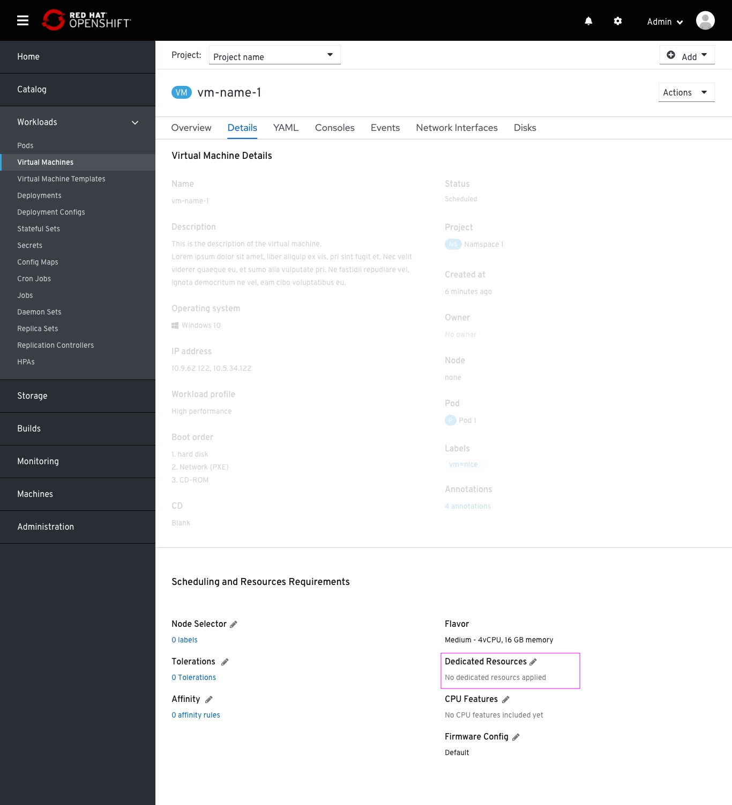
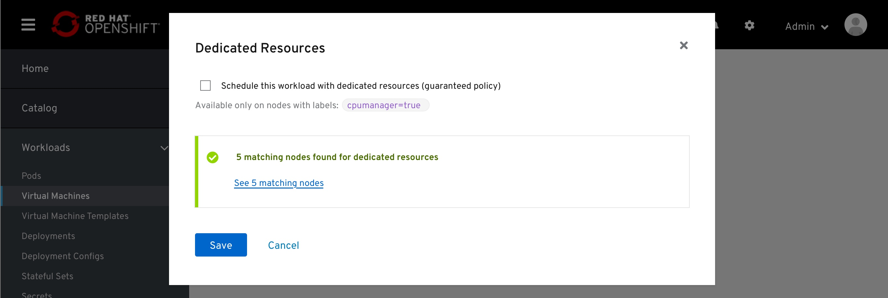
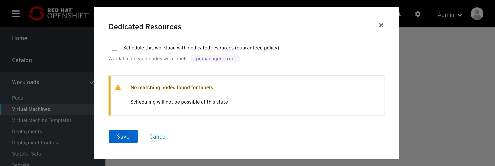
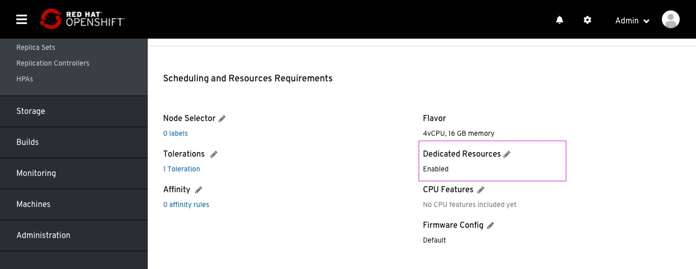

# Dedicated resources

Enabling dedicated resource for a VM workload.

'Dedicated resources' requirement is placed in the Scheduling section of the VM details tab. The default is 'No dedicated resources applied'

This feature is available only for nodes with the label 'cpumanager=true'
It is specifed within the modal.
On landing on the modal, the nodes checker already checked for matching nodes.

In case no mathcing nodes found, the Nodes checker will warn that.
Applying this feature is still possible.

Preview of this feature enabled in-page.