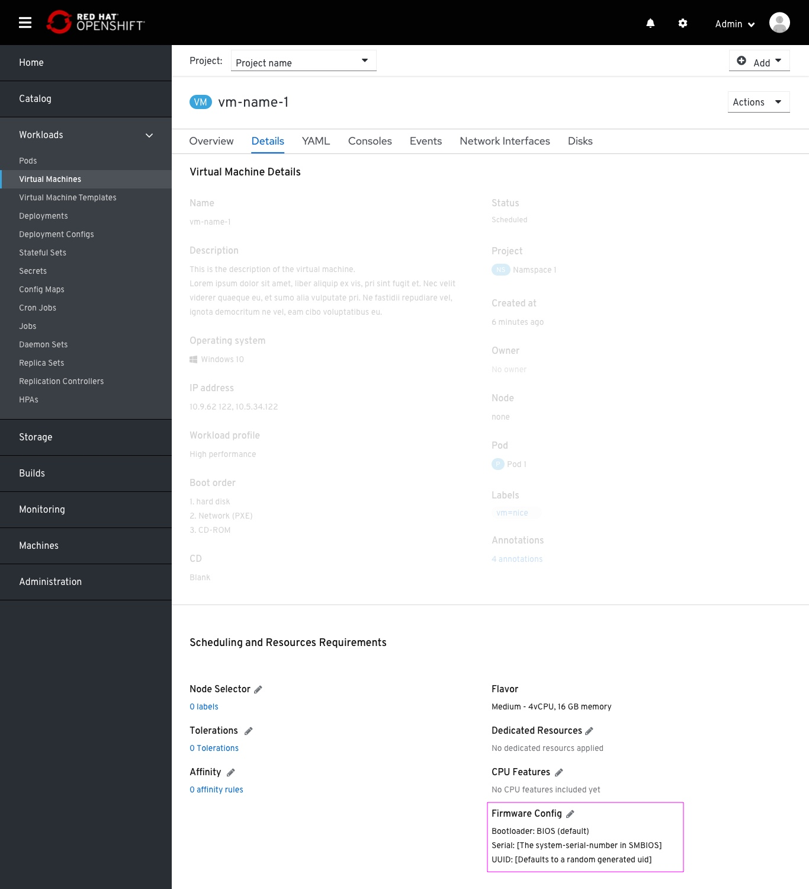
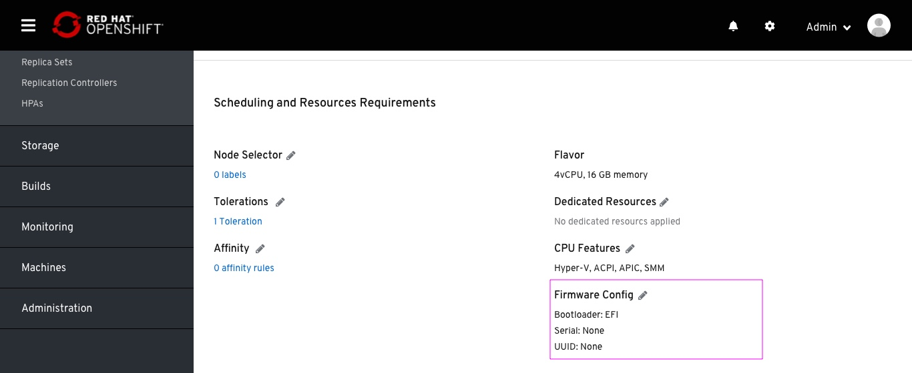

# Firmware Config

Exposing Firmware Config for VM.

Firmware Config is placed in the Scheduling sction of the VM details tab.
The default value of this field is "Default"

This modal is composed by three fields:
- Bootload (Selection): BIOS (Default) and EFI
- Serial (sting): [The system-serial-number in SMBIOS]
- UUID ( sting): [UUID reported by the vmi bios. Defaults to a random generated UID]

Changing the Bootload to EFI

Changing the default configuration will reflect in the field value specified in-page.
In case strings removed from the sting fields, the value in-page will be 'None'.