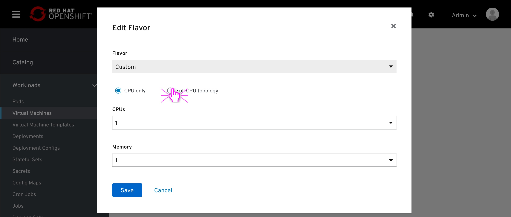
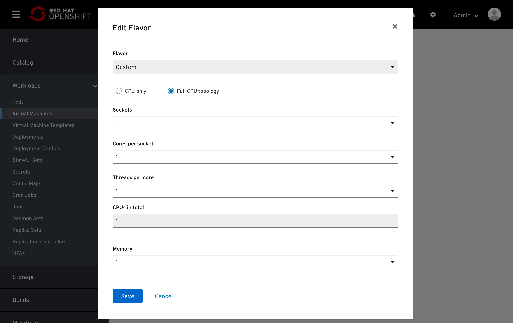

# Flavor

Displaying the VM flavor (CPU and Memory) in the Scheduling section .

VM flavor is set on the creation process.
If the flavor is set to any of the sizes which is not custom, that flavor will be locked to changes.
Edit (pencil) button will be removed in this case.

If the Flavor was set to Custom during the creation process, the flavor will be editable.

Opening the Edit Flavor modal reviels that the flavor is set and locked to Custom.
However, the values of the CPU is editabke in dedicated fields below.

By clicking 'Switch to full topology', the UI will toggle dispay full topoloy options.
At the bottom of the "full topology" field, there will be a 'CPUs in total' counter.
Clicking the 'CPU only' will toggle back to the previous, collaped mode.