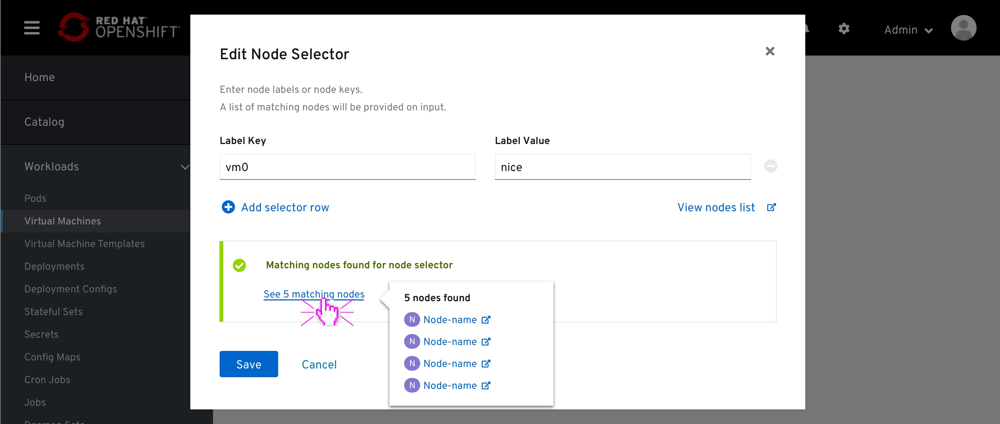
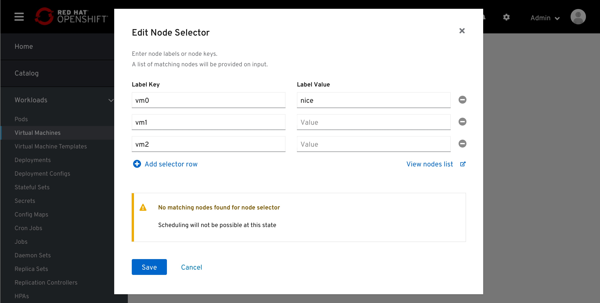

# Node Selector

Introducing Node-selector as it appears in-page and the Edit modal.

The node-selector field is pulled from the Workload details section and placed under the Scheduling section.

In this example there is no node-selector set, meaning, no node labels added.
Clicking on the edit (pencil) button will open the Edit modal.
Clicking on the "O labels" link text will open that modal as well.

The modal consists of:
- key=value pair text fields followed by a Remove button
- Button to add another pair, or label
- External link to the nodes list
- "Nodes Checker", active notification that provides feedback if nodes found for the labels above

When there is only one row of key=value pair, the Remove action will be disabled

On typing some value within any of the fields, the Node Checker will check for nodes with matching labels, with a time out of [1] second to kick in.
Entering only the key will create a 'Key=Exist' node selector.

In case a match found, The Node Checker will fire a positive feedback.
It will also include a link to view the matching nodes within a popover on click.

In case no match found, the Nodes checker will fire a warning feedback.
In this case, the user has added another label and no nodes found that have both the first and the second label.
At this point the user might click the "explore nodes list" external link (which will open the full Nodes list in a new tab) to search for a node of a more suited label.

The node-selectors, or node labels will be displayed in-page.

In case the situation in the cluster changed and no nodes found, OR the user simply applied the node-selector modal with no nodes found, this will be visible in an in-page warning as well.