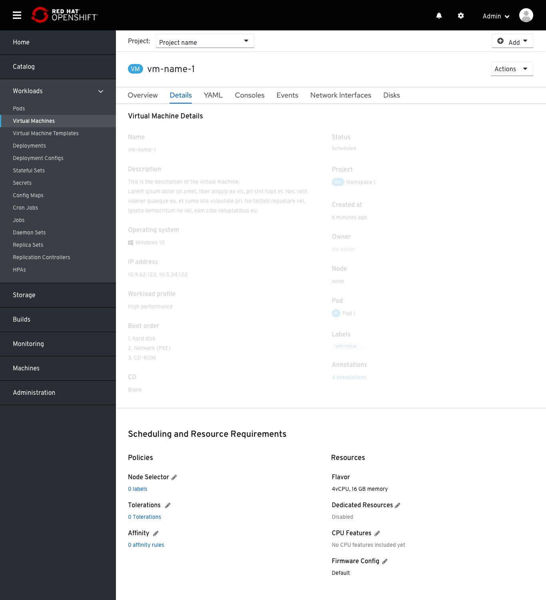

# Scheduling Section

Creating a new section in the VM details page, Overview tab
('Scheduling': If, where and how this workload will be placed within the cluster's nodes)

Introducing a new section within the Details tab: `Scheduling and Resources Requirements`.
This section comes right after the Virtual Machine Details section.
This section contains all the properties that are set from this workload and affect this workload's scheduling.
The two columns are sorted so the left column is dedicated for label-based kubernetes scheduling policies.
The right column is dedicated for resources request and management.
