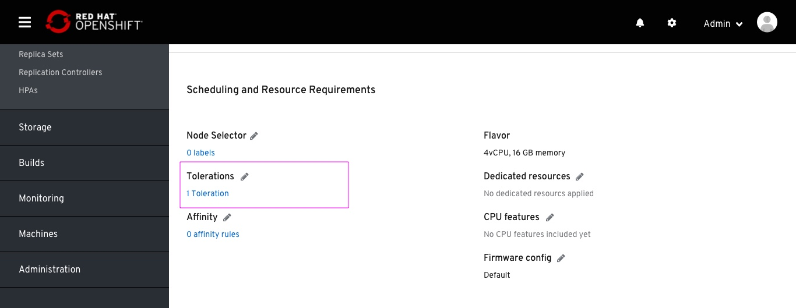

# VM Tolerations

Mananging VM tolerations for tainted nodes

Within the VM page, Details tab, the Tolerations field is placed under the Scheduling section.

The modal presents the same placement as Node-selector.
The differences are as follows:
- An additional 'Effect' field for each row.
- The 'Add toleration row', and not 'Add label row'
- The 'Nodes checker' checks for expressions including the 'Effect' field, meaning node taints.

Matching nodes found.
Same function as in Node-selector.

Results in-page.