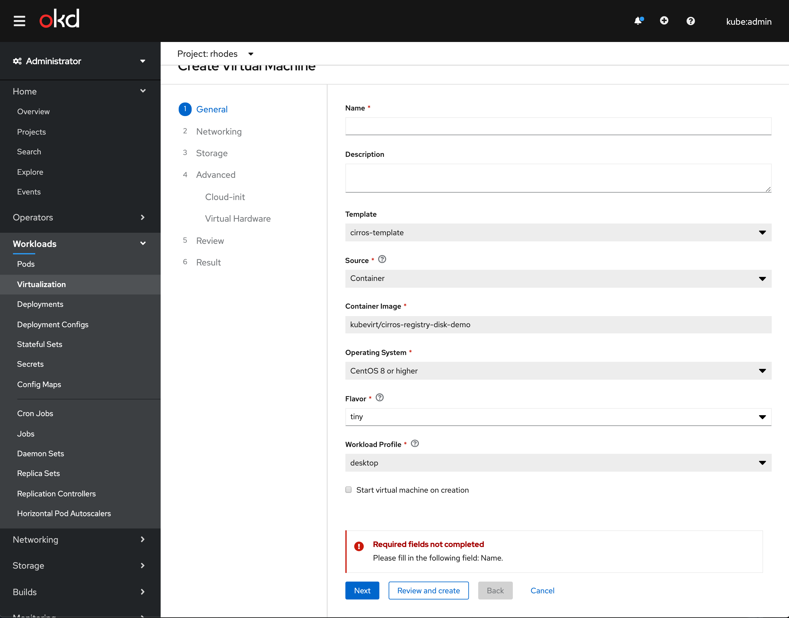
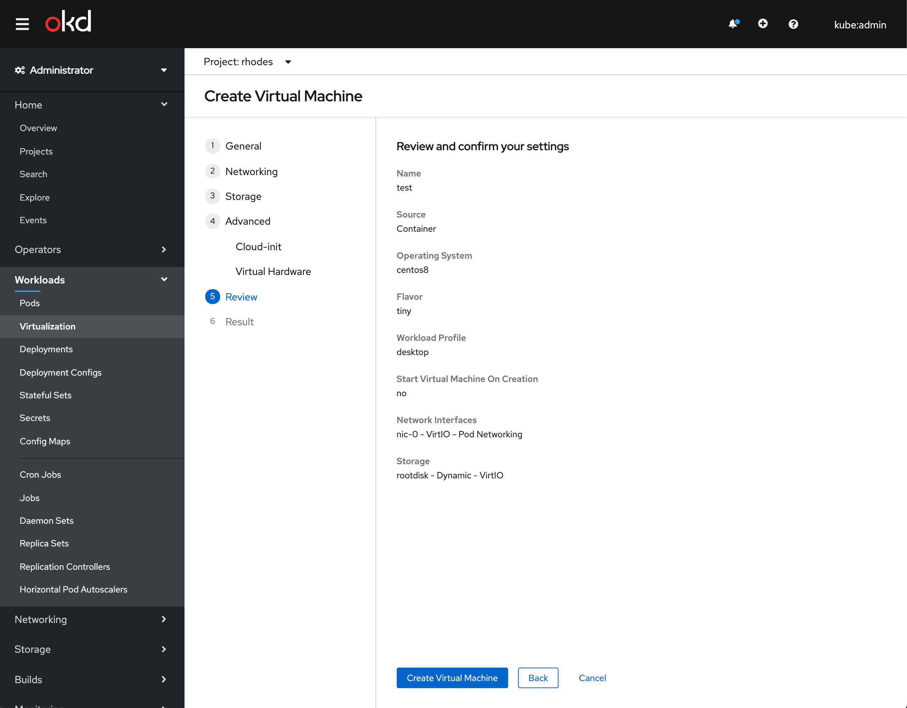
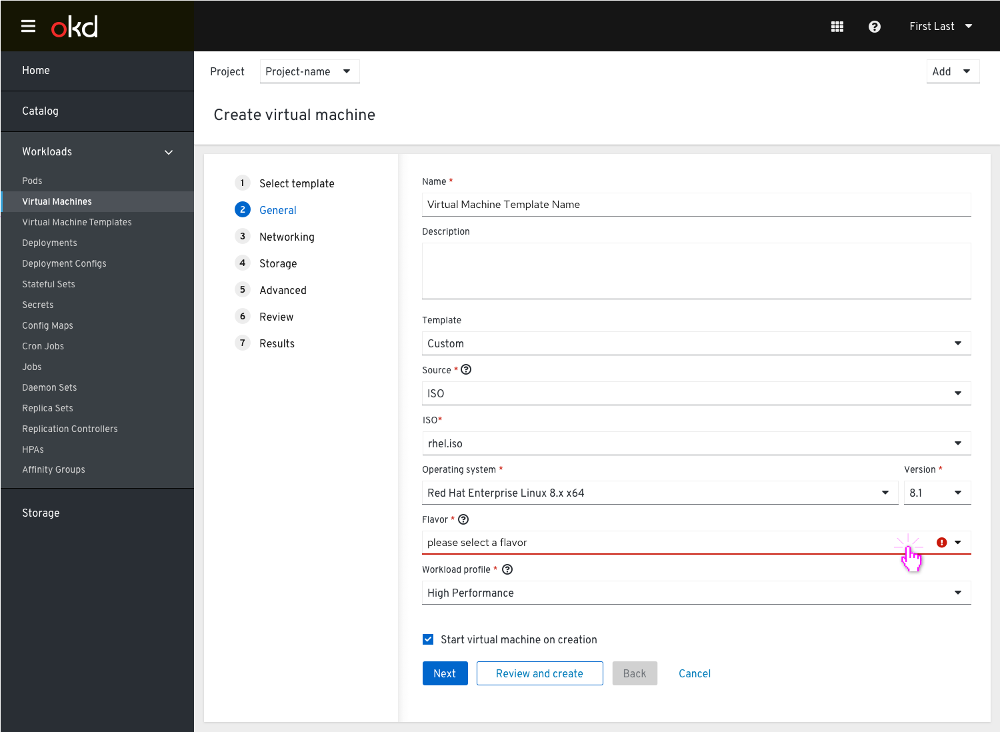

## Virtual machines and VM templates are located under Virtualization

One of the options for users to create a VM is when they choose a to create it from a template.
Under the left side navigation tab ‘Virtualization’ we'll have 2 tabs: ‘Virtual Machine Templates’ and ‘Virtual Machines’.

### Virtual Machine Templates Tab

From the Virtualization left nav item the user goes to the Virtual machine templates tab where they can see the full list of templates.

Both options will lead the user to the general step of the wizard where they will need to provide a name for the VM they want to create.

If all they need is to provide a name for the VM, they can skip to the 'Review and create' step where they can review the settings and create the VM.

If they need to edit any of the settings for this VM that are different from the template they started with, they will need to go through the steps to edit the settings and then create the VM. F.e. if a user wants to change the flavor, they will need to go to the general step and reedit this field.

