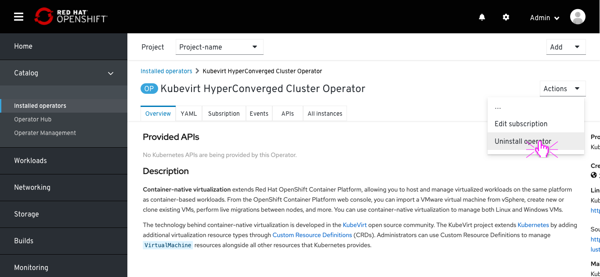
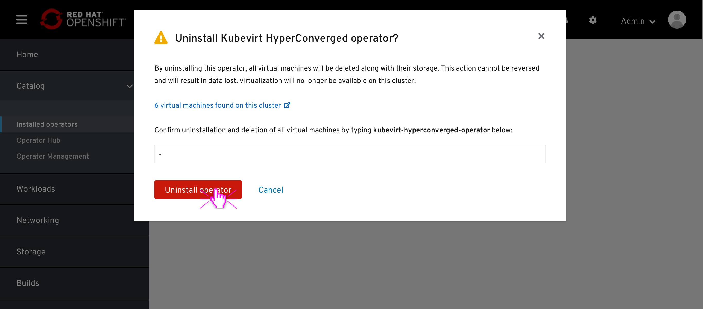
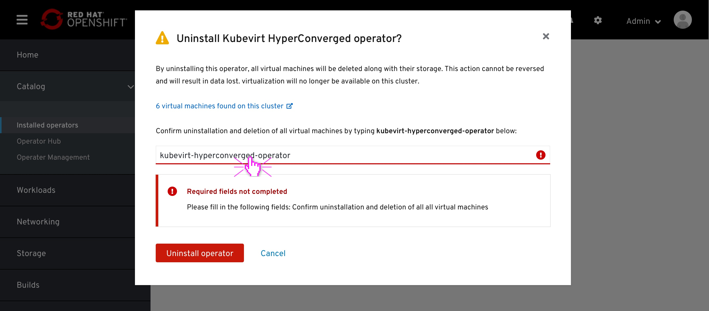
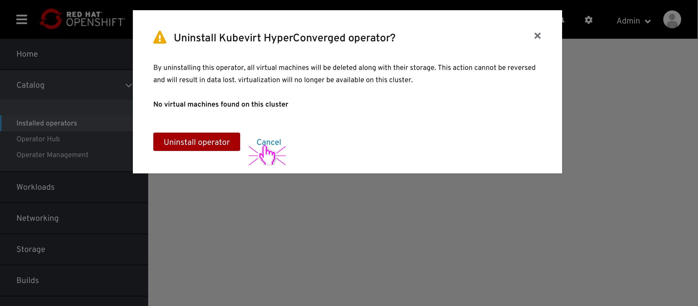

# Uninstall CNV

Ensure that the user is aware that uninstalling this operator will require to delete all VMs as well. That deletion cannot be reversed and data will be lost.

When `uninstall` is selected the user is presented with a confirmation dialog notifying that:
- This action requires deletion of all VMs
- There are [x] VMs found, with an external link to view them
- A confirmation string box, where the user need to type the operators name.

 After the migration had started, the status of the VM in the list view will be updated to reflect that the migration has already started.

 

In case the user has clicked the `uninstall` button without confirming, A warning notification box will notify that required fields are missing.

 

In case there are no VMs in the cluster, the modal will surface that and will not require any additional confirmation.