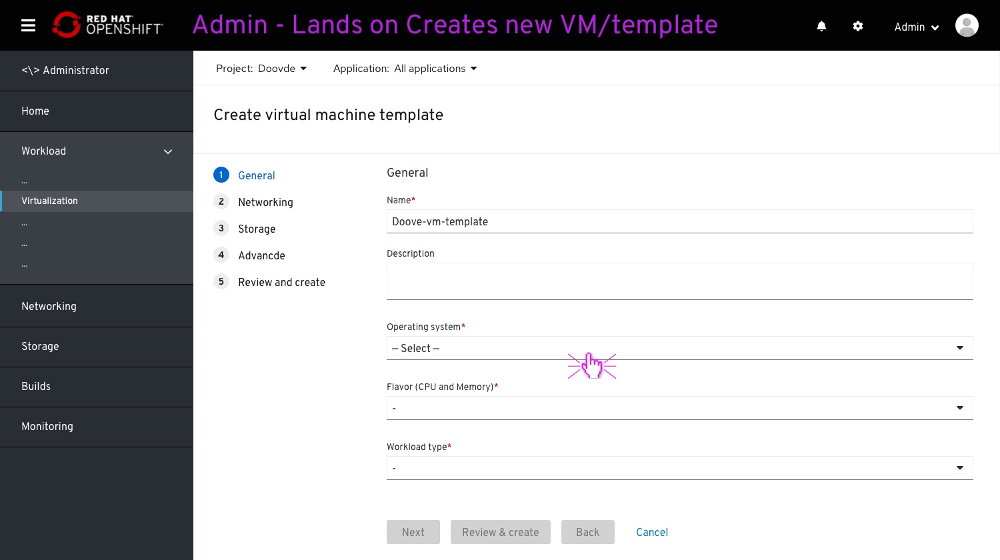
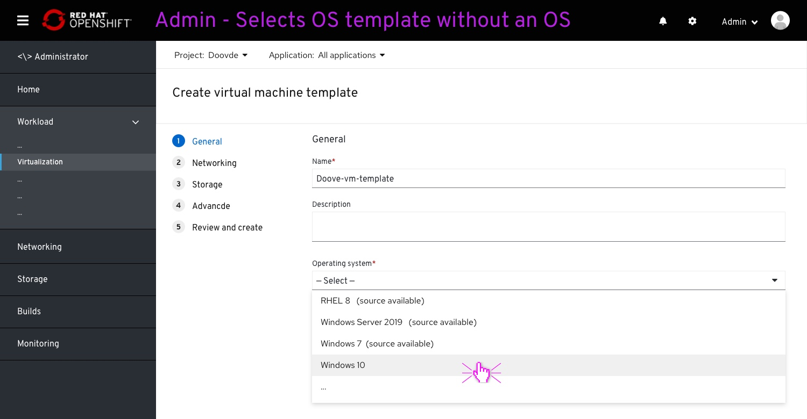
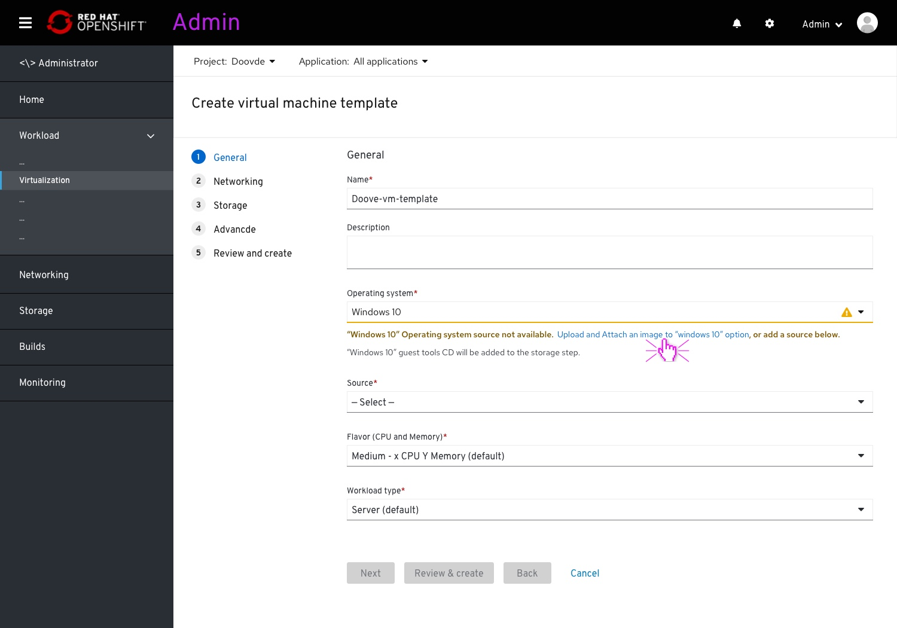
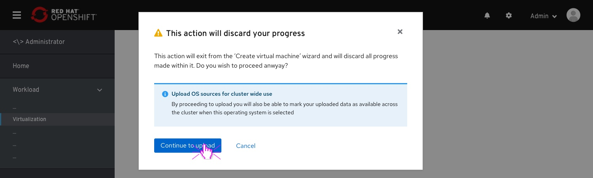
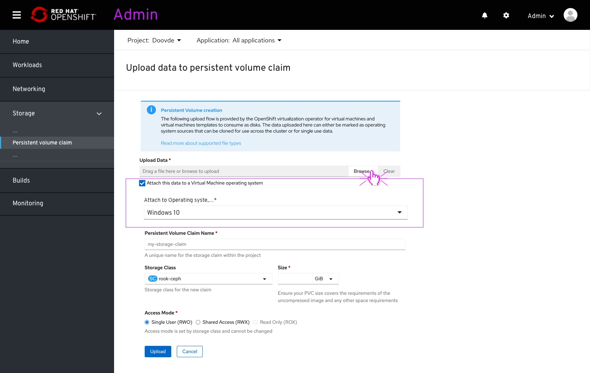
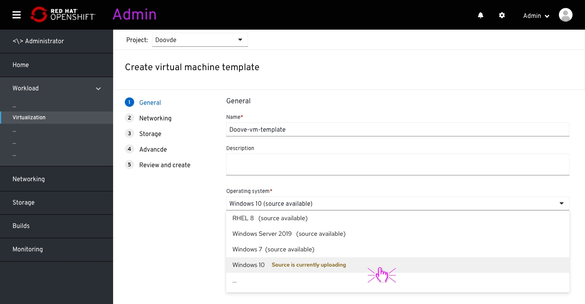
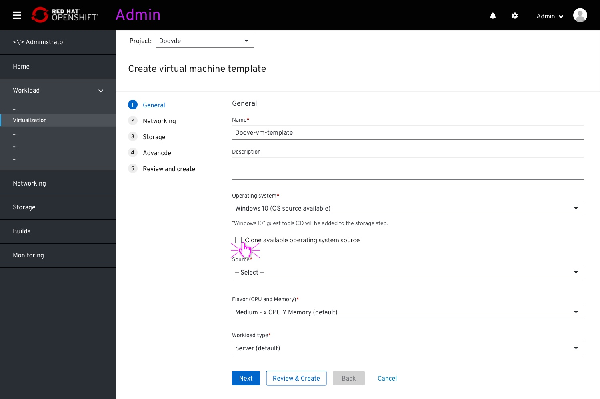

# Add an operating system image to a common template

## About

We strive to provide an off-the-shelf OS image with every common template.
This an ongoing effort.
Hopefully this will provide the user with a much easier experience to creating a virtual machine.
This OS image takes the shape of a disk image(data-volume) and can be attached to the OS template (one of the parameters within the common templates).
These OS images, and common templates in general, won’t be editable for the user.
Today, we don’t have OS images, so we need a temporary solution; offering the user a way to attach a new image that he adds to a common template, making it available on selecting that OS template field.

## Adding an OS image

On clicking "Create VM" the user lands on the wizard.
The user enters a VM name and clicks on the operating system dropdown to select an OS.

The options with included images will be marked with a "(source available)".
This time, the user selects an OS without an available image/source.

The user will be presented with a warning message notifying that no OS image/source detected.
The user can either click the "Upload and attach..." action to couple a new OS image to the OS selection, or to provide a source on the field below.
A “source” field (previously called “source”) will present itself.

On clicking the "Upload & Attach os source..." on the warning message link, the user will be presented with a modal.
This modal will warn the user that the "create VM" session will be discarded and all progress will be lost.
The modal will also mention the benefit of continuing, making this source available for all from now on.

## Selecting an OS with a backed OS images

The user browse to the image local file.
All other fields are left to default, making the image an available source when selecting "windows 10 from the OS dropdown".

After the Upload and attach complete, the source will be available for "windows 10".

In case the user has entered the wizard without waiting for the upload and attachment to finish, the "windows 10" option will indicated that a source is currently being added.

Unchecking the "Clone..." checkbox will surface the "source" field again below.
