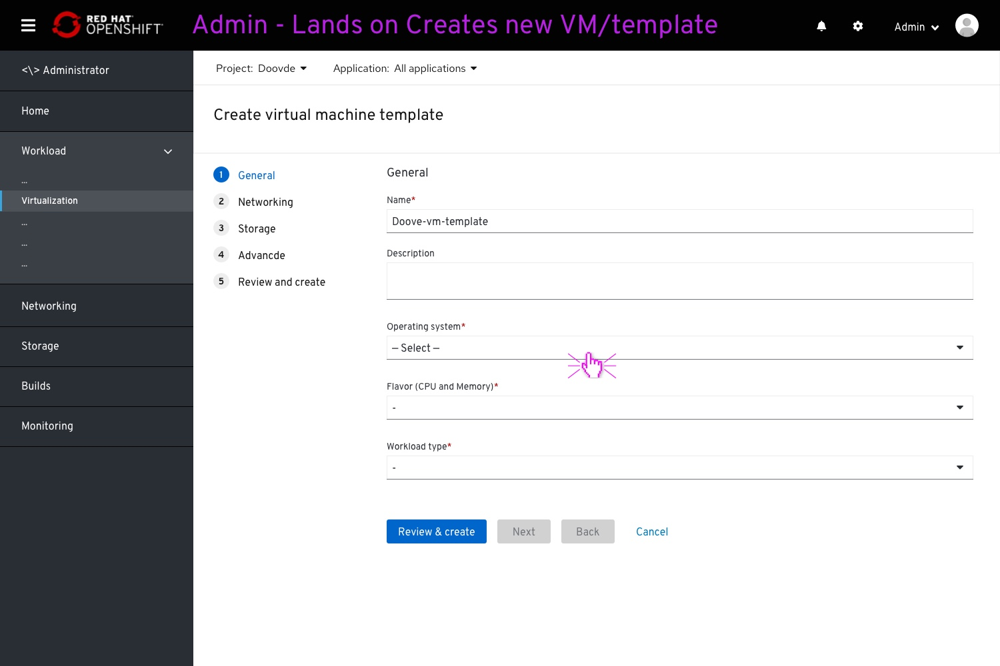
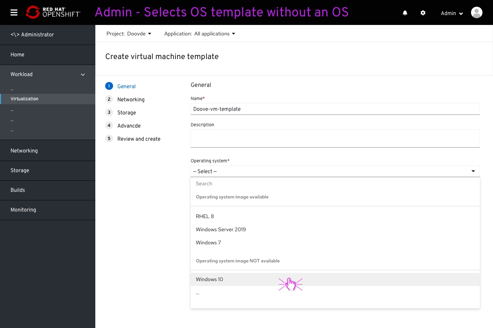
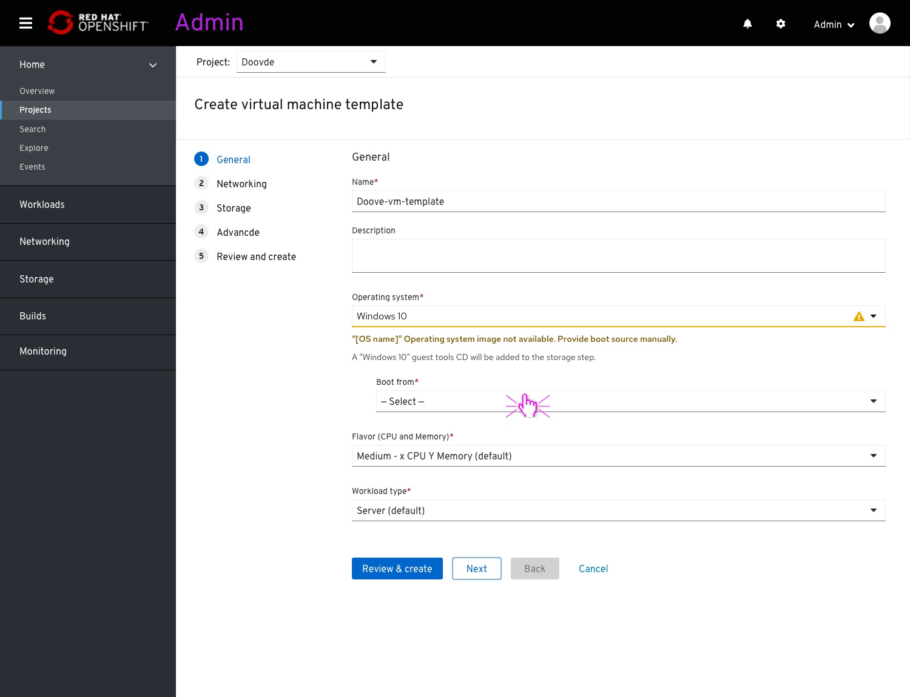
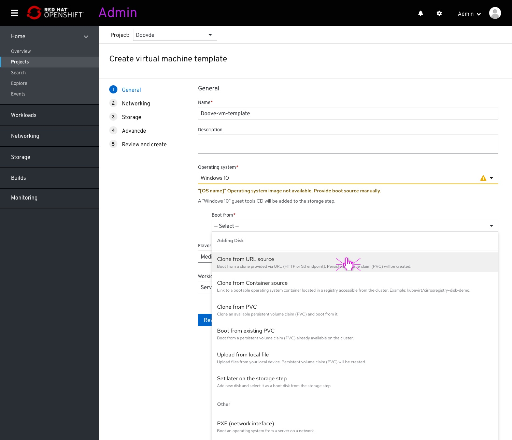
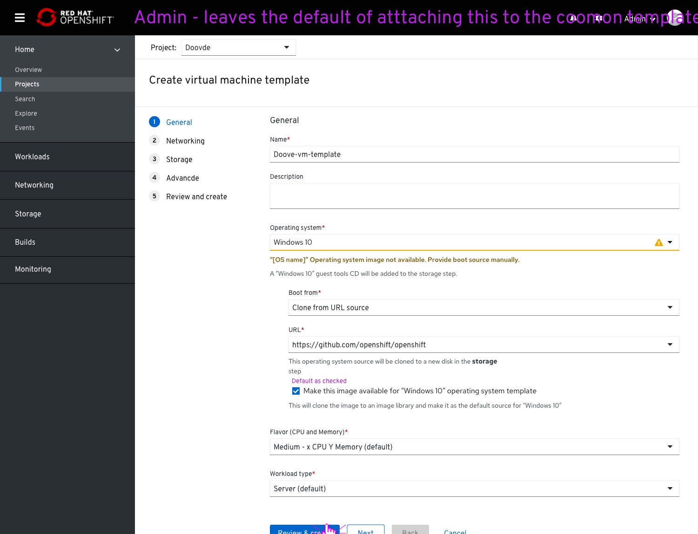
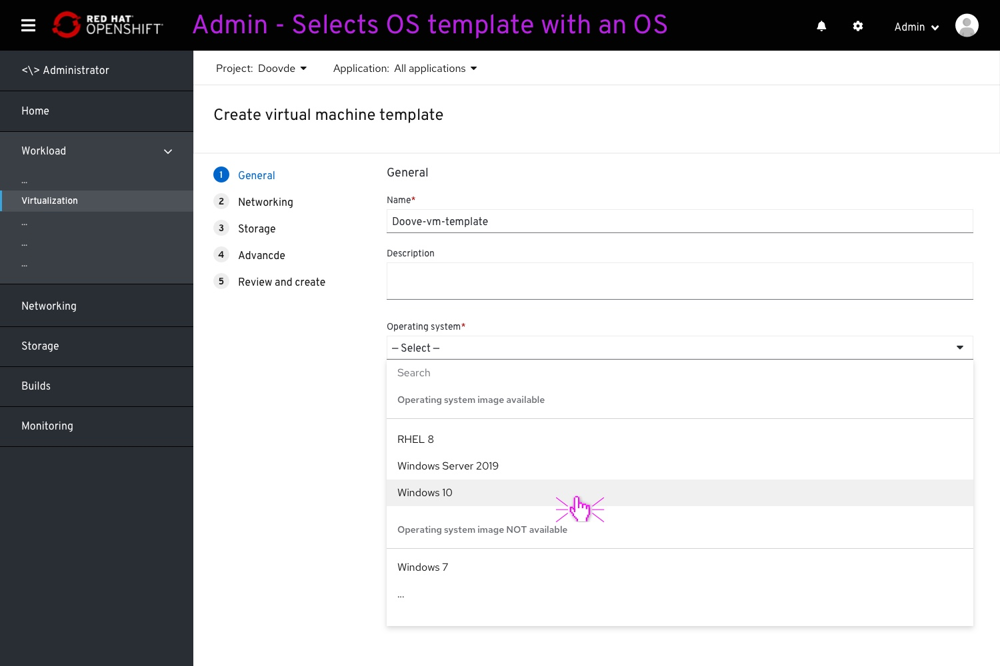
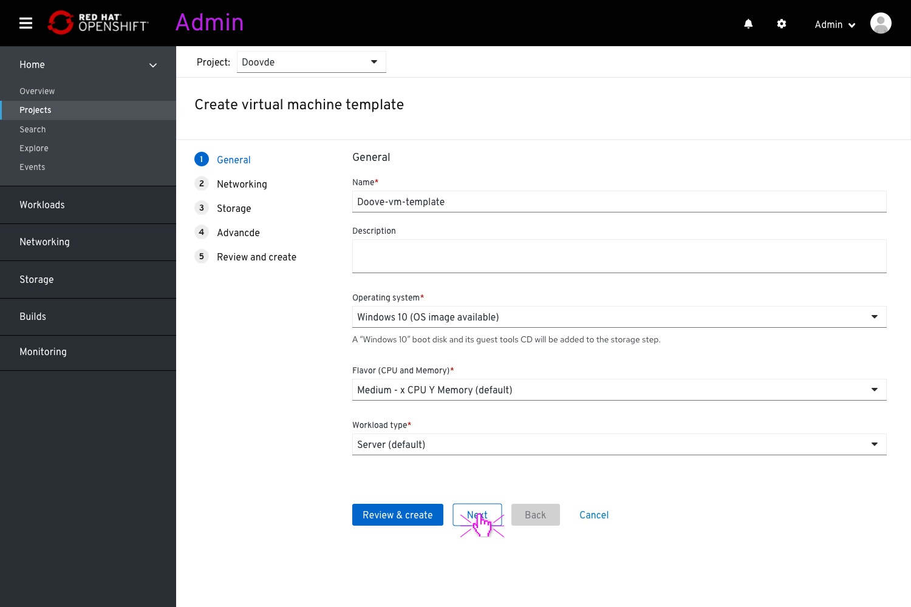

# Add an operating system image to a common template

## About

We strive to provide an off-the-shelf OS image with every common template.
This an ongoing effort.
Hopefully this will provide the user with a much easier experience to creating a virtual machine.
This OS image takes the shape of a disk image(data-volume) and can be attached to the OS template (one of the parameters within the common templates).
These OS images, and common templates in general, won’t be editable for the user.
Today, we don’t have OS images, so we need a temporary solution; offering the user a way to attach a new image that he adds to a common template, making it available on selecting that OS template field.

## Adding an OS image

On clicking "Create VM" the user lands on the wizard.
The user enters a VM name and clicks on the operating system dropdown to select an OS.

The OS dropdown would promote OSs backed by images by placing them on top.
It will also have a search field to fetch all desired results without going through two lists.
This time, the user selects an OS without an available image.

The user will be presented with a warning message notifying that no OS image detected.
A  “Boot from” field (previously called “source”) will present itself, indent.

"Boot from" options.

In this case, the user selects to clone from URL and boot from the clone.
The user enters the URL.
The user and leaves to default the “Make this image available for …” checkbox on.

## Selecting an OS with a backed OS images

This time, the user selects an OS from the "available images" section.

The user is notified that this option has an OS image available.
