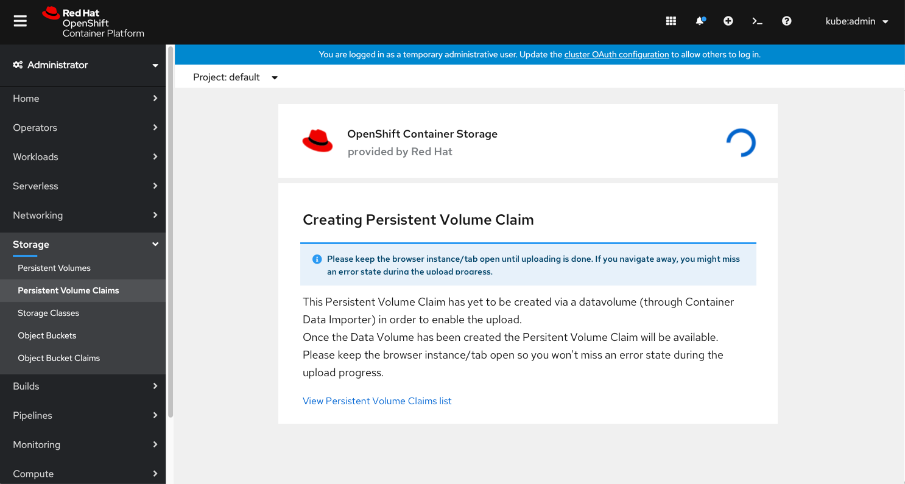
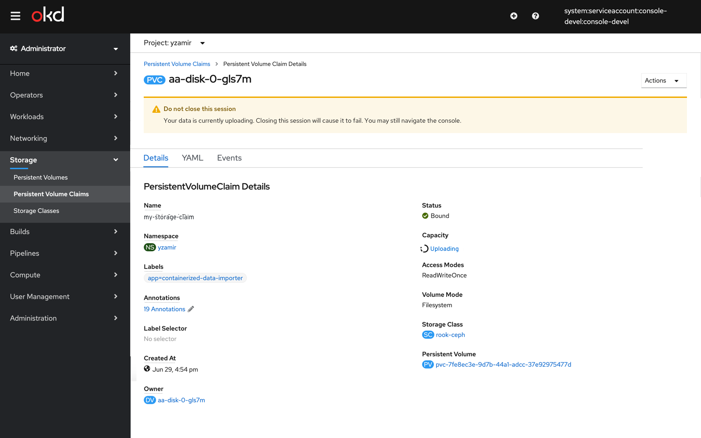
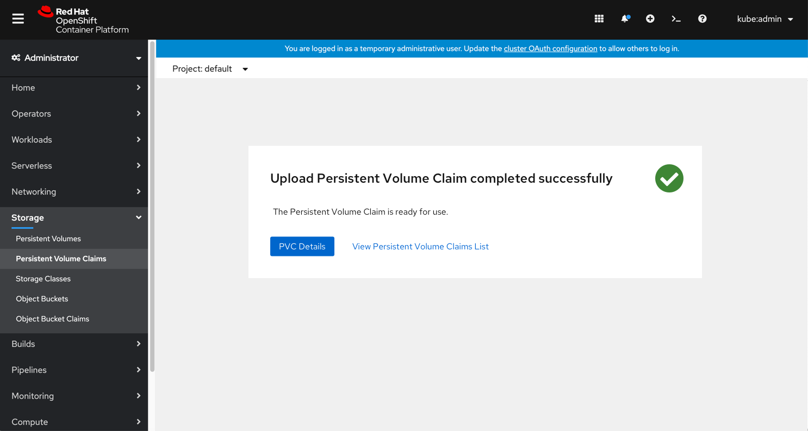
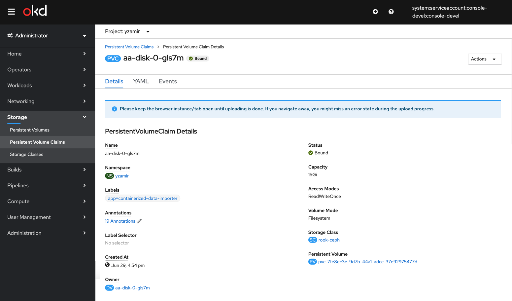
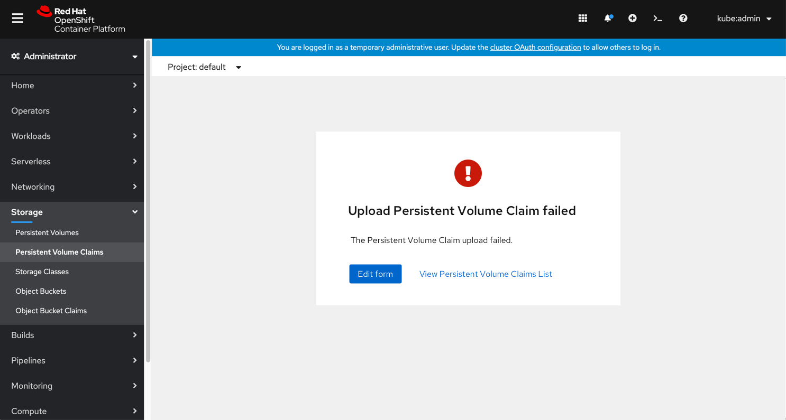

# Upload Image prior to creating a VM

This PR deals with when a user wants to upload an image prior to creating a virtual machine.
It needs to be accomplished via the storage/PVC area.
It should ensure the user understands what the backing PVC does but does not remove the Disk terminology.

The ‘Create PVC’ button will change into a dropdown, so users will be able to select ‘Upload data to Persistent Volume Claim’ from this dropdown.
That will make 2 separate actions for creation, one of them being able to 'Upload data to Persistent Volume Claim'.
By creating a dropdown and adding this new action, we'll highlight this action as a new feature (in an existing form) so the users will be able to easily find it.

They will get to a new upload screen with an inline info alert that says this PVC will be created using a DataVolume through Container Data importer (CDI).
User chooses an image to upload and fills in the PVC details: Name, size, storage class, access mode. Some of the fields can be filled out but editing will be optional as well.

After the user clicks ‘Upload’ they will get to the new installing screen where a spinner symbplyzes the PVC is currently being created.

The status is shown and updates in real time on the upload screen.
We'll include a warning notification with a request to keep the browser instance open until uploading is done, otherwise the upload process will stop and fail. We'll provide a link to view the PVCs Details page.

The List view will show an ‘uploading’ status. A popover will include an explanation (The PVC has been created and the file upload is in progress) and an option to cancel the upload process.

Once the upload is successfully done the user has the option to view the PVC Details page or view the PVC's list.

If the CDI fails to create the PVC, we'll show an error on the upload page and users will be able to go back to the form and fix the error.

List view when upload fails

