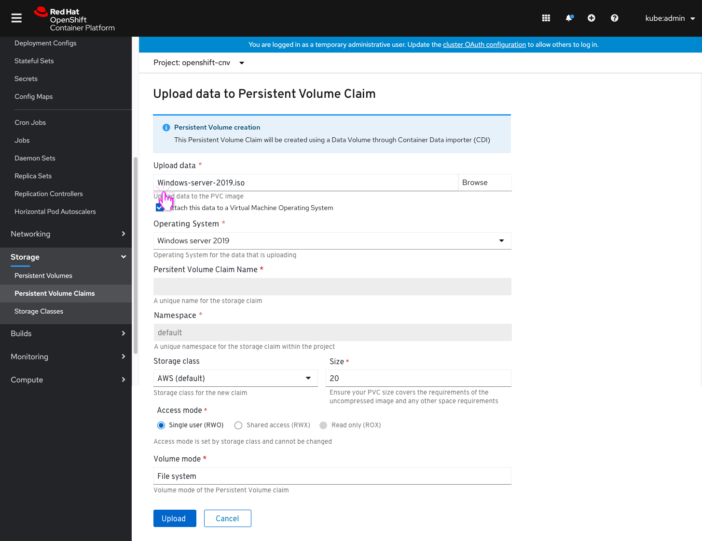

# Upload Image (data source) prior to creating a VM

This PR deals with when a user wants to upload an image (data source) prior to creating a virtual machine.
It needs to be accomplished via the storage/Persistent Volume Claim area.
It should ensure the user understands what the backing Persistent Volume Claim does but does not remove the Disk terminology.

The ‘Create Persistent Volume Claim’ button will change into a dropdown, so users will be able to select between create 'Persistent Volume Claim with form' or create ‘Persistent Volume Claim with form and data upload’.
By creating a dropdown and adding this new action, we'll highlight this action as a new feature (in an existing form) so the users will be able to easily find it.

They will get to a new upload screen with an inline info alert that says this Persistent Volume Claim will be created using a DataVolume through Container Data importer (CDI).

The user chooses an image (data source) to upload.
In order to allow the user to flag an OS for the data they are uploading, they need to select an OS to attach data to. This selection will define the name/namespace of the Persistent Volume Claim.
If they want it to back an Operaing System they'll check the check box and the Operating System dropdown will be shown.
Once that happens the name/namespace fields are filled in and become disabled.
Then the user fills the rest of the Persistent Volume Claim details: size, storage class, access mode, namespace. Some of the fields can be filled out but editing will be optional as well.

After the user clicks ‘Upload’ they will get to the new installing screen where a progress bar symbplyzes the upload progress. The status is shown and updates in real time.
We'll include a warning notification with a request to keep the browser instance open until uploading is done, otherwise the upload process will stop and fail. Users may still navigate the console, though.
We'll provide a button to view the Persistent Volume Claim details and a link to cancel the upload process.

The List view will show an ‘uploading’ status. A popover will include an explanation (The Persistent Volume Claim has been created and the file upload is in progress) and an option to cancel the upload process.

Once the upload is successfully done the user has the option to view the Persistent Volume Claim Details page or view the Persistent Volume Claim's list.

If the CDI fails to create the Persistent Volume Claim, we'll show an error on the upload page and users will be able to go back to the form and fix the error.

List view when upload fails

