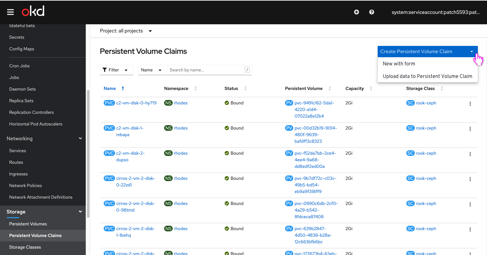
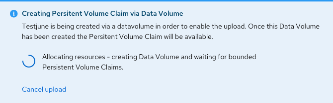
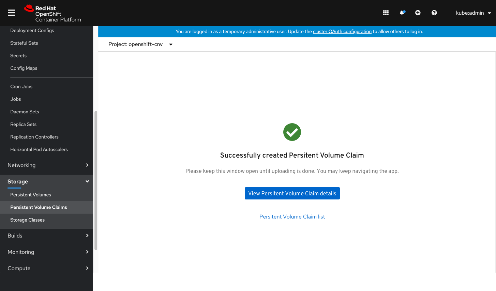
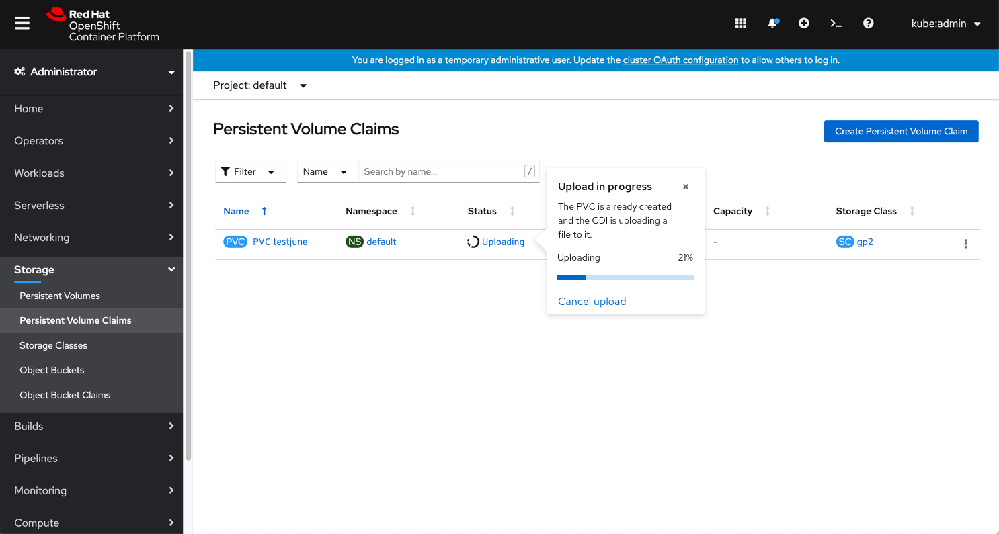
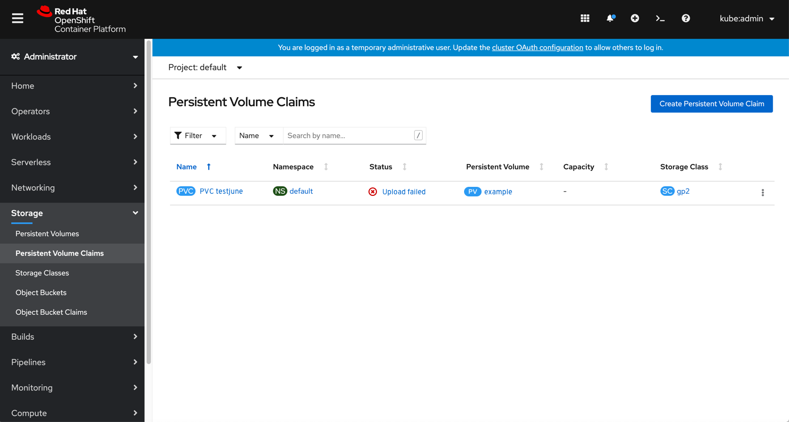
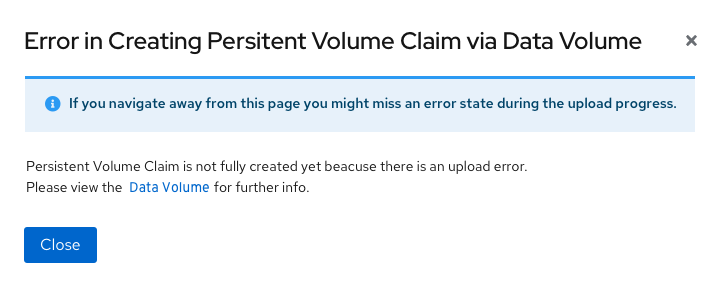

# Upload Image prior to creating a VM

This PR deals with when a user wants to upload an image prior to creating a virtual machine.
It needs to be accomplished via the storage/PVC area.
It should ensure the user understands what the backing PVC does but does not remove the Disk terminology.

The ‘Create PVC’ button will change into a dropdown, so users will be able to select ‘Upload data to Persistent Volume Claim’ from this dropdown. 

They will get to a new upload screen with an inline info alert that says this PVC will be created using a Data Volume through Container Data importer (CDI).
User chooses an image to upload and fills in the PVC details: Name, size, storage class, access mode. Some of the fields can be filled out but editing will be optional as well.

After the user clicks ‘Upload’ they will get an inline notification with a spinner + text explanation about the PVC creation progress. We’ll use the spinner over the progress bar because we can't really offer progress and there aren't any steps to highlight.

Once the progress is successfully finished they will get a success indication with a request to keep this browser instance/tab open and can either choose to go to the PVC Details page or to the list view.

The List view will show an ‘uploading’ status and the popover will include an explanation (the PVC is already created and the CDI is uploading a file to it) and an option to cancel the upload process.

If the upload fails before the PVC is created, we’ll show an error on the PVC.
Until we have toast notifications we don't want to encourage the user to leave the PVC upload flow until something has been successfully created, so we’ll advise the user that in case they navigate away, they might miss the error, and provide a link to the data volume for further info.

