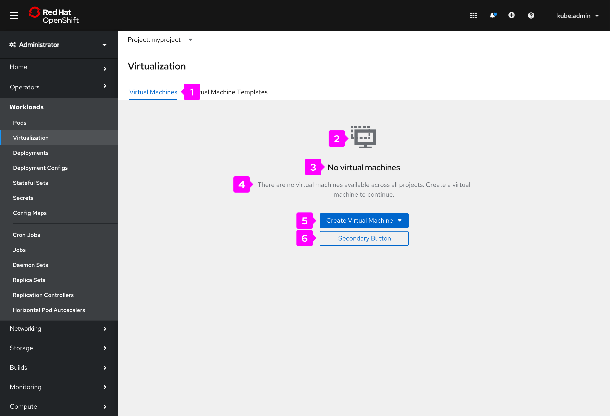
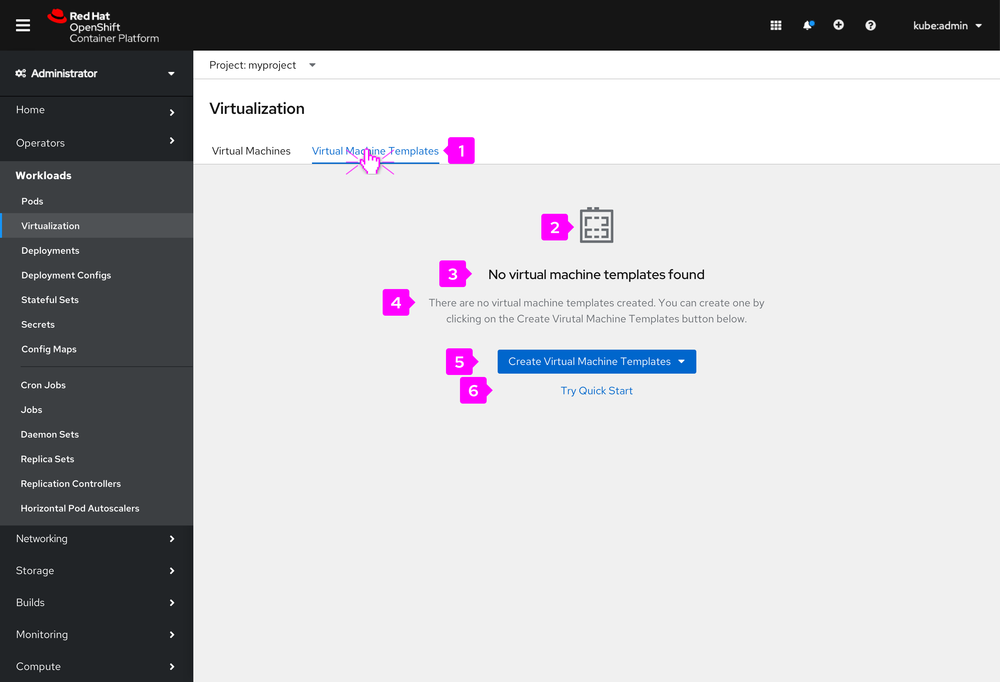
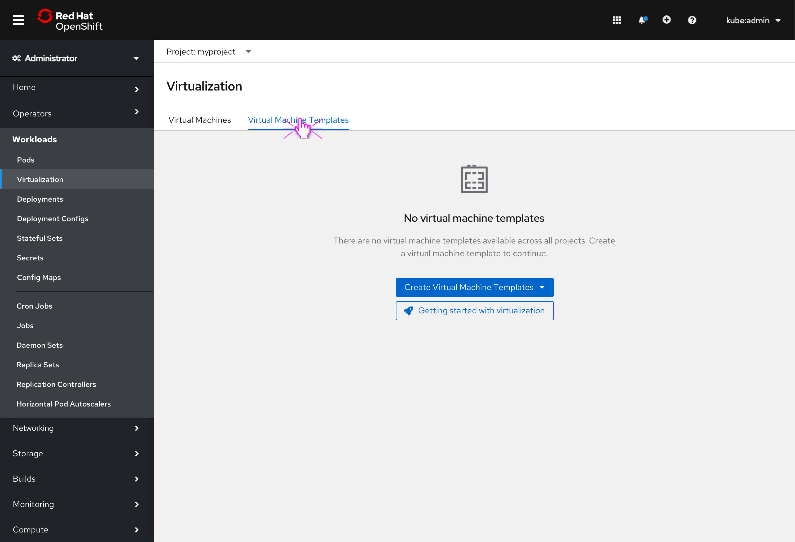

# Virtualization Default Empty States
Foday Kargbo - UXD
## Background
Virtualization is being introduced to the console. Virtualization will be accessed via the main left navigation panel. Once the user navigates to Virtualization, they will see 2 tabs, one for the Virtual Machines screen, and one for the Virtual Machine Templates screen. The Virtual Machines tab will be selected by default.
## Objectives
Users who have not created virtual machines or virtual machine templates will not be able to see any data on these screens. 

The goals of this task:
- Create empty state screens when there is no data to show
- Inform the user about the current state
- Educate the user about what they will see when data is available
- Guide the user to take action
- Explore any useful content that might help the user be contextually productive?
## 1. Virtual machine default empty state screen

## UI Inventory
1. Tabs
2. Graphic (Icon)
3. Title text
4. Body text
5. Call to action button
6. Secondary call to action (optional)

## Discussion
1. Tabs: Are we ok with the title on this tab? Yes (Resolved)
2. Graphic: We should use an image with context 
3. Title text: Are we ok with this title?
4. Body text: Are we ok with this text?
5. Call to action button: On click/tap it opens a dropdown menu with 3 options:
    - New with Wizard
    - New from YAML
    - New from Template
6. Secondary call to action: (optional) Is there a need for this? Suggestion: We could use this as an opportunity to educate the user. This could be a good place for a "Quick Start" button. Alternatively, we can introduce the Quick Start above the tabs. Quick Start placement is a work-in-progress and still needs to be confirmed. Comments?

## 2. Virtual machine templates default empty state screen

## UI Inventory
1. Tabs
2. Graphic (Icon)
3. Title text
4. Body text
5. Call to action button
6. Secondary call to action (optional)

## Discussion
1. Tabs: Are we ok with the title on this tab?
2. Graphic: We should use an image with context. Comments? 
3. Title text: Are we ok with this title?
4. Body text: Are we ok with this text?
5. Call to action button: On click/tap it opens a dropdown menu with 2 options:
    - New with Wizard
    - New from YAML
6. Secondary call to action: (optional) Is there a need for this? Suggestion: We could use this as an opportunity to educate the user. This could be a good place for a "Quick Start" button. Alternatively, we can introduce the Quick Start above the tabs. Quick Start placement is a work-in-progress and still needs to be confirmed. Comments?

## Explorations
Exploring various ways to push Quick Starts in the empty states.

### Screen 1

