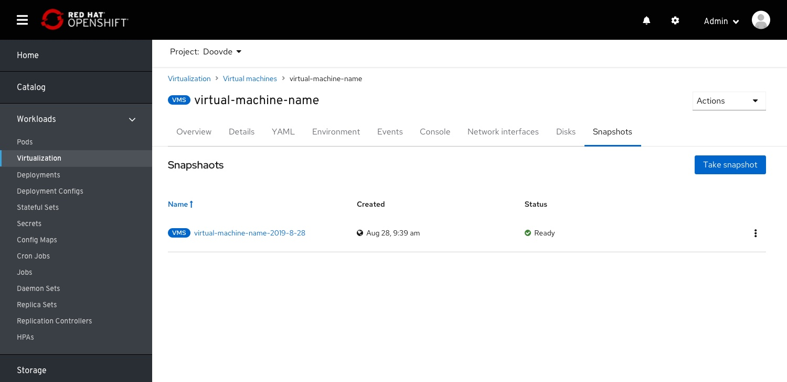
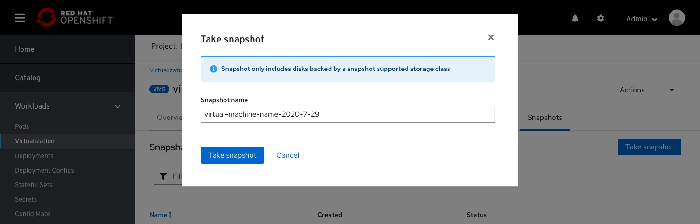
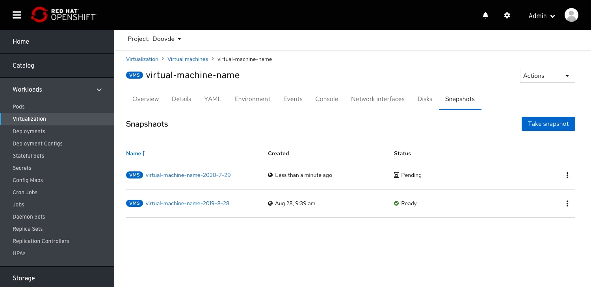
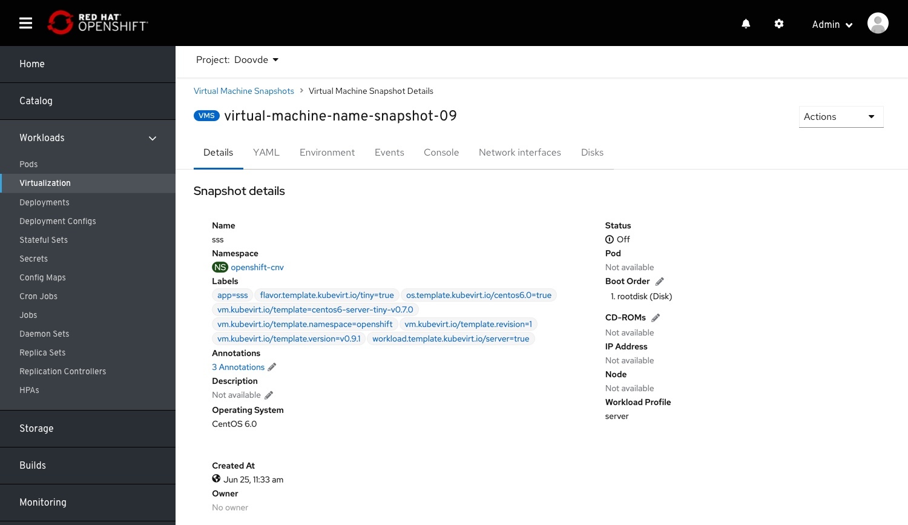
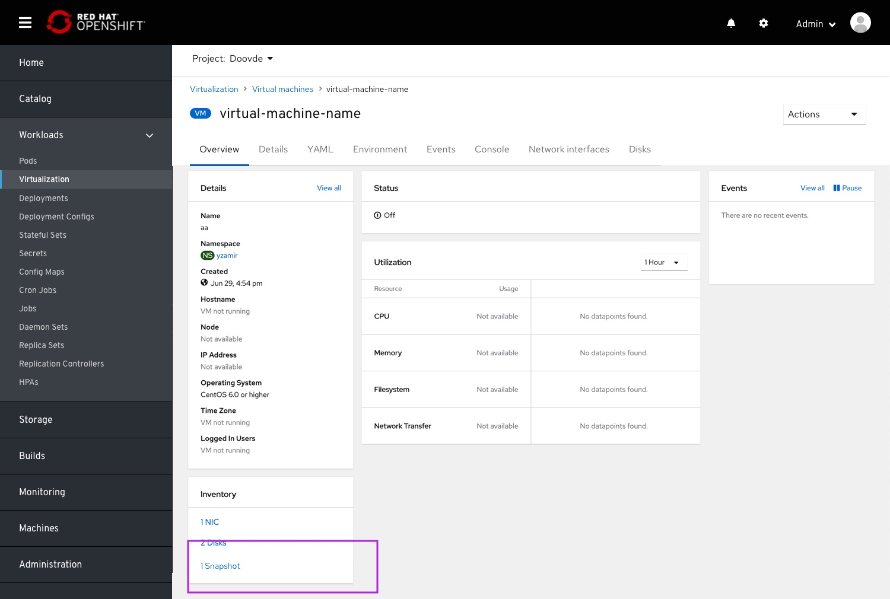
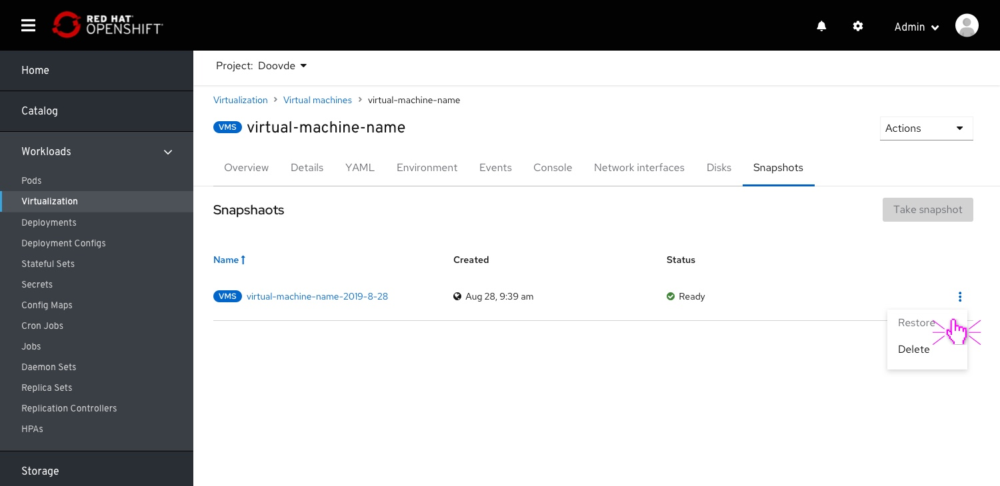
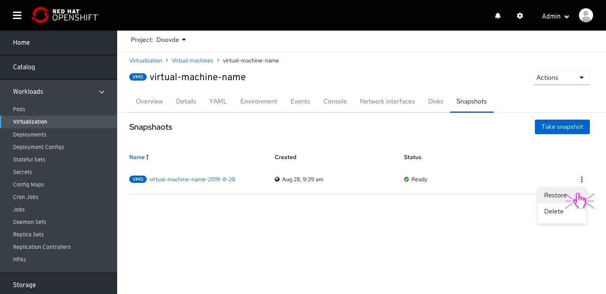
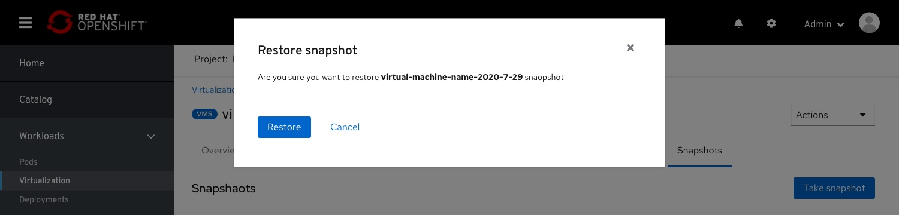
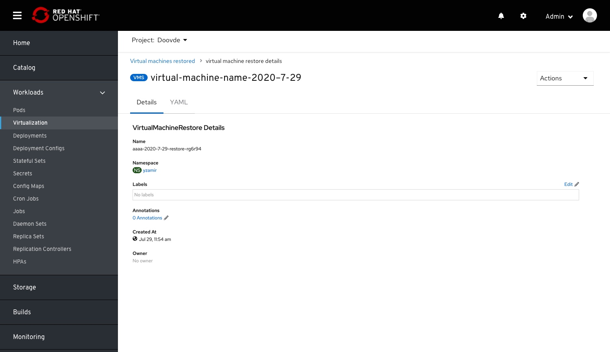

# VM snapshots

This item will cover updates to vm-snapshots
- Creating a VM snapshot
- Snapshots on the VM details page
- Restoring a VM from snapshot

## Creating a snapshot

From the virtual machine details  page > snapshots tab, the user selects Take Snapshot”.

A modal will be presented, requesting for a snapshot name.
An autogenerated name combined with the VM name and the date of the snapshot, this will help in sorting the items on the table.

On creation, the user returns to the VM details snapshot list (because the snapshot was taken from a modal)

## VM snapshot details page

Clicking on the VM snapshot name will land the user on the snapshot details page.
At the moment, the current implementation of the IA (visible in the breadcrumb) is:
'Virtual Machine Snapshot > Virtual Machine Snapshot Details'
This should be changed in the future to"
'Virtualization > virtual machines > virtual machine details > snapshots > snapshot details'

## Snapshots on the VM dashboard

Snapshots will be surfaced in the VM dashboard > Inventory, linked to the snapshots list

## Snapshots for running VMs

For a running VM, snapshots cannot be taken.
The current implementation is to disable the actions.
It is the same case for disks.
In future design, this should be changed to alerting the user why a snapshot cannot be taken.

# Restoring VM from snapshot

Selecting the Restore action from a snapshot actions menu.
This is available also from the snapshot details page.

A restore conformation modal.

On restoring, the user will land on a "VM-Snapshot restored" details page.
This page is currently located (visible in the breadcrumb) under:
'Virtual Machine Restores > Virtual Machine Restore Details'
This should be changed in the future to reflect if the VM which was run over, and provide a IA that can be reached from navigation, and link back to the current VM.
