# Snapshots - updates

## Adding a ‘Last restored’ column to the list view

We'll add a ‘Last restored’ column to the snapshots list
that will show which snapshot was restored most recently, so the latest snapshot would be at the top of the list and indicate the time when it was last restored from.

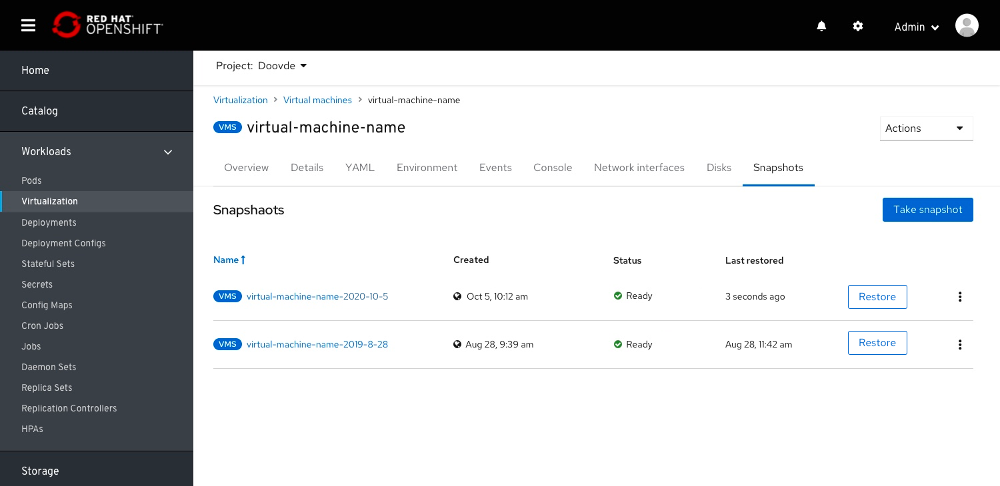

## Restore VM from a snapshot

After the user clicked to ‘Restore’ VM from a snapshot we will show in the status column that the VM is currently being restored from this snapshot.
Restore can be done either from the kebab menu or from the secondary button at each row.

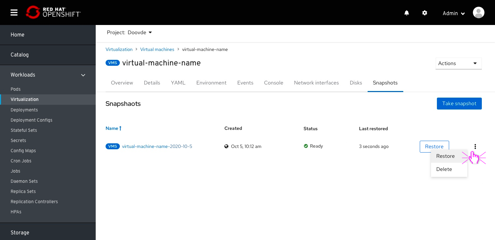

## Restoring popover

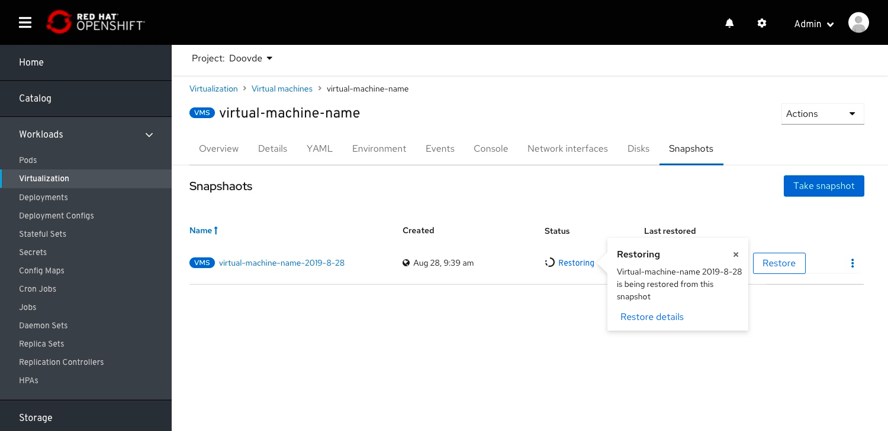

## Restore completed

## Restore failed

In case the Restore failed the users can either go to the snapshot details page (by clicking the snapshot name) to see the inline warning alert and continue the investigation from the link.

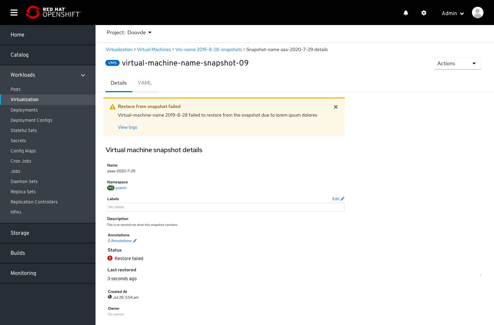

Or click the ‘Try again’ and create a new one and continue the restore procedure.

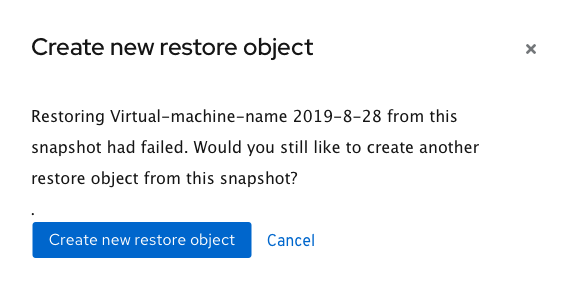

## Adding a description

 We will add the option for the user to add a description to the Snapshot modal so they will remember what this snapshot contains when they will restore from it.
 The description for the VM Snapshot will be added to the Details Page as well.

## Showing which disks will be included in a snapshot

Snapshots will always include all disks which are snapshot-capable. But, there are 2 main reasons for why a disk will not be part of the snapshot:

1. The disk is not a persistentVolumeClaim or dataVolume type. Unsupported types cannot be snapshotted because the data does not reside on a PVC.
2. The disk belongs to a storage class which is not configured to enable snapshots.

We will let users know which of the VM's disks are included and which aren’t in the snapshot they are about to take.

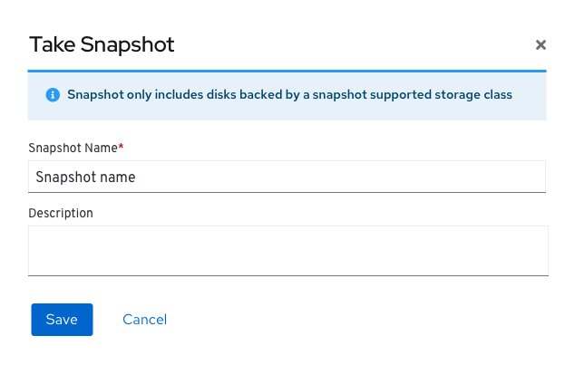

When only part of the disks are included in the snapshot we'll show the included disks are in a collapse/ expand drawer and the excluded ones in a warning notification.
We'll add a confirmation check box so users will be aware of the excluded disk(s) and confirm that they still want to continue to take the snapshot.
We'll allow the users to fix the excluded disks issues by sending them to the edit disk page or to the YAML.

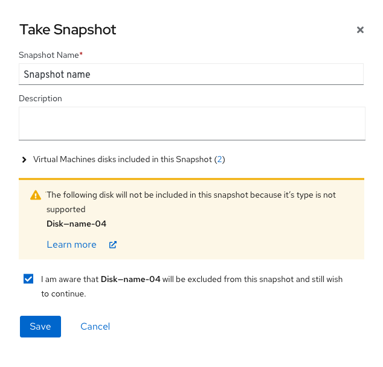

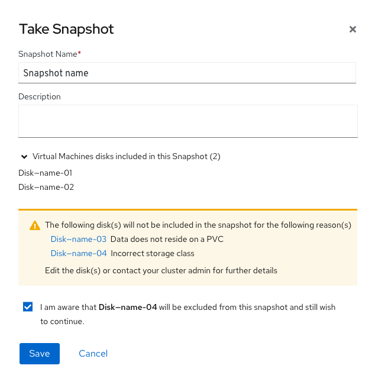

## Details page

The details page will also include the status of the snapshot and the last restored time.

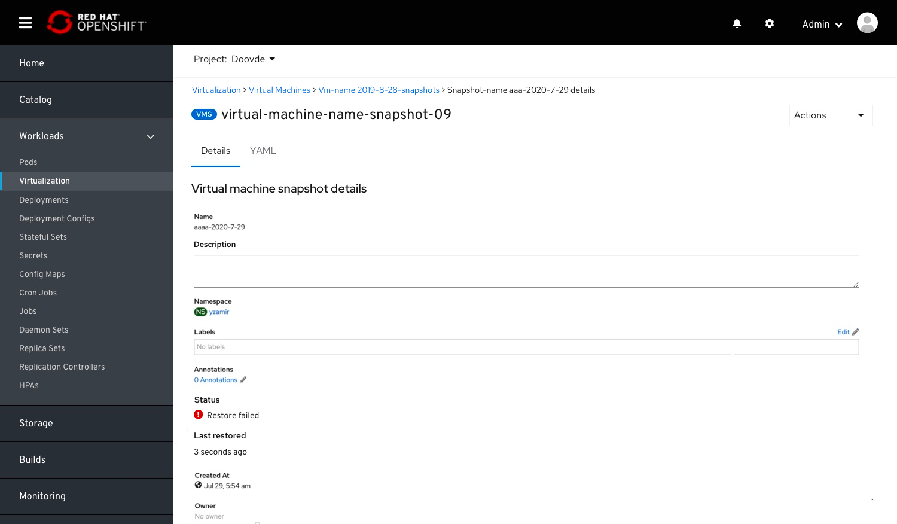

## A Restore action is added to the Actions menu

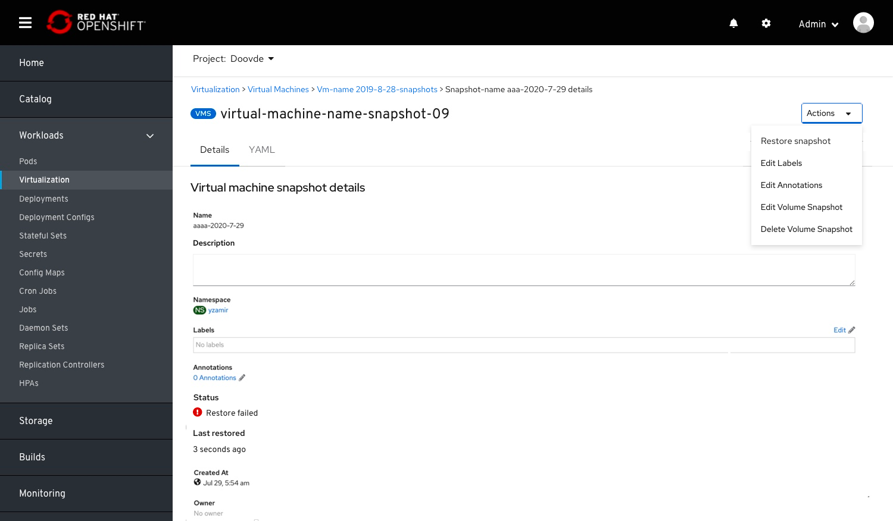

## Alerting before a VM is deleted

When a user decides to delete a VM, we'll let them know that all snapshots of this VM will be deleted as well.

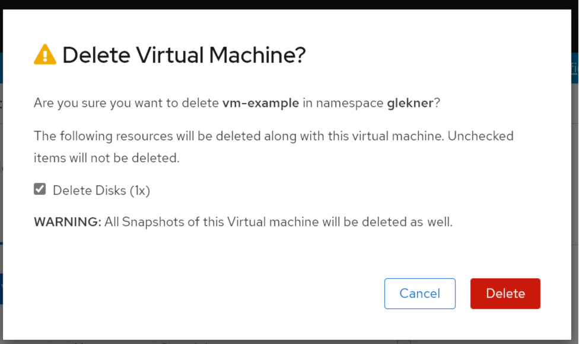