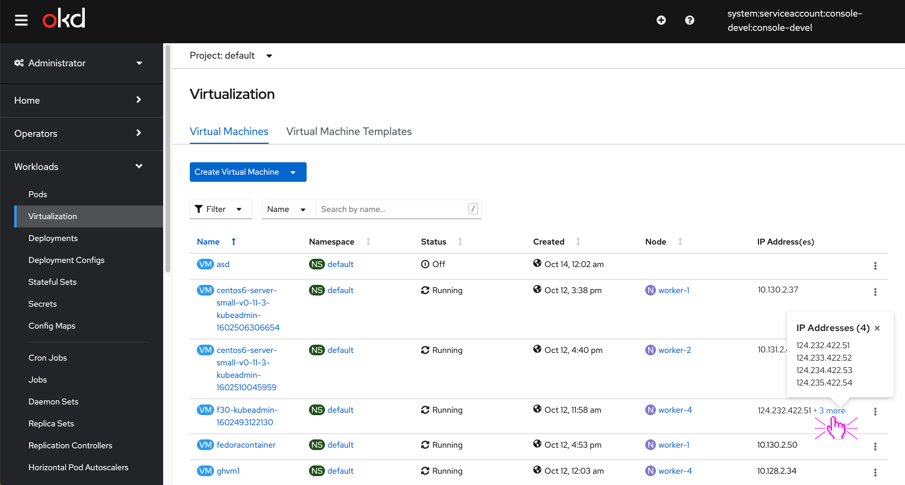
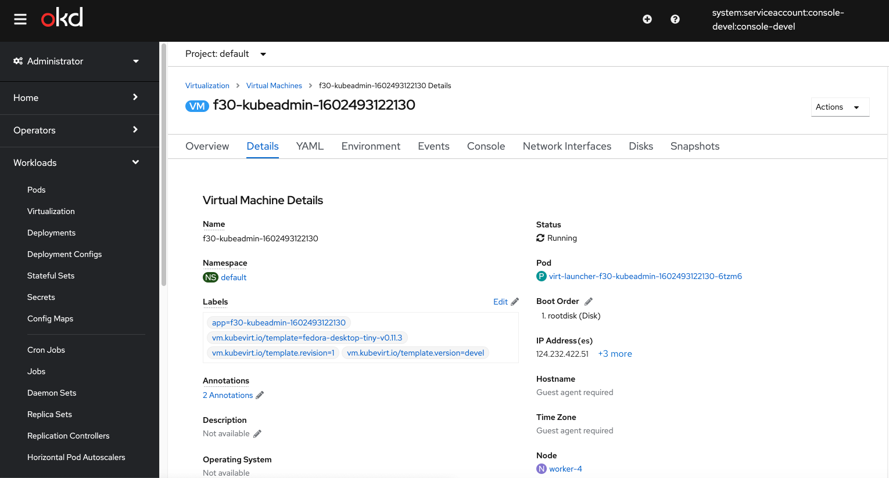
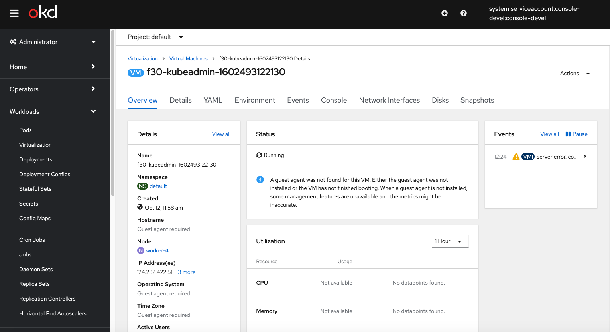

# Add V4 and V6 IP Addresses

## Adding a ‘Last restored’ column to the list view

Currently we only show IPv4 IP addresses but with the addition of IPv6 we should consider how these strings should surface in the list/details view of the virtual machine.
Currently we would not be able to show both types together though.

## List view

In cases a Virtual Machine has more than one IP address, we will show the IP address and the +X more and add a popover that will include all the IP addresses for that VM.

## Popover

That will also reflect in the Virtual Macine's details page

and in the Virtual Machine's Overview page as well.

