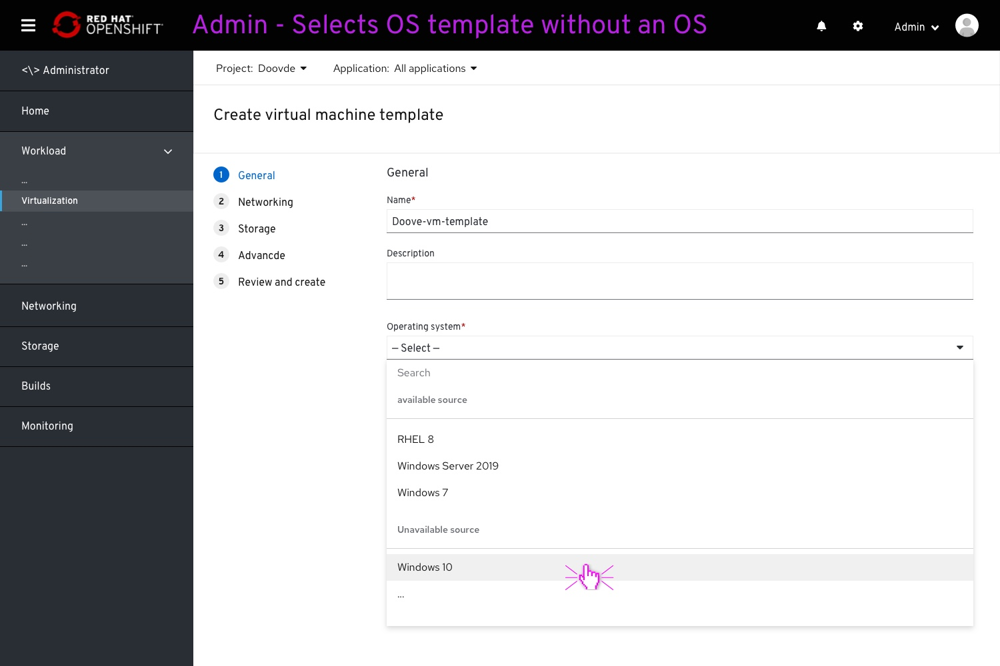
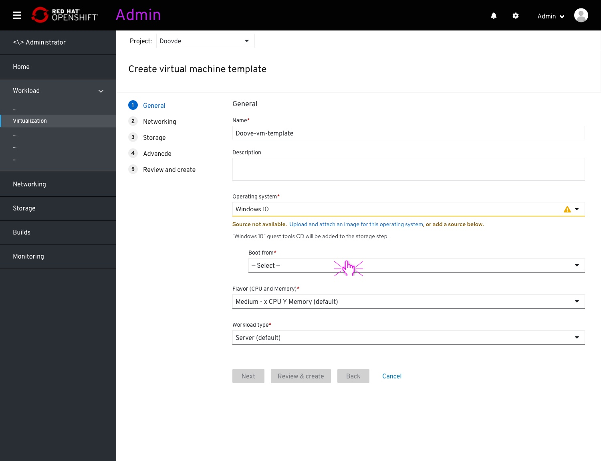
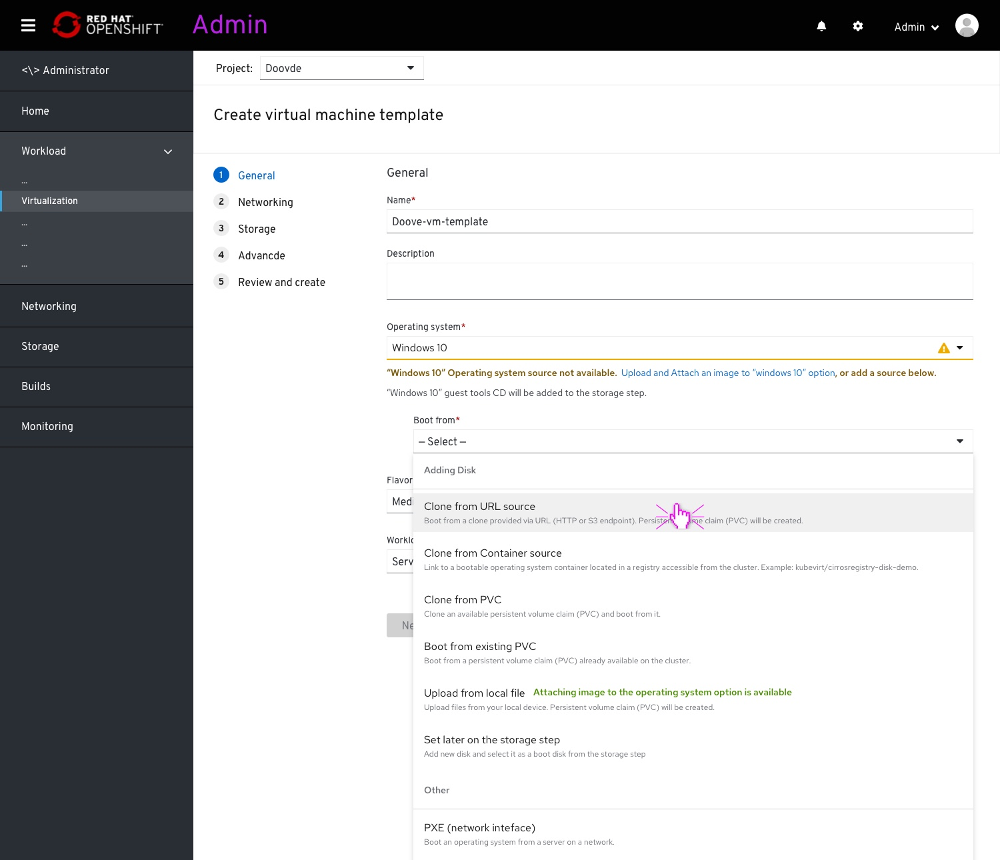
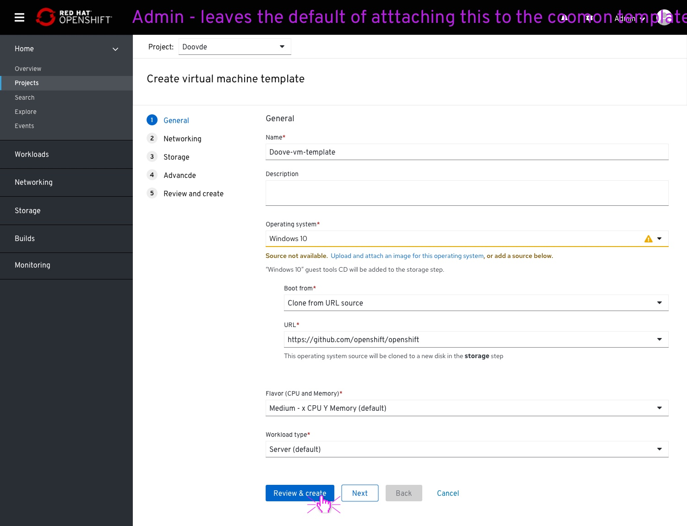

# Add an operating system image to a common template

## About

This is an update for the 4.6 version.
This will cover an update for:
- the "Operating system" dropdown
- "Source" dropdown name, placement and options

## OS dropdown

The dropdown options will be ordered by two sections, promoting the options with an available image above the ones without.
This dropdown will also have a search field to avoid looking for a specific OS in two different lists.

## "source" dropdown

The "source" field will be renamed to "Boot from".
It will be indent to the Operating System dropdown.

The "Boot from" options text will be aligned to the "Boot from".
The Upload option will mention that attaching the image to the OS will be available.

When providing a source, the UI will mention that this source will be added as a disk on the storage step.
In this example, after the user has entered a URL source.
