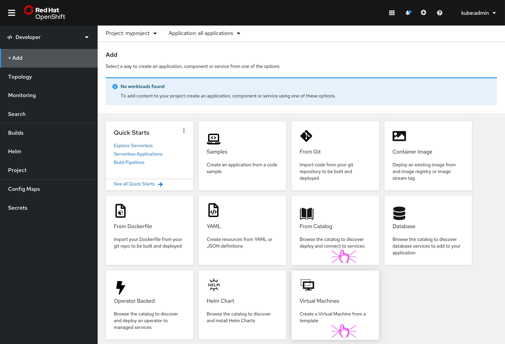
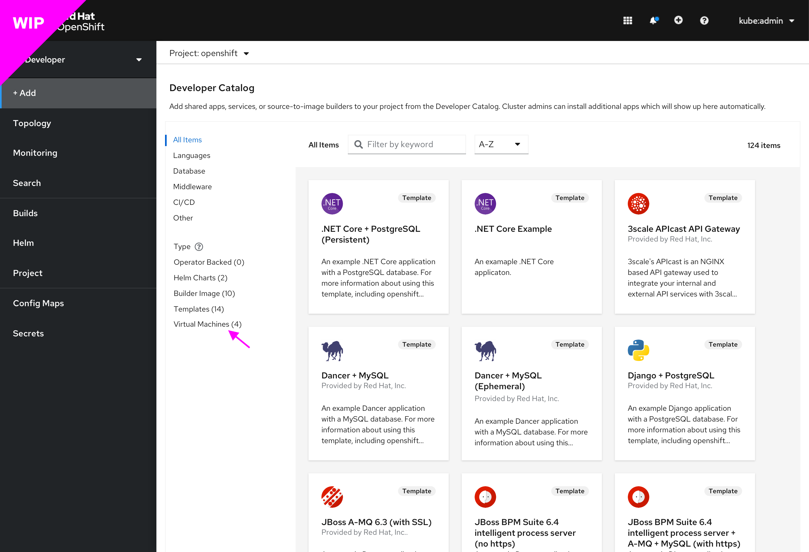
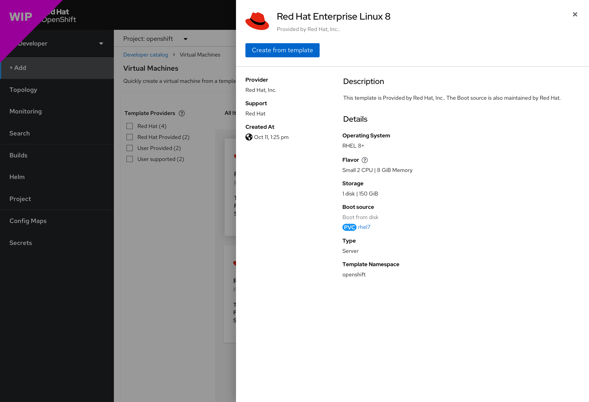
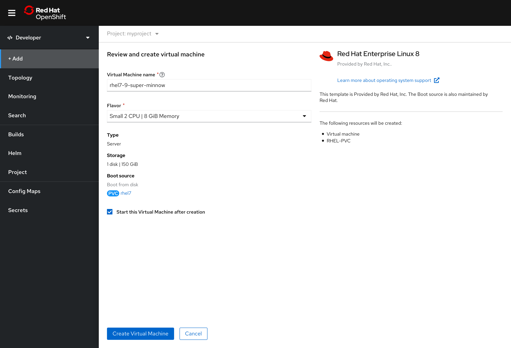
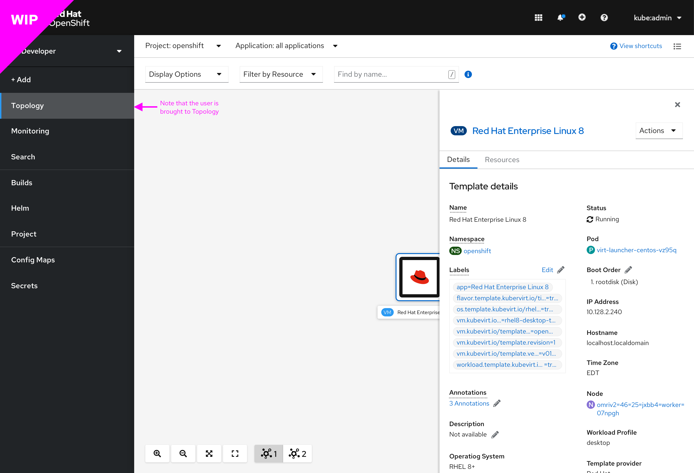

# Developer Console - Create a Virtual Machine from a template flow

## Background

On the developer console, there is currently no way for a developer to quickly create a virtual machine from a template. Virtual machines can only be created on the administrator console by administrators (cluster admins) and developers. We will be introducing this feature to the developer console with this initiative.

## Goals and objectives
Giving developers the ability to quickly and seamlessly create virtual machines from templates. This should reduce the perspective switching cost and improve the overall console experience.

## Introducing
- The ability to create VMs on the developer console
- A “Virtual Machines” card to the “Add” page
- Virtual machine template cards in the developer catalog
- The ability to see a virtual machine template option in the main filter on   the developer catalog page

## General information
- A developer can create a virtual machine from a template
- Only templates with boot sources will be available
- Templates can not be customized
- There are 4 types of templates:
- Red Hat supported
    - Red Hat provided
    - User provided
    - User supported
- Template filtering mechanism will be according to template type only 
- The developer can select Flavor size from the following:
    - Tiny
    - Small
    - Medium
    - Large

## Virtual Machine template card details
The details on the virtual machine template cards are as follows:
- Card label (Virtual Machines ) upper right corner
- Template name (text)
- Template provider information (text)
- Virtual Machine details:
    - Type: 
    - Flavor:
    - Storage:

## The general flow
### The Add screen

1. **Add screen** - Developer starts their navigation here. If OpenShift Virtualization is installed, the user will see the Virtual Machines card

### The Virtual Machine screen

2. **Virtual Machines screen** Developer sees virtual machine template cards and Template Providers filter

### Dev Catalog screen

a. **Dev Catalog screen** alternatively, they could get here by:
Clicking on the “From Catalog” card
- Then clicking on the “Virtual Machines” filter option
- Selects a template to create from *(these are templates that have a source available, either a Red Hat template that ships with a source OR a template that has a source that the admin added)*

### The details drawer

3. **The details drawer** - This drawer opens from the right side with the various template details:
- Create from template button (CTA)
- Provider
- Support
- Template creation date
- Template description
- Operation system
- Flavor
- Storage
- Boot Source
- Type
- Namespace

### Review and create screen

4. **Review and create screen** - the developer lands here after clicking the “Select template button. Here the user will see a short form with 2 pre-filled fields:
- Input field 1: Virtual Machine name (auto generated name)
- Input field 2: Flavor (a default size will be pre-filled)
- Create Virtual Machine button (CTA)
- Cancel button
- Overall template information
    - Template name
    - Template documentation
    - Template resources information
- Text link: Learn more about operating system support [external link.](https://access.redhat.com/articles/4234591)

### Topology screen

5. **Topology screen** - This screen will be presented with the right drawer open and the “Details” tab selected by default