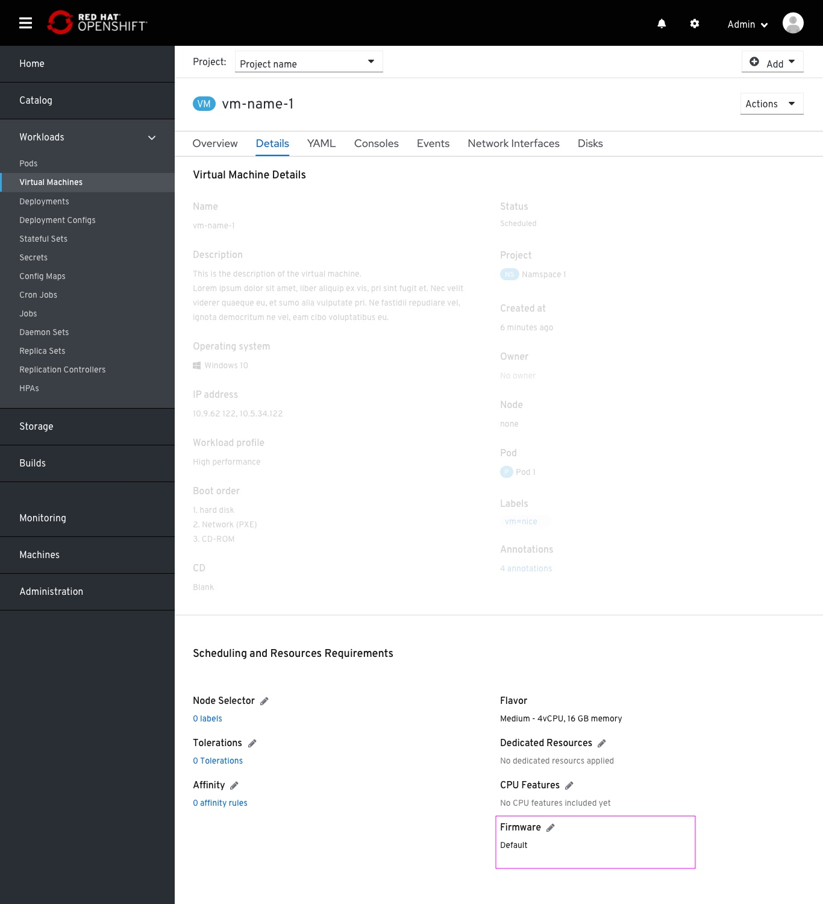
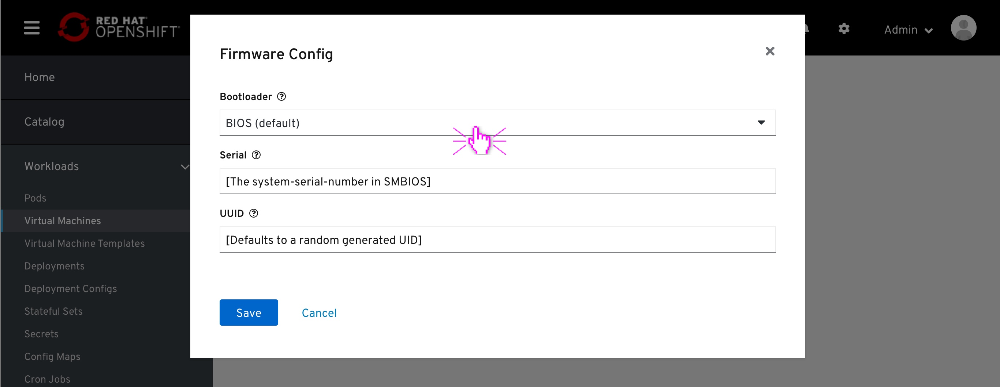
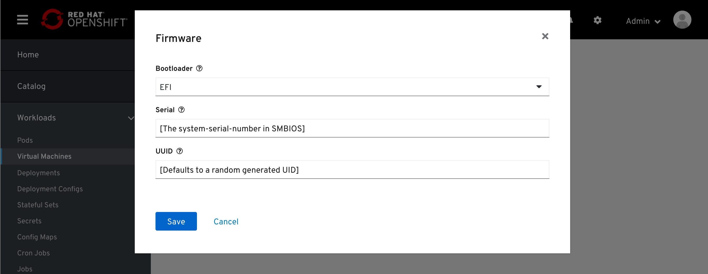
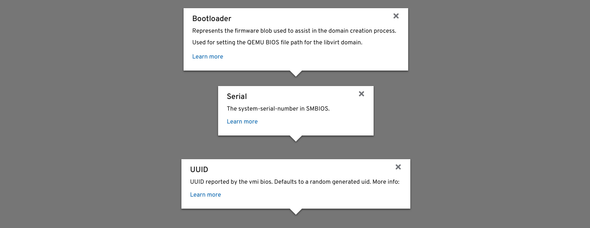
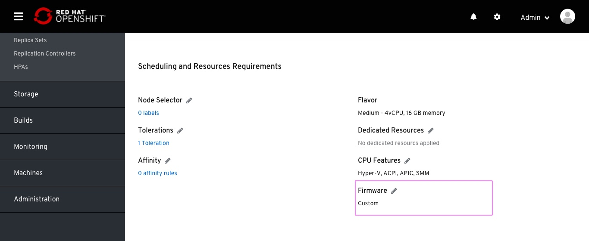

# Firmware

Exposing Firmware Config for VM.
Firmware is placed within the scheduling section. It is related to CPU, and shoudn't be seperated from the rest of the CPU features. Because of that, it should be located next to other CPU features. Also, it affects performance, so it is related to "Resource Requirements".

Firmware is placed in the Scheduling sction of the VM details tab.
The default value of this field is "Default"

This modal is composed of three fields:
- Bootload (Selection): BIOS (Default) and EFI
- Serial (string): [The system-serial-number in SMBIOS]
- UUID ( string): [UUID reported by the vmi bios. Defaults to a random generated UID]

Changing the Bootload to EFI

For each feature, a popover will be available when clicking the help icon next to the field name.
Bootloader link: https://kubevirt.io/api-reference/v0.26.0/definitions.html#_v1_bootloader
Serial link: https://kubevirt.io/api-reference/v0.26.0/definitions.html#_v1_firmware
UUID link: https://kubevirt.io/api-reference/v0.26.0/definitions.html#_v1_firmware

Changing the default configuration will be reflected in the field value specified in-page in a 'Custom' value, followed by specific values.
In case the Bootloader changes, the Firmware value will specify 'Custom - Bootloader: EFI'

In case any Serial or UUID values has changed, the Firmware field will specify 'Custom', with no further values specifically for the UUID or Serial. This is because there is no reset to default.

In case strings removed from the string fields, the Firmware value will change to 'Custom - Serial: None'.