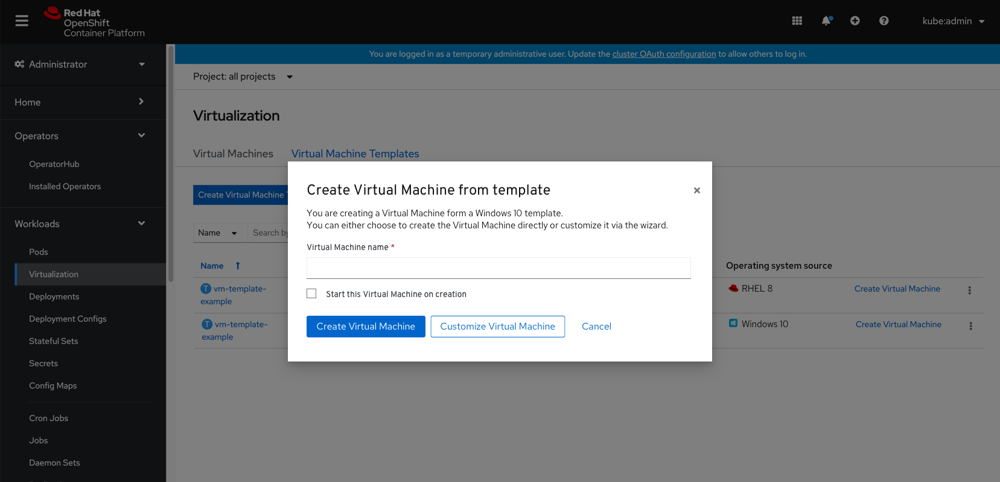

# Templates backed by golden images

Showing users which templates are backed by golden images (that are provided by OpenShift Virtualization/ or created by an admin).

## Adding an ‘Operating system source’ column

Add an ‘Operating system source’ column to the list view to show which Operating system is running on the VM and adding an icon to differentiate whether it's a vendor OS image or a custom OS image.

## VM Details page

## Allowing users to quickly create VMs from templates

At the Virtual Machine Templates list page, from each template, users can either click the link ‘Create Virtual Machine’ or open the kebab menu and select to create it from there.

They will get to a modal where they'll need to fill in the the name of the VM they wish to create.
Once they click ‘Create Virtual Machine’, the VM will quickly get created.
If they click ‘Customize Virtual Machine’ they will have the option to make changes to the VM that's being created from the template. Selecting that will lead them to the Create VM wizard where they can configure things and create the VM by following the wizard’s steps. In this action users are not changing the template itself but the VM that's being created from it.

